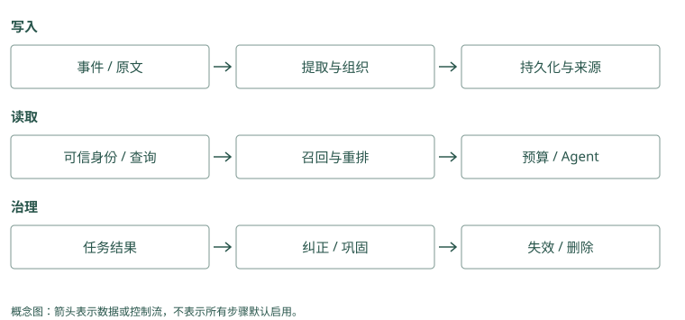

# 前言：记忆不是聊天记录

本书的 Mem0 和 Graphiti 例子用简化记录说明过程，表示希望得到并应当核对的结果，不是两套服务的实测输出。应用需要补做的查询、筛选、审核或执行，会在例子中直接说明。

## 从一个会忘事的助手开始

你请一个助手帮忙发布 Atlas 项目。第一次发布失败，你告诉它：“这个项目发布前，要先检查数据库迁移。”几天后换了一个会话，你又说：“帮我发布 Atlas。”助手直接执行发布，再次撞上同一个问题。

我们要做的记忆功能很具体：让第二次发布用上第一次的教训。为此，助手需要把教训保存下来，在处理 Atlas 发布时找到它，并把它带进这次模型调用。仅仅在硬盘上留了一份聊天记录，还没有完成这件事。

再加一个变化：用户说“今天只是演练，不要碰生产环境”。如果系统把这句话记成“Atlas 永远不能发布到生产”，下次正式发布也会被阻止。助手确实记住了文字，却记错了适用范围。本书会反复使用这个案例，观察一条信息如何从原话变成事实、如何找回、如何纠正，以及什么时候应该退出当前上下文。

Mem0：Alice 说“Atlas 发布前先检查迁移”。把它存成一条短记录。下次她问“发布前注意什么”，应用查回这句话，交给助手；助手才有依据先做检查。

Graphiti：文档写“Atlas 由平台组维护”“平台组发布由 Lin 批准”。把两句话分别记成关系。应用先找维护团队，再找该团队的批准人，就能带着两份来源回答“Lin”。

<details class="source-example">
<summary>源码与边界（选读）</summary>

### 在 Mem0 中，教训先成为可以搜索的事实

Mem0 是供应用调用的记忆程序。你自己的助手仍负责回答和执行发布，Mem0 帮它把有用的话存下，再按问题取回来。用户说“Atlas 发布前要检查数据库迁移”，应用把这句话交给 Mem0；它可以请一个提取模型整理出短记录，再保存。下次应用问“Atlas 发布前注意什么”，取回这条记录，并放进回答模型的输入。

这里有两次不同的模型工作：提取模型整理旧话，回答模型处理当前任务。它们可以使用相同型号，也可以分别配置。保存接口叫 `add()`，搜索接口叫 `search()`；接口就是程序对外提供的调用入口，名字本身不会让记忆自动进入下一次回答。

### 在 Graphiti 中，教训成为有来源的关系

Graphiti 也是供应用调用的程序，它尝试把材料中的对象与关系分别保存。比如“Atlas 由平台组维护”，会涉及项目 Atlas、团队平台组，以及“维护”这件事。下一份资料说“平台组的正式发布由 Lin 批准”，两份资料就能通过同一个平台组连接。程序还要留下这些关系分别出自哪份材料。

Graphiti 将一次收到的材料称为 episode，将 Atlas、平台组这样的对象称为实体，将两个对象之间的事实连接称为边。写入入口叫 `add_episode()`。图画好了以后，应用仍要查询，取回支持当前问题的关系和原文，再交给回答模型；基本搜索不会因为图上有连接就自动完成所有多步查找。

</details>

## 你需要知道什么，不需要知道什么

你可以把 Agent 理解成“能调用工具、连续做任务的模型程序”。模型每次处理的输入叫上下文，包括系统规则、当前消息和工具结果。Token 是模型计算这段输入长度的单位，和汉字数或单词数并不完全相同。上下文有容量和费用限制，因此我们不能把所有旧聊天都塞进去。

读概念章节不需要知道向量数据库、知识图谱或论文里的评测指标。遇到这些技术时，会先用少量记录演示它解决什么问题，再解释计算过程。跟做代码实验需要 Python 3，以及打开终端、运行命令的基本经验；示例只用标准库，不需要模型密钥。

读完后，你应能自己回答三个问题：这句话要保存成什么；下一次任务怎样找到它；它过时或错误时怎样处理。项目比较帮助你把这些做法映射到真实实现，不要求你先记住 16 个项目的名字。

Mem0：给一条教训编号 M1，正文是“先检查迁移”，来源是昨天的对话。搜索取回 M1 后，给模型的是正文；M1 这个编号用来查来源或改记录。

Graphiti：给文档编号 E1，给 Atlas 和平台组分别编号 N1、N2，再保存“N1 由 N2 维护，来源 E1”。查到这条关系后，还能按 E1 回看文档，确认没有连错团队。

<details class="source-example">
<summary>源码与边界（选读）</summary>

### Mem0 的学习入口是消息与短事实

一条记录有两部分：人能读的正文，以及程序用来管理和寻找它的信息。正文可以是“Atlas 发布前检查迁移”；附加信息可以说明它属于 Alice、来自 session-42。程序里的 metadata 就是这些附加信息，payload 是后端保存的一包字段。后文出现 `payload["data"]` 时，指的就是从这包字段里取正文。

Embedding 是把一段文字转换成一串数字的动作，这串数字叫向量，用来比较意思是否接近。它不能取代原文，也不是把知识训练进模型。返回对象里的 `memory` 字段保存正文，应用要读取这个字段，才能让回答模型看到具体教训。

### Graphiti 的学习入口是 episode、entity 与 edge

可以把一次收到的文档叫 E1，把它谈到的 Atlas 叫 N1，把“Atlas 由平台组维护”这条关系叫 R1。E1 是材料，N1 是对象，R1 是陈述，三者用途不同。Graphiti 用 UUID 给它们编号；UUID 是程序生成的标识符，阅读时先把它理解成不应随意混用的身份证号，不必记住长字符串。

以后看到 `fact`，读作一条关系的人类可读正文；看到 `episodes`，读作“支持这条关系的材料编号列表”；看到 `summary`，读作围绕某个对象整理的摘要。摘要方便快速了解对象，确认谁批准发布时，还要检查具体关系和来源。

</details>

## 先把两条最小流程跑在纸上

下面使用 Alice 的 Atlas 项目。Alice 是用户，Atlas 是项目；第二个用户 Bob 也可能有一个同名项目，所以姓名和项目名还不足以决定哪些资料可读。示例中的 M1、E1、N1、R1 是便于手算的编号，不是两套服务的实际返回结果。模型抽取也可能产生不同措辞和结构。

Mem0：输入“Atlas 昨天失败，以后发布前检查迁移”→整理成“Atlas 发布前检查迁移”→保存。下次搜索“Atlas 发布要求”→取回这条文字→应用放进当前消息。存下与用上是两次操作。

Graphiti：输入“Atlas 由平台组维护”→保存维护关系和原文。再输入“平台组发布由 Lin 批准”→接到同一个平台组。应用查齐两条关系后回答“Lin”；只查到维护关系，就还不能回答批准人。

<details class="source-example">
<summary>源码与边界（选读）</summary>

### Mem0 写入时，长消息在哪里变短

输入是一条用户消息：“Atlas 昨天发布失败。以后发布前先检查数据库迁移。”应用先决定哪些消息允许记忆，去掉秘密，并附上 Alice 的可信身份，再调用 `add()`。Mem0 普通写入会先读取同范围近期消息，帮助理解“那个项目”“以后也这样”的指代；再搜索一小批相关旧记录，供提取器参考。它没有先读完整个历史库。

提取模型收到新话、近期话和相关旧记录后，提出要新增的短陈述。假设它给出 M1：“Atlas 发布前需要检查数据库迁移。”这一步会丢掉闲聊，却也可能丢掉“本次”“可能”等条件。应用不能只因返回的格式正确就相信陈述准确，仍要与原话核对。当前普通路径以新增事实为主，不会自动把所有旧事实更新或删除。

程序为 M1 生成向量，保留正文与所属身份，计算正文的 hash，并写到事实后端。Hash 是文字指纹，相同正文得到相同指纹，用于快速查重；“先检查迁移”和“先核验迁移”的指纹不同。事实后端可以理解成实际保存记录并提供搜索的数据库服务。历史数据库另记消息和变更，不是同一张事实表。

```text
新消息 + 近期消息 + 找到的旧记录
                 ↓ 提取模型整理
候选 M1：“Atlas 发布前需要检查数据库迁移。”
                 ↓ 数字表示、查重、附上身份和来源
事实库：M1 的正文 + 向量 + 附加信息
历史库：消息与记录变化
```

一段聊天可能整理出多条记录，也可能没有值得新增的内容。提取服务不可用与“没有新内容”不同：前者需要处理故障，后者可能是正常结果。事实和历史分开保存，也意味着检查一次写入时不能只看返回条数。

### Mem0 读取时，为什么还需要应用多做一步

几天后，Alice 问：“帮我发布 Atlas。”应用调用 `search()`，并限定 Alice 的可读范围。Mem0 将问题也转成向量，在事实库里找意思接近的记录，形成第一批候选。候选就是待挑选的记录，并非最终答案。关键词匹配和 Atlas 等对象的关联可以调整这些候选的次序；当前快照没有保证把第一批之外的记录都补进来。

假设返回 M1，应用取出正文，加上“来源为上次对话，当前状态仍需验证”，与新任务一起发给回答模型。模型才有机会先调用迁移检查工具。Mem0 的搜索分数表示它认为这条记录有多相关，不表示迁移已检查、事实已核实或发布已批准。

```text
当前问题 → 受范围限制的搜索 → 取回 M1
                                  ↓ 应用组装消息
回答模型看到：历史教训 + 当前发布任务
                                  ↓ 应用授权并执行工具
这次迁移检查结果 → 决定继续或停止
```

### Graphiti 写入时，为什么要认出对象再连关系

先收到文档 A：“Atlas 由平台组维护。”Graphiti 为原文建立材料对象 E1，再请模型找出它谈到的对象 Atlas、平台组。接下来查询已有对象，判断这次平台组是否已经存在。这叫身份解析，也常称消歧：两个名字不同可能指同一团队，两个名字相同也可能是不同公司的团队。

假设得到 N1=Atlas、N2=平台组，程序把维护关系的两端指向这两个确定编号。原文还另存为 E1，关系 R1 记着它来自 E1。再收到文档 B：“平台组的正式发布由 Lin 批准。”同一个平台组应继续用 N2，Lin 得到 N3，新关系 R2 来自新材料 E2。

```text
材料 E1：Atlas 由平台组维护。
材料 E2：平台组的正式发布由 Lin 批准。

对象 N1：Atlas      N2：平台组      N3：Lin
关系 R1：N1 → 由谁维护 → N2，来源 E1
关系 R2：N2 → 正式发布由谁批准 → N3，来源 E2
```

这是本书的一种建模示意，不保证模型自动使用这些中文关系名。程序还要检查新关系是不是旧关系的重复，或是否描述了状态变化；最后保存材料、对象、关系以及相互引用。若平台组身份识别错了，后面即使正确理解“批准”，连接仍会指错对象。

### Graphiti 读取时，连线和答案之间还隔着核验

用户问谁批准 Atlas。应用先查询相关事实边；基础 `search()` 同时利用文字匹配和向量相似度来找边，再合并排序。它通常返回关系正文和来源编号，不是整篇原文，也不保证把 N1 到 N2 再到 N3 的两段路都走完。找到了 R1 而没找到 R2 时，可以继续以平台组查询，或显式选择支持邻域扩展的高级搜索。

拿到 R1、R2 后，应用检查中间对象编号是否同为 N2，批准关系是否针对正式发布，以及目标日期是否有效，再按 E1、E2 取回原文。回答模型读到两份证据，才可以形成“Lin”的答案。如果第二份材料实际说的是出差审批，就不能因为同样连到 Lin 而回答发布问题。

以后正式批准人变成 Mei，图可以为旧关系记结束时间，并保留新关系的开始时间；是否正确判断变化、是否正确过滤查询日期，都要单独验证。Mem0 的新增卡片也能保存变更文字，但默认追加并没有提供同等的关系有效区间。后文将用同一变化分别展开这两条路线。

</details>

## 怎样跟着学

前八个机制章节围绕 Atlas 发布助手展开。先读正文里的例子，看到“动手检查”时暂停，尝试写出自己的答案；再看答案提示。第 4 章给出可运行的最小系统，第 10 至 13 章把同样的数据送进不同项目，观察它们的处理差别。

正文按原话、记录、读取和动作展开，遇到一种机制，会解释它为什么有用、怎样判断结果，以及条件变化后会在哪里失效。每章后面的“实现笔记与源码对照”保留版本细节，章末项目表也收在可展开的速查区中；准备接入或读源码时再查看。图用于回顾正文里的过程，不必先背项目名和对照结论。书中的示意输出是教学用例，不是声称我们运行过每个项目。

Mem0：读“默认中文”这个例子时，检查存下的是否仍是默认，而非“所有回答必须中文”。再试问“这封邮件请用英文”，看应用是否保留本次要求。

Graphiti：读批准人例子时，先画“Atlas→平台组→Lin”。后来改成 Mei，再分别问变更前和变更后的批准人，看查询选中了哪条关系。

<details class="source-example">
<summary>源码与边界（选读）</summary>

### 两条标志性实现怎样贯穿全书

读 Mem0 段落时，先问输入是哪句原话、形成哪张卡、下次取回哪段正文；读 Graphiti 段落时，先问材料里有哪些对象、关系接到哪里、原文怎样回查。正文先用这些具体变化解释，再列源码入口。函数名用于复查对应实现，初读不需要凭名称猜流程。

每个正文概念小节都用 Mem0 与 Graphiti 继续推演。Mem0 以本地 `mem0/memory/main.py` 的同步实现为主，Graphiti 以 `graphiti_core/graphiti.py` 及其维护、搜索模块为主。正文中的小段代码用于解释调用契约，除明确说明的最小 SQLite 实验外，不表示本书已配置并运行两套服务。

本次源码核对锁定 Mem0 的 `a39a802bbc93e85b820078cd3c4dbaf53af25dbe` 和 Graphiti 的 `0de2993c5199ebd4c1efcf09ea9984ec4e53e86f`。默认值只对应这些快照。遇到巩固、Skill 发布、权限或预算等概念，会明确区分框架已有动作与应用需要补充的机制，不能把推荐接法读成内置功能。

源码入口：[Mem0 主流程](../../sources/repos/mem0/mem0/memory/main.py)、[Graphiti 主流程](../../sources/repos/graphiti/graphiti_core/graphiti.py)。初读跟着正文理解状态变化，复查时再打开对应函数。

以下材料索引帮助你查找项目，不必在开始学习前逐行阅读。

</details>

<details class="implementation-notes">
<summary>资料索引与项目导航（选读）</summary>

Agent Memory 最容易被做成“把历史消息塞进向量库”。这能工作，却只解决了最简单的问题：过去某句话还能不能被搜到。真正的记忆系统还必须回答：

1. **写什么**：原始对话、提炼事实、用户画像、行动轨迹、失败教训，还是可执行 Skill？
2. **何时写**：每轮同步写，还是会话结束异步巩固？
3. **如何变更**：用户从上海搬到杭州，旧事实应删除、覆盖，还是保留有效时间？
4. **何时取**：每轮自动召回，还是由 Agent 主动查询？
5. **取多少**：top-k 不是上下文预算。五段长文本可能比二十条原子事实更贵。
6. **何时忘**：错误、重复、过期信息若永久保留，记忆越多，Agent 反而越差。
7. **怎么证明有效**：检索命中不等于任务完成，LLM judge 分数也不等于真实生产收益。

本书把记忆看成一条受治理的数据管线：

```text
事件 → 捕获 → 提取 → 规范化 → 去重/冲突 → 存储
                                      ↓
Agent ← 上下文组装 ← 预算控制 ← 重排 ← 候选召回 ← 查询
                                      ↓
                             使用反馈、巩固、遗忘
```

## 本书的材料

本地保存 16 个源码仓库，其中旧 Letta 仓用于核对迁移，另 15 个是当前产品、研究实现或配套工具。论文有 11 篇，包含 MemGPT、LoCoMo、LongMemEval。正文先讲机制，再逐个项目追踪数据模型、写入、读取、演化与失败边界。

| 项目 | 它在管线中的角色 | 详细讲解 |
|---|---|---|
| MemGPT / 旧 Letta | 有限窗口与主动换入历史的来源；旧仓仅作历史入口 | [Agent 原生记忆](08-agent-native.md) |
| Letta Code | Agent 编辑 core、读取 deferred memory，Git 提交后重新编译上下文 | [MemFS 与生效时机](08-agent-native.md) |
| Mem0 | 从消息批量提取事实，用语义池和词/实体信号排序 | [事实路线](10-fact-profile.md) |
| Memobase | buffer 批处理，稳定画像直接读取，事件另行检索 | [画像路线](10-fact-profile.md) |
| Graphiti | episode 来源、实体消歧、带时间的关系边 | [时间图谱](11-graph.md) |
| Cognee | 异构输入、schema 抽取、多存储与多检索器 | [知识平台](11-graph.md) |
| HippoRAG | 事实/段落种子与 Personalized PageRank 关联召回 | [关联检索](11-graph.md) |
| MemOS | MemCube 封装多形态记忆，scheduler 组织处理与调用 | [资源管理](12-memory-os.md) |
| MemoryOS | 近期问答提升为主题 pages，再更新长期画像/知识 | [层级提升](12-memory-os.md) |
| Hippo Memory | 衰减、召回强化、outcome、sleep 巩固与可选重排 | [生命周期](12-memory-os.md)、[Jev 接法](16-jev.md) |
| A-MEM | 生成笔记描述、建立连接、更新邻居属性 | [演化网络](12-memory-os.md) |
| MCP Memory Service | 多客户端服务、全文/向量融合、巩固与运维 | [服务接入](13-integration.md) |
| Basic Memory | Markdown 源文件解析成观察与关系，按 URI 展开上下文 | [文件知识库](13-integration.md) |
| Agent Beacon | 跨 harness 归一动作事件，保留可审计 trace | [捕获层](13-integration.md) |
| TencentDB Agent Memory | L0 至 L3、团队 ACL、资产 Loadout 与请求代理 | [团队接入](13-integration.md) |
| Hermes Jev Skills | 候选隐私检查、判别重排、证据充分性与决策缓存 | [判别层](16-jev.md) |

教学例子用同一类部署偏好、发布失败与批准关系说明机制，不是项目实测。源码观察、论文算法与托管 README 宣称分开注明，避免把某个概念自动当成每个版本都已实现的功能。

所有项目排名都提高了维护权重，但“提交多”不是唯一标准：机器人提交、文档批量更新和单人高频提交都会放大 commit 数。因此书中同时观察最近更新时间、30 天活跃天数、活跃作者数、主仓迁移、测试/评测与开源边界。

## 三条阅读路线

- **只想选型**：第 1、9、14、17 章，再按上表读候选项目详解。
- **要自己实现**：第 1 至 8 章，边读边运行 `examples/mini_memory.py`。
- **要做研究或评测**：第 6、7、14 章，再读附录中的论文原文。

本书不承诺一个万能冠军。用户画像、编码 Agent、长期陪伴、多 Agent 团队和企业知识图谱需要的是不同记忆。正确的问题不是“谁是 SOTA”，而是“在我的数据、查询、预算与风险约束下，哪一种机制产生净收益”。

## 如何读本书的跨项目对照

每章的对照范围是本地 16 仓快照，不是互联网上所有 memory 产品。表中“可选”表示依赖后端、配置或插件；“应用负责”表示该框架没有替你完成这个环节；“历史/论文”不能当成当前 SDK 保证。未找到某项机制的证据时，写成“不据此认定”，不把空白自动解释为绝不支持。

讲解统一回答四个问题：输入是什么，在哪一步改变状态，输出如何进入 Agent，以及会在哪种样例上失败。结论表比较这些操作，不把接口名、营销名或不同协议的分数直接排在一起。

</details>

## 动手检查

一个系统保存了全部聊天，但每次回答只把最新一条消息发给模型。它能避免第二次发布重复犯错吗？

答案提示：还不能。保存解决了“以后还有没有原文”，读取和上下文组装解决“这次模型能不能看到”。你可以在纸上画三个框：旧对话、挑选相关内容、当前模型输入，看看自己的方案缺的是哪一个框。

<figure class="concept-diagram" tabindex="0"><figcaption>图：技术章节围绕三条管线比较，不假设每个项目承担全部职责。</figcaption></figure>

<details class="comparison-reference">
<summary>项目对照速查（选读）</summary>

## 本章对照结论

| 想理解的区别 | 应同时阅读的项目 | 比较对象 | 不应混同 |
|---|---|---|---|
| 事实与稳定画像 | Mem0、Memobase、MemoryOS、TencentDB、Letta、MemOS | 提取/提升时机与读取方式 | query top-k 与按用户直接读 |
| 图与关联检索 | Graphiti、Cognee、HippoRAG、A-MEM、Basic、Hippo、MCP、TencentDB、MemOS 文本后端 | 边的含义、扩展方式、证据来源 | PPR、BFS、笔记 link 与实体 boost |
| 演化与遗忘 | Hippo、MCP、MemoryOS、A-MEM、Memobase、Graphiti、Cognee、MemOS、TencentDB、Letta | 价值、描述、层级或事实状态怎么变 | 衰减、覆盖、过期与隐私删除 |
| 接入与选择 | Beacon、Basic、MCP、TencentDB、Letta、Hermes，并对照 SDK/图框架 | 数据入口、身份和最终 assembler | capture、transport、store 与判别器 |

</details>

