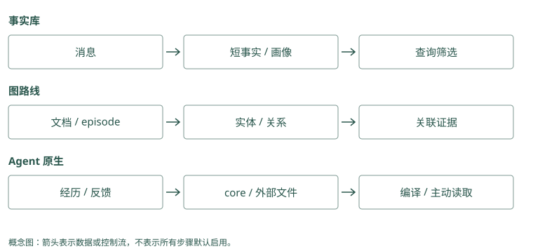

# 统一心智模型

## 模型为什么没有自动记住上次对话

假设第一次对话的输入是“Atlas 发布失败了”，模型回答“下次先检查数据库迁移”。第二次调用时，你只发送“帮我发布 Atlas”。第一次的文字若不在输入里，模型就没有这段经历可以参考。即使应用把第一次对话存到数据库，数据库也不会自动出现在模型的输入中。

可以把模型想成一个正在做题的人：桌上摊开的几页纸是当前上下文，柜子里的资料是外部存储。柜子再大，也需要有人选出相关的一页放到桌上。这个比喻只解释访问关系，不表示模型真的按人的方式记忆。

最简单的记忆程序因此做两件事：任务结束后保存有用信息，下次任务开始前取出相关信息。模型参数不必变化，新的输入就足以改变它的行为。

### Mem0：外部状态通过 search 回到输入

`Memory` 初始化提取模型、embedding、事实存储和历史数据库。`add()` 改变这些外部状态，没有修改基础模型参数；`search()` 返回包含 ID、正文和评分的记录。应用仍需把记录转成消息发送给回答模型。`history()` 是查看记录变更的入口，也不会自动进入回答上下文。

### Graphiti：图也在模型窗口之外

`Graphiti` 的 driver 连接图存储，LLM client 负责抽取，embedder 支持索引。`add_episode()` 更新节点和边；`search()` 返回 `EntityEdge` 列表。模型并不能直接看见图数据库，应用要读取边的 `fact`，补来源和时间，再组织输入。图的规模与一次调用看见的规模是两回事。

## 让一条发布教训走完整个过程

第一次发布，我们有下面的材料：

```text
项目：Atlas
命令结果：发布失败，数据库版本不匹配
用户补充：下次发布前先检查数据库迁移
来源：对话 session-42 和失败工具调用 tool-7
```

保存这些原始材料叫捕获。Agent Beacon 主要帮助做这一步，它把不同工具和运行环境产生的活动整理成可以回看的事件。事件还不是教训：“命令失败”可能有很多原因，不能直接概括成“以后禁止发布”。

下一步，从原话中提取一条有边界的陈述：“Atlas 发布前需检查数据库迁移，来源 session-42。”这叫编码或提取。Mem0 会用模型从消息中提取类似的短事实。提取让长对话变短，也引入风险：模型可能把用户没有说过的原因补出来，因此我们留下来源。

接着，把这条陈述归到 Atlas 项目、发布流程，并存起来。这是组织和存储。只用文字也能起步，但还需知道谁有权读取。另一个用户的同名 Atlas 项目，不能因为名字一样就共享这条记录。

### Mem0：一段事件会分成消息记录与事实 payload

`_add_to_vector_store()` 先把消息拼成提取输入，用同作用域最近十条消息解释省略表达，再召回十条相关旧记忆供比较。提取结果的 `text` 成为 payload 的 `data`，同时生成 hash、词形文本和时间。消息在正常收尾路径另存入历史数据库；应用应额外保留工具事件 ID，不能把每张事实卡片都当作完整原始轨迹。

### Graphiti：实体身份决定边接到哪里

`add_episode()` 建立 `EpisodicNode`，执行 `extract_nodes()` 和 `resolve_extracted_nodes()`，产生临时 UUID 到规范 UUID 的映射。抽出的边用这个映射修正端点，再通过 `_extract_and_resolve_edges()` 处理重复与变化。若 Atlas 被错误合并，随后正确抽出的“需检查迁移”也会接到错误项目上。

## 第二次发布：先找，再读，再做

第二次用户问“帮我发布 Atlas”，应用从当前登录身份得到可读项目范围，在这个范围里搜索发布相关记录。搜索得到的几条记录叫候选，因为它们还没确定要全部放进模型输入。

程序选择发布教训，连同来源组成一段上下文：

```text
历史观察，适用于 Atlas：
发布前需检查数据库迁移。
来源：session-42；请结合当前仓库状态验证。

当前任务：帮我发布 Atlas。
```

模型现在可以先调用迁移检查工具，再决定是否发布。把选出的记录组织成这段输入，叫上下文组装。记忆系统并没有替模型执行检查；它提供了让这次决策少犯旧错的信息。

若检查真的避免了失败，我们可以记录一次有帮助的使用结果。若用户指出“上次原因其实是配置文件错误”，我们就要纠正原教训。更新、纠正和降低旧记录的影响，统称为演化或生命周期管理。

### Mem0：过滤、评分、格式化之后还差一次组装

当前 `search()` 使用 `filters={"user_id": "alice"}`，不能照搬旧教程把 `user_id` 作为顶层搜索参数。底层先产生语义候选，结合关键词与实体信号排序，再格式化为 `MemoryItem`。调用方把 `memory`、来源 metadata 和当前任务合并；检索接口不负责调用你的发布工具，也不保证回答模型会遵循教训。

### Graphiti：返回的是事实边，原文需要另查

不指定中心节点时，基础 `search()` 使用 `EDGE_HYBRID_SEARCH_RRF`，返回边而非整份 episode。边的 `episodes` 保存来源 UUID，调用方可据此取回 episode 核验。需要节点、episode 或社区结果时使用 `search_()` 的组合配置；把基础接口的输出当作全部证据，会遗漏这些对象。

## 三种架构，就是三种放资料的方法

**事实库**把可复用陈述写成一条条记录。Mem0 搜索这些记录；Memobase 更倾向提前整理用户偏好字段。前者像从卡片盒里挑卡片，后者像直接打开用户资料页。任务不同，合适的读取方式也不同。

**图结构**额外保存对象之间的连接。假设一份资料写“Atlas 归平台组”，另一份写“平台组发布由 Lin 批准”，只搜 Atlas 可能漏掉后一份。Graphiti、Cognee 和 HippoRAG 用不同方式利用连接，帮助取回跨资料证据。图要先建立，错误连接也会把搜索引向错误对象。

**Agent 自管理上下文**让模型通过工具决定何时读旧资料，或者修改以后常驻的短规则。Letta Code 会保留小段核心记忆，详细资料放在按需打开的文件里。它省去了每次加载全部内容的费用，但模型可能没有意识到需要打开那份文件。

这些方法可以组合。Atlas 的稳定约束常驻，工具原始输出放历史库，批准关系放图；最终仍要有一个明确的组装位置，决定本次到底给模型看什么。

### Mem0：实体索引没有把事实库变成时间关系图

当前批处理还建立实体记录，其中 `linked_memory_ids` 指向涉及该对象的事实。查询提取实体后，对这些 ID 加分，帮助聚合 Atlas 相关记忆。实体记录没有在这条路径里定义“谁维护谁”的有向事实边，也没有自动执行多跳关系搜索；如果需要第二跳，应用需增加读取动作或换用相应结构。

### Graphiti：图结构与摘要承担不同工作

`EntityNode.summary` 压缩对象周围的信息，`EntityEdge.fact` 保存具体关系，episode 保留输入材料。查询可以搜摘要或关系，但回答批准人时仍应找到维护与批准两条具体边。Graphiti 提供结构和搜索配置，Agent 的常驻 core、主动工具循环与技能授权仍由宿主实现。

## 记忆怎样改变一次决策

再看第二次发布。如果模型只收到“帮我发布 Atlas”，它通常会根据当前仓库和已有知识拟定计划。这个计划可能合理，却没有理由专门关注上次漏掉的迁移步骤。放入发布教训后，计划有了一个具体的检查对象：数据库结构是否与即将发布的版本兼容。记忆的作用可以在这里被观察到，不必用“助手更懂我了”来描述。

不过，历史教训不能替代当前检查。上次数据库版本不匹配，不意味着今天仍然不匹配。助手应把记忆当作提出检查的依据，再用这次工具结果决定继续还是停止。假设当前检查通过，正确行为是继续后面的发布流程；如果助手仅凭旧失败记录宣布“Atlas 无法发布”，就是把过去的事件误当成现在的状态。

这一区别也解释了为什么我们同时保存事件和教训。事件回答“上次发生了什么”，教训帮助决定“这次先关注什么”，当前工具结果回答“现在是否满足条件”。三者在输入里最好有清楚的身份。如果把它们压成一句“Atlas 的数据库有问题”，模型就很难知道该重试、检查还是拒绝。

可以把完整的调用过程想成一次交接。任务结束时，程序为下一次工作留下有边界的记录；任务开始时，程序挑出相关记录，交给模型；模型执行后，程序再保存新的观察。每次交接都可能丢信息，因此排查时沿着原文、记录、候选、最终输入和动作逐步查看。数据库里有记录，只证明交接的第一段完成了。

### Mem0：观察计划变化需要记录实际注入

可以让同一个回答模型分别收到无记忆输入和包含“检查迁移”的输入，比较它是否调用当前检查工具。Mem0 搜索分数只解释选择记录的原因，不能证明检查发生。保存搜索结果 ID 与最后注入文本，才能区分候选正确、组装遗漏和模型忽略三种失败。

### Graphiti：时间事实也只提供检查依据

边中写“某日发布失败”描述一次经历，写“正式发布需检查迁移”描述未来约束，两者都可能与查询相关。应用组装时应标出关系用途和有效时间，避免模型把历史失败当作今天必须停止的依据。最终判断仍以当前工具结果和可信发布策略为准。

## 动手检查

系统搜索出了正确教训，但最终模型输入没有它。问题在存储、检索，还是上下文组装？如果输入包含教训，模型仍没有执行检查，又是什么问题？

答案提示：第一种是组装问题；第二种要查模型怎样使用证据，以及工具流程有没有执行。排查时保存本次选中的记录 ID 和最终输入，比只看“搜索成功”更有用。

<details class="implementation-notes">
<summary>实现笔记与源码对照（选读）</summary>

## 记忆是受限上下文的控制系统

LLM 本身只看到当前输入。Agent Memory 的工作不是无限扩展输入，而是把过去的状态转换成少量、可信、与当前任务相关的上下文。因此可以把它写成一个控制问题：

```text
最大化：任务收益 - token 成本 - 延迟 - 错误记忆风险
约束：权限、时间有效性、来源可追溯、上下文窗口
```

一个工程上完整的系统至少有六层：

| 层 | 职责 | 常见实现 |
|---|---|---|
| Capture | 收集事件 | 消息、工具调用、文件变更、Git、trace |
| Encode | 从事件形成记忆 | 规则、LLM 提取、OpenIE、摘要 |
| Organize | 建立结构 | 元数据、时间线、画像、图、Skill |
| Store | 持久化与隔离 | SQLite/Postgres、向量库、图库、Markdown |
| Retrieve | 召回和组装 | BM25、embedding、图遍历、rerank、预算 |
| Evolve | 更新生命周期 | supersede、冲突、反馈、巩固、遗忘 |

## RAG 与 Memory 的边界

RAG 通常把外部文档视为相对稳定的知识源；Memory 面向**持续发生、与主体相关、会改变未来行为**的事件。二者可以共用检索基础设施，但治理规则不同。

- 文档“支付接口支持退款”通常是知识。
- 用户“本项目禁止改旧鉴权模块”是约束记忆。
- Agent“上次迁移失败，因为漏跑 schema 检查”是经验记忆。
- “Alice 当前住杭州，2025 年住上海”是带有效时间的事实。

如果所有内容都用同一套 chunk + cosine top-k，系统无法正确处理身份、时间、冲突和操作风险。

## 三种主导架构

### 1. 平面事实库

把对话提炼为短事实，附 `user_id`、时间和标签，再做向量或混合检索。Mem0、Memobase 属于此路线的不同变体。优点是简单、低延迟；弱点是关系、多跳与冲突处理需要额外机制。

### 2. 图或上下文图

把 episode 作为来源，提取实体和关系，并维护时间有效性。Graphiti 强调双时间与 provenance；Cognee 强调可配置的抽取、图构建与多存储管线；HippoRAG 用知识图和 Personalized PageRank 强化多跳关联。

### 3. Agent 自管理状态

让 Agent 直接编辑总在上下文中的 memory blocks，并把细节放入可检索外部记忆。MemGPT/Letta 把上下文窗口类比为内存层级；Letta Code 又将记忆投影为 MemFS，并用 Git 追踪变化。这条路线把“何时记、怎么改”部分交给 Agent，本质上是系统提示学习。

现实系统常组合三者：核心身份放 memory block，事件进事实库，项目知识进图，成功轨迹再结晶为 Skill。

## 用一次发布把六层连起来

假设 Agent 执行 Atlas 发布，迁移检查失败，用户指出“这次只是演练，以后真实发布要先检查迁移”。Capture 保存用户原话、失败命令、输出和时间。Encode 提取“本次是演练”与“真实发布前检查迁移”，不能把前者写成永久禁止发布。Organize 为两条信息分配 task/procedural 类型与 Atlas scope，保存来源和适用边界。

下一次问“如何发布 Atlas”，Retrieve 先限制可见项目，再找流程与原始失败证据，组装有限上下文。若该规则真正避免错误，Evolve 才根据可靠 outcome 延长寿命或生成候选 Skill；若根因后来被纠正，应 supersede，而不是因多次召回就强化它。

同一个例子在各项目中会走不同路径：Beacon 负责动作 trace；Mem0 生成短事实；Memobase 不一定适合项目流程，但能保存用户属性；Graphiti 连接项目、迁移与时变关系；Cognee 加载文档/轨迹到结构索引；HippoRAG 找跨段证据；MemoryOS 用 pages 和热度提升；Hippo 用 outcome 与 sleep 治理；A-MEM 修改关联描述；Letta Code 把稳定规则写入未来 core 或 Skill。

MCP Memory Service 让多客户端读写这些内容，Basic Memory 提供人审 Markdown，TencentDB 提供团队资产和权限范围，MemOS 调度不同记忆模块，Hermes Jev Skills 给候选做判断。旧 Letta 仓只用于理解迁移。读项目时应问“它实际负责哪一层、哪些责任仍留给应用”，而非假定每个 memory 产品都有六层完整实现。

## 最重要的设计原则

1. **记忆必须有主体和作用域**：用户、Agent、团队、项目不能只靠标签约定。
2. **保留来源，不把推断伪装成事实**。
3. **更新优先使用失效区间或 supersession，避免静默覆盖历史**。
4. **召回必须受 token、延迟和权限三重预算控制**。
5. **记忆写入和读取都要可观测**：为何写、为何取、最终是否有帮助。
6. **先做可删除、可导出、可重建，再谈“永久记忆”**。

## 架构比较：选择动作发生在哪一层

事实路线把大部分选择留到 query 时：Mem0 从短事实池筛选，Memobase 在写入阶段把稳定属性整理好，读取时只选择事件。图路线把关系提前编码：Graphiti 保存变化中的事实与来源，HippoRAG 在图上扩散相关性，Cognee 还选择数据管线和 retriever。它们省下 reader 搜索长原文的工作，却增加了建索引与抽取错误成本。

Letta 把选择拆成编译与工具读取：小 core 每次驻留，详细经历只有主动读后才进入窗口。Basic 用文件/URI 让选择显式，TencentDB 先按资产可见性缩小范围。它们的共同失败可能是“有证据但没打开正确入口”，而非相似度差。

MemoryOS、Hippo 和 A-MEM 进一步在查询之前改变组织：分别提升层级、调整价值、修改关联描述。MemOS 则增加资源与调度层。服务、trace 和 Jev 工具不能替代这些操作，组合时要明确是谁拥有原文、谁生成派生信息、谁决定最终上下文。

</details>

<figure class="concept-diagram" tabindex="0"><figcaption>图：输入相同，选择发生的位置不同，失败定位也随之改变。</figcaption></figure>

<details class="comparison-reference">
<summary>项目对照速查（选读）</summary>

## 本章对照结论

| 项目 | 主导控制动作 | 如何送入当前上下文 | 应用仍需负责 |
|---|---|---|---|
| Mem0 | 提取事实、搜索与评分 | add 后按 query search | 认证、时间语义、打包 |
| Memobase | buffer 整理画像与事件 | profile 直接读，事件搜索 | flush 一致性与画像核验 |
| Graphiti | 实体/边 resolution | 搜索事实、追踪 episode | reader、授权与建图恢复 |
| Cognee | loader/schema/retriever 路由 | recall 返回结构或答案 | 固定所选管线与验收 |
| HippoRAG | fact/passage seeds 与 PPR | 排序 passage 交 reader | 会话/身份治理 |
| MemoryOS | page/session/长期层提升 | 多层检索与画像上下文 | 阈值、token 与隔离 |
| MemOS | cube/backend/scheduler | 文本检索或兼容资源加载 | 模型兼容与队列运维 |
| Hippo | strength/outcome/sleep | 本地候选、可选重排 | 反馈可靠性与删除政策 |
| A-MEM | 笔记属性和 link 演化 | 近邻、尝试邻居扩展 | 演化审计与持久化 |
| Letta Code | self-edit 与后续编译 | core 常驻，文件/recall 主动读 | 高风险规则评审 |
| Basic Memory | 文件解析与显式关系 | URI/搜索/邻域上下文 | 文件历史与编辑冲突 |
| MCP Memory Service | 统一服务与巩固 | MCP/REST 返回候选 | 每路权限与最终 assembler |
| Agent Beacon | 动作采集与归一 | trace 交下游提炼 | 定义哪些事件成为记忆 |
| TencentDB | 资产、层级与 Loadout | Proxy 注入及工具读取 | 服务链、身份与撤销验证 |
| Hermes Jev Skills | 候选判别与下一步选择 | ID 回映射原文 | store、授权与总预算 |
| MemGPT / 旧 Letta | 论文主动换入；旧仓历史 | 有限窗口加外部工具 | 按实际 runtime 验证，勿套旧 API |

</details>

