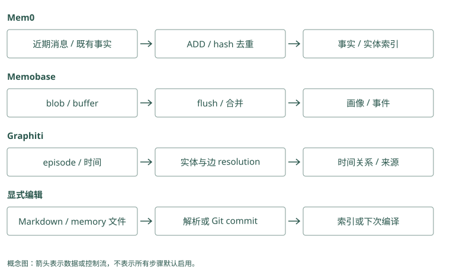

# 写入管线：什么值得记

## 先别急着总结，把原话留住

Atlas 的旧记录写着“默认部署到测试环境”。今天用户说：“以后默认预发布，不过今天的演练仍在测试环境。”你会怎样保存？

如果只保留最后一句，“默认测试”似乎没变；如果只保留第一句，今天的任务又可能跑错环境。我们先保存这次原始消息、所属用户和项目、收到消息的时间。即使后续提取失败，这段原文仍能帮助重做处理。

程序把一段输入送往提取、检查和存储的过程，叫写入管线。理解它最容易的方法是追踪这条输入在哪一步变了形。

### Mem0：消息保存在提取流程的收尾阶段

正常路径通过 `self.db.save_messages()` 保存消息，包括没有提取出新事实的情况。但 LLM 调用失败会抛出 `LLMError`，尚未走到最后的消息保存。需要可靠捕获时，应用应在调用 `add()` 前持久化原事件，不能把 SDK 内部的近期消息缓存当成先写日志的保证。

### Graphiti：建立 episode 对象不等于已经落库

`add_episode()` 先创建带 content、来源描述、`created_at` 和 `valid_at` 的 episode 对象，之后抽取、解析，最终由 `_process_episode_data()` 保存。抽取失败可能发生在保存之前。因此也应先在入口保存原事件，再后台提交，失败后依据稳定事件 ID 重试。

## 提取：把长期变更和本次例外拆开

提取器可以是手写规则，也可以是语言模型。它应该提出两条候选：

```text
候选 A：Atlas 今后默认部署到预发布。
候选 B：本次 Atlas 演练使用测试环境。
```

这里的“候选”意味着尚未最终接受。我们检查 A 有没有把“以后”理解成长期默认，B 有没有保留“本次”的边界。如果输出是“用户喜欢测试和预发布”，它虽然语句通顺，却没有保存足以指导下一次动作的信息。

这也是为什么不能只评估提取结果是否像摘要。写入要保留主体、对象、时间和适用条件；缺一个字段，读取阶段可能就得猜。

### Mem0：一次提取同时参考旧事实与近期消息

`generate_additive_extraction_prompt()` 接收新消息、最近消息、已召回事实和自定义指令。旧 UUID 被映射为短整数标签供提示使用，减少生成虚构标识的机会；输出解析为 `memory` 列表中的 `text`。这条普通路径生成新增事实，不能依据过时 docstring 推断它仍自动执行 UPDATE 或 DELETE。

### Graphiti：先抽对象，再抽对象间的限定关系

实体抽取与消歧提供规范端点，边抽取结合前序 episode 和 `reference_time` 理解“以后”和“本次”。应用可在 `custom_extraction_instructions` 中强调默认与例外区别，但仍应查看生成边是否保留任务条件。结构化 JSON 合法，只证明字段能解析，不证明语义正确。

## 去重：重复文字和重复意思是两件事

假设库里已有“Atlas 默认预发布”，新候选是“Atlas 默认部署到预发布”。文本不完全一样，含义却可能相同。

文本 hash 可以理解为给一段文字生成一个便于比较的指纹。它能快速找完全相同的文字，不能可靠认出同义表达。Mem0 当前本地追加路径会使用这种查重，同时借助已召回的旧记忆指导提取；它没有因此扫描并理解全库的每一句话。

想做含义查重，通常要先找相似旧记录，再判断它们是不是说同一件事。TencentDB 的 L1 去重就先召回候选，再批量请模型判断新旧关系。没有找到旧记录时，判断器无从比较，所以“存成功”不等于“肯定没有重复”。

### Mem0：hash 去重的边界是本批次与召回旧记录

代码对提取正文计算 MD5，与 `seen_hashes` 和 `existing_hashes` 比较。前者防止本批重复，后者只包含本次召回的旧记录；全库其他位置的相同正文仍可能漏过。同义句 hash 不同，而提取提示只能对看见的旧事实避免重复，无法保证全库语义唯一。

### Graphiti：先精确去重，再比较关系候选

`resolve_extracted_edges()` 用源 UUID、目标 UUID 和规范化 fact 去掉本批完全重复。随后查询两端节点间已有边，混合搜索重复候选，并另搜可能失效的相关边，交给关系解析模型。它比较对象、事实与时间，代价比文本指纹大；旧边未进入候选时，语义去重也可能漏掉。

## 变化：保留旧事实，还是修改当前视图

对默认环境，我们可以追加 A，并说明它取代旧默认；旧记录保留给历史查询。也可以更新一份当前画像，把 `default_environment` 改为预发布，另留变更来源。

Mem0 的本地推断写入主要追加新事实，读取时仍需辨别新旧状态。Memobase 在批量处理时合并画像字段，当前值读取方便，但错误合并会直接影响以后回答。Graphiti 针对关系和时间维护旧边的失效区间，更适合需要追问“上周默认哪里”的场景。

若用户说的只是“本次预发布”，三种做法都不应擅自改变长期默认。更复杂的技术不会自动补上错误理解的适用范围。

### Mem0：自动追加与显式更新是两条路径

普通 `add()` 保留新事实，不自动关闭旧默认。应用确认变更后，可以显式 `update()` 修改当前记录；历史库保存 UPDATE 前后正文，但这不是现实有效区间。需要历史默认时，另保留带生效日的版本记录和查询规则，不要仅按 `updated_at` 回答。

### Graphiti：重复与失效结果分开返回

边解析返回 `resolved_edges`、`invalidated_edges` 和 `new_edges`。重复可能复用已有 UUID，新状态可能让旧边结束；摘要更新只用新边。应用既要核对新预发布关系，也要核对旧测试关系的结束日，不能只统计新增条数就宣布变更正确。

## 为什么有些项目没有马上处理

一次模型提取可能比写一行数据库慢。我们可以在用户等待回答时立即处理，也可以先保存原文，再让后台处理。前者通常叫热路径，后者叫冷路径。

Memobase 先把消息放进 buffer，也就是待处理集合，再通过 flush 集中处理。Flush 的意思是把待处理内容送入画像和事件整理流程。MemoryOS 则在近期对话达到容量后组织成中期页面，再决定哪些内容要提升为长期知识。MemOS 的 scheduler 是调度器，把处理任务排队或派发。这几种触发条件不同，不是都“等会话结束”。

后台模式下，用户刚说出的纠正可能还没进入长期库。本次回答应直接保留近期消息，不能因为读到了旧画像就忽略眼前的新信息。要排查这种问题，可以记录“原文已保存”和“派生信息已可读”两个状态。

### Mem0：AsyncMemory 没有替应用建立持久队列

异步 API 允许调用者等待模型和存储工作，不表示请求一返回就有耐进程故障的后台任务。同步或异步普通写入都要完成提取与存储流程。若要移出回复热路径，应由应用配置持久队列，跟踪接收、处理中和完成状态，当前消息仍直接进入当前回答。

### Graphiti：单个 episode 内并行，关联 episode 仍需有序

实现用异步任务并行部分抽取和 embedding；`add_episode()` 的说明仍建议关联输入顺序提交并等待。因为后一个事件可能依赖前一个的节点或事实。多个独立 group 的请求可以按隔离范围组织并发，但不能由“async”推断任意乱序写入都有相同结果。

## 文件和工具事件怎样进入这条管线

Basic Memory 接收明确写好的 Markdown，再解析观察和链接；Letta Code 允许 Agent 编辑记忆文件，并通过提交和后续编译影响未来输入。它们不必对每一条消息都调用一次事实提取模型。

Beacon 捕获命令、工具结果等事件，可为提取提供证据；Hermes Jev Skills 主要在读取时筛选候选，不替你决定长期保存什么。接入时可以先画原文往哪里走，再确认谁负责形成教训，避免把采集成功当成提取成功。

### Mem0：infer=False 适合已经审核的文本

传入已筛选的工具教训并设 `infer=False`，会逐条保存非 system 消息，记录 role 和可选 actor，并生成 embedding。它跳过事实提取，不会自动知道文件版本、失败根因或敏感字段。应用要先清理原日志，并在 metadata 中保存来源和适用范围。

### Graphiti：文件与工具输出可作为 episode 材料

`episode_body` 接收文本，`source` 区分消息、文本或 JSON 等输入形态，`source_description` 解释来源。把工具输出提交进去后，仍会经历抽取与解析；异常堆栈可能包含许多不值得建成实体的词。通过 schema 和提取指令限定关注对象，并保留原事件以便核验。

## 怎样判断一句话值得长期保存

“今天帮我发布 Atlas”很重要，因为它决定眼前的任务；但任务结束后，这句话对下一次发布通常没有直接指导作用。“正式发布前检查迁移”则可能反复影响行动。重要性与长期价值并非同一个问题，写入器需要判断信息将在什么场景下再次使用。

可以把自己放在下一次任务的入口，问：如果缺少这条信息，助手会做错哪一个具体决定？对默认环境，可能选错目标；对已验证的失败教训，可能漏掉检查；对一段无关寒暄，往往说不出明确影响。无法指出复用场景的内容，可以先留在原始历史中，不急着提升为常规召回的事实。这样仍然保留回查能力，又避免每次搜索都被低价值摘要挤满。

对根因尤其要克制。假设工具报数据库错误，用户猜“是不是迁移没跑”，随后助手重试成功。重试成功不足以证明猜测，因为网络恢复、配置修正或其他步骤都可能导致成功。此时可以保存失败事件和待验证假设，却不应生成“所有发布失败都先重跑迁移”的流程。候选阶段给系统留下了核验的机会，直接写成强规则则会把不确定性藏起来。

### Mem0：新增事实的选择发生在模型提示里

提取器试图筛出有用陈述，但普通路径没有一个经任务结果验证的价值评审器。应用可以先过滤闲聊和秘密，再要求候选保留“可能”“本次”等语义；返回成功之后抽样检查事实正文。重要性 metadata 若没有读取逻辑配合，也只是被保存的业务字段。

### Graphiti：能成为关系不意味着值得常规召回

图可表达大量临时事实，抽取 schema 决定哪些对象和属性有位置保存。高连接度但无用的节点会增大搜索噪音，所以输入筛选与类型设计也是价值控制。图中的 source 和时间帮助审查证据，却没有代替业务判断失败猜测能否升级为流程规则。

## 写入失败后，怎样安全地再试一次

假设原文已保存，提取生成两条候选，其中一条写入成功，另一条因 embedding 服务断开失败。整次请求重试时，如果每次都生成新 ID，第一条也可能再次插入。用户没有重复表达，库里却多出两份证据，后续巩固还可能把它误认为反复确认。

应用可以为这次原始事件分配稳定 ID，并记录它处理到哪一步。重试时检查已有结果，补做未完成部分，而不是把整个事件当成新的输入。这里的幂等表示重复处理同一事件，不应产生额外的业务结果；它不等于语义去重，因为两个不同事件说了同一件事，仍可能各自提供合法来源。

后台处理还需要区分“接收成功”和“可读取”。把消息放入队列后立即告诉用户“以后会记住”，却没有监控失败任务，会造成难以察觉的遗忘。更诚实的状态是原文已接收、整理中、已完成或失败待重试。至于当前回答，仍应直接使用刚收到的纠正，不把后台延迟转化为当前决策错误。

### Mem0：批量回退可能产生部分成功

批量 embedding 失败会逐条尝试，批量插入与历史写入也有逐条回退。某些错误被记录后流程继续，返回记录来自构造好的 `records`，因此不能只看 results 就推断每个存储都一致。重试前按 ID 核对事实、历史和实体链接，入口维护稳定事件与派生 ID 映射。

### Graphiti：uuid 参数不能直接当作任意幂等创建键

当前 `add_episode(uuid=...)` 会尝试读取已有 episode，而不是无条件用这个 UUID 创建新对象。应用不能把一个尚不存在的随机事件 ID 填进去就宣称幂等。应保存事件到 episode UUID 的映射和处理状态，检查实际落库，再决定重试或重建；还要防止旧边失效动作被重复执行。

## 动手检查

给提取器三句话：“默认中文”“这封邮件英文”“今后默认英文”。写下每句应改变的长期字段和本次任务字段，再检查旧中文记录应该保留、失效还是删除。

答案提示：第二句只改变本次任务；第三句才能支持默认语言的变更。旧中文曾经有效，可以保留作历史；用户要求删除其数据时才另走删除流程。两种操作目的不同。

<details class="implementation-notes">
<summary>实现笔记与源码对照（选读）</summary>

写入质量决定记忆上限。召回算法无法修复一个充满无关对话、重复摘要和错误推断的库。

## 热路径与冷路径

**热路径**在回复前后同步执行，适合写入明确、低成本、高价值的信息，例如用户显式偏好和关键决策。它增加延迟，也容易让一次 LLM 提取失败阻塞主任务。

**冷路径**在会话结束或队列中异步执行，适合批量去重、画像更新、Skill 提炼和图构建。Memobase 用每用户 buffer 批处理聊天；MemOS 用 MemScheduler 异步写入；Hippo 把 `sleep` 作为巩固步骤。

推荐组合：

```text
热路径：保存原始 episode + 明确的 pinned memory
冷路径：提取 → 去重 → 冲突检测 → 巩固 → 建索引
```

## 一次可靠写入

1. **捕获原始事件**：消息、时间、主体、来源、工具结果摘要。
2. **候选提取**：事实、偏好、约束、决策、失败原因、成功步骤。
3. **价值判断**：未来是否可复用？是否稳定？不记会有什么代价？
4. **规范化**：短句、主体明确、时间绝对化，避免“明天”“那个服务”。
5. **查重与冲突**：相同则增加证据；变化则 supersede；矛盾但不确定则并存并标记。
6. **分配类型与作用域**：用户/Agent/项目/团队；episodic/semantic/procedural。
7. **写入与审计**：记录 extractor 版本、模型、prompt 和来源。

## 用一条矛盾记录走完写入路径

假设用户上周说“默认发到测试环境”，今天明确说“以后默认发到预发布环境”。不要把两句话简单拼成“用户喜欢测试和预发布”，也不要只凭后一条消息删除前一条历史。可以先保存原话及来源，再写入一条有时间边界的候选偏好：

```text
上周原话 ──→ 旧偏好：默认测试环境（曾有效）
今天原话 ──→ 新偏好：默认预发布环境（当前有效）
                    │
                    └── 指向旧偏好：取代，而非否认过去
```

写入时至少记录主体、适用项目、来源消息 ID、观察时间和生效时间；如果用户只说“这次发预发布”，应先按单次任务约束处理，不能擅自更新长期偏好。回忆时按项目和有效时间筛选，再把“当前默认”和“历史曾用”区分展示。原话也要受删除请求和保留期约束，不能因为审计需要就永久保存。

## 这些步骤在项目里如何执行

**Mem0** 的本地 batch pipeline 先读取近期消息与同作用域既有记忆，再单次提取新增事实，批量 embedding、按文本 hash 去重，写入向量与历史，最后链接实体。重复检查不是全库语义去重，实体链接也不是时间关系裁决；要区分“同一句重复”“同义重复”和“新状态”。

**Memobase** 先把 blob 放进用户/项目 buffer，容量、空闲或显式 flush 触发处理。状态从 idle 到 processing，再到 done/failed，之后更新画像与事件。热路径便宜，但刚写入的偏好可能暂不可见，并发 flush 还需要幂等保护。

**Graphiti** 保留 episode，以 reference time 解释相对日期，再抽取实体和边。Entity resolution 合并别名并修正边端点，edge resolution 找重复/矛盾、维护有效时间。去重错误会伤害整个连接结构，因此 schema、消歧与时间回归集是写入验收的一部分。

**Cognee** 从 loader 与分块开始，经 schema 抽取到关系/图/向量存储；不同输入类型选择不同管线。**HippoRAG** 则把 passage 的 OpenIE 三元组、同义连接与来源写入检索图，重点是多跳证据能否到达，而非用户画像是否实时更新。

**MemoryOS** 在短期容量触发后构造 pages、判断连续性、做多主题摘要并合并 session，热段再提升为长期知识。**A-MEM** 在新笔记生成描述后找邻居，由模型决定添加 links 或修改邻居 context/tag。前者压缩和提升，后者改关联描述，二者都需检查派生信息是否偏离原文。

**Hippo** 在 buffer/episodic/semantic 间巩固，并用 sleep 处理重复与衰减。**MemOS** 通过 reader、memory backend 与 scheduler 组织处理。**TencentDB** 从 L0 抽取更高层记忆与 Skill，生成日志关联 prompt 版本。**Basic Memory** 则解析明确写入的文件，**MCP Memory Service** 接收客户端提交并维护索引；它们不应自动被归为“每条消息调用 LLM 提取”。**Beacon** 先保存统一 trace，尚未完成事实筛选；**Letta Code** 允许 Agent 写文件再提交、后续编译生效；**Hermes Jev Skills** 主要筛选读取候选，没有承担长期写入。

这些路径的对象、触发时机和损失点不同，详解位于 [第 8 章](08-agent-native.md)、[第 10 章](10-fact-profile.md)、[第 11 章](11-graph.md)、[第 12 章](12-memory-os.md)、[第 13 章](13-integration.md)、[第 16 章](16-jev.md)。

## ADD-only 还是 CRUD

早期 Mem0 流程常让模型输出 ADD/UPDATE/DELETE；当前本地 OSS `_add_to_vector_store()` 已采用单次 ADD-only batch 提取，并链接实体。其 2026 README 的新算法与 benchmark 还包含托管优化，不能把平台数字直接当作 OSS SDK 结果。追加降低写入裁决复杂度，但把变化消歧的一部分责任留给读取，且 created_at 不等于现实有效时间。

两种策略没有绝对优劣：

- **ADD-only**：审计友好、不丢历史、写入稳定；要求检索理解时间和重复。
- **CRUD/合并**：上下文更干净、查询简单；错误更新可能永久破坏知识。

对高风险事实，推荐 append + validity interval；对缓存式摘要，可重建覆盖；对用户删除请求，必须物理删除相关原始与派生数据。

## 何时升级为 Skill

一条经历不能自动成为流程。至少满足以下条件之一再升级：

- 同类任务重复成功；
- 有明确输入、步骤、边界和验收；
- 失败代价高且原因已验证；
- 人工审核通过。

TencentDB Agent Memory 将 Chat Memory 与 Skill 分开，Letta Code 支持 skill learning，MemOS 本地插件区分 L1 轨迹、L2 策略、L3 世界模型与结晶化 Skill。这比把长工具轨迹原样塞回上下文更可控。

## 同样的去重，为什么会得出不同结果

Mem0 的 hash 比较文本是否完全重复；Graphiti 的 resolution 判断对象、关系和有效时间；Memobase 的 merge 判断新信息是否应改变同一画像属性。对于“中文回复”与“默认用中文”，hash 可能保留两条，画像 merge 可能整合成一个值。对于“这次英文”，画像 merge 若错误泛化会损坏长期偏好，追加事实则把消歧负担留给 reader。

TencentDB 的 [`record/l1-dedup.ts`](../../sources/repos/tencent-agent-memory/MemoryCore/src/core/record/l1-dedup.ts) 采用两阶段：给每条新 L1 召回候选，再将所有新旧配对批量交给 LLM 决定动作。候选优先 native hybrid，否则 FTS 与 client-vector 用 RRF，写入去重的隔离可以限定 session，与跨会话查询不是同一过滤。缺召回能力或未找出候选时直接 store，不应把成功响应理解成已经完整去重。

MemoryOS 的 session merge 则比较主题摘要/关键词，把 pages 放入主题集合，并非确认页面事实完全相同；A-MEM 的 evolution 让新笔记与邻居改变描述，不是删除重复原文。Hippo/MCP 的冷路径聚类和合并有更大的历史窗口，能够处理热路径没看到的重复，但错误压缩也可能丢失一次性例外。

对于文件写入，Basic 的 parser 只把明确 observation/link 结构化，Letta 的 commit 只确认文件版本可编译，两者不会自动保证内容没有矛盾。Beacon 事件 ID 去重针对同一动作重复采集，不针对“两个失败是否属于同一根因”。这些操作需要不同标注集，不能统一用一个重复率验收。

</details>

<figure class="concept-diagram" tabindex="0"><figcaption>图：抽取、flush、resolution 和 commit 的完成语义不同。</figcaption></figure>

<details class="comparison-reference">
<summary>项目对照速查（选读）</summary>

## 本章对照结论

| 项目 | 写入/处理触发 | 合并或去重的对象 | 主要失败与回退边界 |
|---|---|---|---|
| Mem0 | add 推断；也可 infer=False | batch/召回文本 hash、entity | 局部查重；部分成功需核验 |
| Memobase | buffer 阈值/空闲/flush | profile 属性与事件 | 延迟可见、并发重复 flush |
| Graphiti | add_episode | 实体身份、重复/矛盾边 | schema/时间/同名误合并 |
| Cognee | remember 的输入分支 | 数据块与 schema 知识 | 多存储与后台任务恢复 |
| HippoRAG | index 新文档 | OpenIE、实体/同义与来源 | 抽取漏边、索引身份不匹配 |
| MemoryOS | 短期满、热段达阈值 | 主题 session、长期画像 | 摘要丢例外、阈值误提升 |
| MemOS | reader 与 scheduler 任务 | 配置选中的文本/资源模块 | 队列积压与最终一致性 |
| Hippo | capture/remember 与 sleep | episode、重复、semantic | 错误合并或强化 |
| A-MEM | add_note | context/tag/link 与邻居属性 | 结构化输出、索引刷新 |
| Letta Code | Agent 编辑后 commit | core/deferred/Skill 文件 | 未提交或未重新编译 |
| Basic Memory | 文件/MCP 编辑后同步 | entity/observation/relation | 同步延迟、链接/并发编辑 |
| MCP Memory Service | 客户端 store、可选巩固 | content/hash 与冷路径聚类 | store 不等于价值筛选 |
| Agent Beacon | harness 动作事件 | 动作 identity 与统一字段 | coverage/fidelity、秘密捕获 |
| TencentDB | L0 捕获与后台提取 | L1 新旧候选 batch judgment | 无候选时直存；隔离不可复用错 |
| Hermes Jev Skills | 小决策 memo；非事实提取 | exact-match key | 不能替代长期写入管线 |
| MemGPT / 旧 Letta | 论文模型调用写工具 | core/archival 内容 | 依赖模型正确触发；旧仓非当前实现 |

</details>

