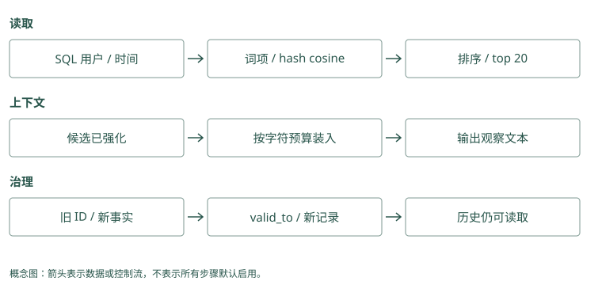

# 从零实现持久记忆

## 先做一个不调用模型的记忆实验

我们先确认一件最基本的事：程序关掉后，教训还在；下一次能按正确用户读到它。这一步不需要自动提取，也不需要下载用于语义检索的模型。

在项目根目录打开终端，进入 `examples/`。下面用临时目录保存练习数据库，不覆盖你已有的 `demo.db`。这些命令在同一个终端依次执行：

```bash
cd examples
lab=$(mktemp -d)
python3 mini_memory.py --db "$lab/tutorial.db" remember \
  "Atlas 发布前检查数据库迁移" --user alice \
  --kind procedural --source session-42
python3 mini_memory.py --db "$lab/tutorial.db" recall \
  "Atlas 发布检查" --user alice
```

第一条命令打印一个随机 ID，实际值每次不同。第二条输出 JSON，也就是用字段和值表示数据的文本，其中应该包含刚保存的正文、来源和评分分项。两条命令是两次独立进程：第二次能读到记录，说明持久化确实发生了，而不是仅留在第一次程序的变量里。

再换用户试一次：

```bash
python3 mini_memory.py --db "$lab/tutorial.db" recall \
  "Atlas 发布检查" --user bob
```

这个新数据库里没有 Bob 的数据，应返回空列表 `[]`。代码先按 `user_id` 取符合条件的记录，再计算相关性。这里的用户参数是教学用的过滤条件，不是登录认证；实际应用必须从可信身份得到它。

本章程序直接把你写好的教训存入 SQLite，不请模型猜怎样总结。Mem0 的直接保存模式也可以跳过事实提取，但仍要配置生成向量等依赖，不能把它当成纯标准库实验。Graphiti 的普通材料写入还需提取对象与关系，所以“跟做本章成功”尚不能证明两套服务已搭好。

### Mem0：零模型实验可以映射到直接保存路径

教学 SQLite 不调用模型。Mem0 的相近入口是 `add(..., infer=False)`，它不提取事实，但仍调用 embedding 并连接配置的存储，不能理解为零依赖。调用教学形态为 `m.add("Atlas 发布前检查迁移", user_id="alice", infer=False)`，检索则用 `m.search("Atlas 发布", filters={"user_id": "alice"})`。这些调用需要先配置 provider。

### Graphiti：从 episode 开始会引入抽取依赖

`await graphiti.add_episode(name=..., episode_body=..., source_description=..., reference_time=..., group_id=...)` 要求时区明确的时间与图后端，并通常调用抽取模型。`add_triplet()` 可以从显式节点和边入手，但仍有关系解析与 embedding 等工作，不能照搬 SQLite 命令声称无需配置即可执行。

## SQLite 里面到底保存了什么

打开 `mini_memory.py`，从 `MemoryStore.__init__()` 看起。SQLite 是把数据库保存在文件里的数据库引擎。建表语句为每条记录保存正文、用户、类型、来源和有效时间，`remember()` 把字段写进去，然后调用 `commit()` 确认这次写入。

你可以用标准库直接检查刚才的数据：

```bash
python3 - "$lab/tutorial.db" <<'PY'
import sqlite3, sys
with sqlite3.connect(sys.argv[1]) as db:
    print(db.execute(
        "SELECT user_id, text, source FROM memories"
    ).fetchall())
PY
```

应看到 Alice、发布检查正文和 `session-42`。这个查询没有调用任何模型，帮助我们把“数据存在哪”与“模型会不会使用”分开。

在最小程序里，一行可以保存编号、正文、用户和时间。接 Mem0 后，还要区分事实后端中的卡片与历史 SQLite 中的消息和变化。Graphiti 则至少区分原材料、谈论对象及事实关系，并保存相互引用。看到一个数据库文件存在，只证明某种状态可能保留，不证明这些不同对象都已写齐。

### Mem0：历史 SQLite 与事实后端不是同一职责

`SqliteManager` 管理变更历史和消息，而事实正文与向量通过配置的 `vector_store` 保存。即使历史文件存在，事实后端不可用也会影响查询。备份和恢复要同时检查事实存储、实体存储及历史数据库，不能把一个 SQLite 文件当作整套状态。

### Graphiti：一次写入形成多个有关联的对象

保存包含 episode、实体节点、事实边及 episode 与实体的关联，driver 承担持久化。读取 episode 的原文与搜索事实边是不同访问路径。验证持久化时应在新连接中按 UUID 读取各类对象，并检查来源链接，而非只看图界面出现一个 Atlas 节点。

## 相关性怎样算出来

`recall()` 先筛用户和有效时间，再比较问题与每条记录。它给词语重叠、hash 向量相似度、新近程度、重要性等信号分别加权，最后从高到低排序。

比如问题含“Atlas”“发布”“检查”，这些字词也出现在记录里，词重叠会提供相关性信号。Hash 向量把词映射到固定数量的数字位置，再比较两段文字的方向；它只是词袋近似，主要根据字词计数比较，不能指望它识别一般的同义表达。

所以本章先观察 `lexical` 和 `semantic` 分项，不把某次搜索命中当成模型理解语言的证明。真正项目里，MCP、Hippo、Mem0 等可以使用全文索引或 embedding，过滤、候选和打包这些位置仍要存在。

玩具程序认出共享词语，是为了让结果能手算。Mem0 用真实向量衡量意思接近，再参考词和对象关联；Graphiti 可比较关系正文向量，也可按配置找对象摘要或材料。换一种候选单位，分数就比较另一种文字，不能把“节点很相关”直接理解成“批准关系已找到”。

### Mem0：真实 embedding 后还有多信号评分

`_search_vector_store()` 对 query 生成向量，再从后端取语义评分，关键词分数规范化后参与 `score_and_rank()`，实体记录另提供 boost。教学代码里的固定加权公式并非 Mem0 的公式；即使字段都叫 semantic，也要分别记录真实向量模型、后端分值和最终评分。

### Graphiti：搜索对象决定向量比较什么

边相似搜索比较 query 与事实文本的 embedding，节点搜索比较节点的索引内容；配置可再用 RRF 或其他方法排序。边、节点和 episode 结果不能当成同一组可交换的候选。学习时先固定边搜索，观察 fact 和来源，再开启组合搜索。

## 用新记录替代旧默认

在同一临时数据库写两条记录，第二条明确引用第一条 ID：

```bash
old=$(python3 mini_memory.py --db "$lab/tutorial.db" remember \
  "Atlas 默认部署到测试环境" --user alice)
python3 mini_memory.py --db "$lab/tutorial.db" remember \
  "Atlas 默认部署到预发布环境" --user alice --supersedes "$old"
python3 mini_memory.py --db "$lab/tutorial.db" recall \
  "Atlas 默认部署环境" --user alice
```

`supersedes` 的意思是“取代”。代码把旧记录的 `valid_to` 写为本次时间，当前查询应不再返回旧默认。它没有自动理解矛盾，是我们明确告诉了它哪条被取代。

旧正文还在数据库里。需要查历史时，Python API 的 `recall(as_of=...)` 可以指定时间；CLI 没有对应参数，不要自行添加不存在的命令选项。第 6 章会解释为什么这还不等于完整的双时间系统。

最小程序用“新记录取代旧记录”表达业务规则，这个字段不会因为换后端而自动存在。接 Mem0 时，需要应用维护取代关系或显式更新；接 Graphiti 时，可核对新旧默认关系与有效时间。程序应能解释为什么保留旧历史、为什么当前选择新值，而不是只比较哪条最后写入。

### Mem0：不要调用不存在的 supersedes 语义

普通 `add()` 没有教学代码中的 `supersedes` 参数。可以把旧 ID 和业务生效时间放进 metadata，但 SDK 不会因此关闭旧事实。显式更新或到期设置需应用决定；要实现本书的历史查询，应在外层维护有效版本，而非把 metadata 当作已执行的约束。

### Graphiti：替代发生在语义与时间解析中

新 episode 说明“18 日起默认预发布”，提取新关系并比较相关旧边，可能让测试关系的 `invalid_at` 为 18 日。它比手工给旧 ID 自动化程度高，也更可能误判单次例外。实验必须核对边字段及历史过滤返回，不能只看新边写入成功。

## 让搜索结果成为有限输入

运行下面的命令，看最终注入文本，而不只是 JSON 结果：

```bash
python3 mini_memory.py --db "$lab/tutorial.db" context \
  "Atlas 发布" --user alice --budget 80
```

`context()` 最多先取 20 个候选，逐条判断是否放得下，超出的长记录会被跳过。这里用字符数近似 token，还没有把标题和所有格式开销计入，因此预算不是目标模型的精确 token 保证。

另外，`recall()` 默认增加命中记录的访问计数，哪怕后来没有装进输入。这是为了演示强化而保留的简化，不能把它当可靠成功反馈。你已经可以指着代码说出三个不同位置：挑候选、装输入、记录结果。

返回五条记录，如果每条都是长文，仍可能塞不进模型。Mem0 的 top_k 和 Graphiti 的 num_results 表示最多返回多少项，不是输入长度预算。应用可以先选少量短事实，必要时再取原文，最后计算总长度；一条有来源的关键教训往往比五段重复背景更适合当前任务。

### Mem0：limit 限制结果，不保证最终 token

`search(top_k=...)` 控制返回条数，正文长短仍由记录决定。应用把 `memory`、metadata 和格式一起计数，才能得到实际注入长度。启用重排也没有自动生成一段满足预算的 prompt，预算打包仍要独立实现。

### Graphiti：num_results 与 SearchConfig.limit 都是中间限额

基础 `search(num_results=...)` 返回有限事实边，组合 `search_()` 还可能包含节点和 episode。来源原文展开后，长度可能远大于 fact 本身。应在核对来源之后统一打包，并给图扩展和原文读取设限，不能把十条边理解成十条短句的固定费用。

## 沿着一次函数调用读懂这个程序

阅读代码时，可以暂时忽略评分公式的权重，从一条记录的去向开始。`remember()` 接收正文和用户等字段，把它们变成一行 SQL 数据；`commit()` 使这次修改在之后的连接里可见。关闭第一个进程再运行第二个进程，正好检验了记录是否真的留在文件中。如果只在一个 Python 对象里写入再读取，即使没有持久化也可能通过，反而容易掩盖问题。

进入 `recall()` 后，先看 SQL 查询得到哪些行。Bob 得到空列表，应发生在这一步；如果先算全库分数再删除 Alice 的结果，输出也可能是空，但内部已经触及了不该读取的内容。这个顺序在小数据库里性能差别不大，在真实服务里却决定了身份隔离能否贯彻到搜索内部。

接下来，每条可读记录得到分数。词重叠和 hash 向量会同时受到字面表达影响，因此示例中的两项并不构成两个完全独立的理解能力。你可以保存“上线前核对数据库结构”，再用“发布迁移检查”搜索，观察结果怎样变化。若搜索不理想，这个实验揭示的是当前词袋近似的限制，不能据此判断真正的 embedding 模型也一定失败。

最后，`context()` 将候选转换为一段文字。这里才发生模型输入的组装，而本程序没有实际调用模型。命令打印出历史教训，证明应用已经拿到可以注入的文本；至于模型会不会检查迁移，还需要在宿主助手中接入并观察工具行为。把这两种实验分开，才能知道失败究竟来自数据管线还是决策执行。

`supersedes` 也值得从调用者的角度理解。程序没有读懂“测试”与“预发布”互相替代，是你把旧 ID 交给它，明确发出替代要求。确定性机制容易测试，语义判断却需要另外的规则或模型。先运行显式替代，有助于确认存储与历史查询正常；以后增加自动冲突检测时，才不至于把判断错误和数据库错误混在一起。

追一次 Mem0 调用，可在纸上记“输入消息→候选正文→保存字段→返回正文→模型消息”。追 Graphiti 则记“原材料→对象编号→关系两端→来源编号→回答证据”。每个箭头都写下当前值，发现“这里仍是原句，那里已改成强规则”时，才知道错误在哪一步出现。

### Mem0：沿 add、payload、search、MemoryItem 读

最短阅读路线是 `add()` 的校验与 scope、`_add_to_vector_store()` 的批处理、`_search_vector_store()` 的候选池，再到结果格式化。逐步记下 message、extracted text、payload 和返回 memory 的形状，便能定位正文在哪一步丢条件。实体链接是辅助索引，不应替代正文核验。

### Graphiti：沿 episode、UUID 映射、edge、SearchResults 读

追 `add_episode()` 时保留一个临时 Atlas UUID，观察 resolution 后对应哪个规范节点，再检查边的两个端点和 episode 引用。追搜索时核对配置启用了哪类对象和哪条召回路。这样可以把“图里有内容”拆成已存、能到达、被选中和实际读到。

## 动手检查

把预算改为 1 和 200，比较哪些记录进入输出。再运行 `python3 -m unittest -v`，确认四个已有测试通过。思考：空结果究竟是没有可读记录、排名没选中，还是预算装不下？

答案提示：先查数据库，再查 `recall()` 的 JSON，最后查 `context()` 文本。沿这三个中间状态排查，就不用靠反复更换模型猜原因。遗忘命令默认只是预览，具体操作和边界在下面的实现笔记中。

<details class="implementation-notes">
<summary>实现笔记与源码对照（选读）</summary>

配套代码：[`examples/mini_memory.py`](../../examples/mini_memory.py)。它只用 Python 标准库，目标是把机制讲清楚，而不是替代生产项目。

## 1. 建库

```bash
cd examples
python3 mini_memory.py --db demo.db remember \
  "发布前必须检查数据库迁移" --user team --kind procedural \
  --importance 0.9 --confidence 0.95 --source incident-42
```

`MemoryStore` 使用 SQLite WAL，并为 `user_id + validity + created_at` 建索引。记忆不是裸字符串，最小元数据决定隔离、更新、衰减与审计能否成立。

## 2. 召回

```bash
python3 mini_memory.py --db demo.db recall "怎么发布" --user team
```

示例同时计算：

```text
score = 0.42 lexical
      + 0.28 hashed semantic
      + 0.10 recency
      + 0.10 importance
      + 0.07 confidence
      + 0.03 reinforcement
```

这里的“semantic”只是 hashed bag-of-terms cosine，用来保持零依赖。生产中可替换为 embedding；评分结构、作用域过滤和可解释分项无需改变。

## 3. 处理变化

```bash
old=$(python3 mini_memory.py --db demo.db remember \
  "生产部署使用 Docker" --user team)
python3 mini_memory.py --db demo.db remember \
  "生产部署已迁移到 Kubernetes" --user team --supersedes "$old"
```

旧记录没有消失，而是写入 `valid_to`。当前查询只返回新事实；历史查询可传 `as_of`。这比字符串覆盖多一个字段，却换来时间推理和审计能力。

## 4. 控制上下文预算

```bash
python3 mini_memory.py --db demo.db context "部署检查" --user team --budget 200
```

`context()` 不是简单 top-k：它继续选取候选，直到近似 token 预算耗尽。真实系统应使用目标模型 tokenizer，并给不同记忆类型留配额，例如核心约束 30%、任务经验 40%、背景事实 30%。

## 5. 遗忘必须先 dry-run

```bash
python3 mini_memory.py --db demo.db forget-decayed --user team
python3 mini_memory.py --db demo.db forget-decayed --user team --apply
```

示例按最后访问时间、重要性与置信度计算指数衰减。默认只预览，显式 `--apply` 才失效记录。这是生产命令应有的安全默认。

## 6. 运行测试

```bash
cd examples
python3 -m unittest -v
```

测试覆盖租户隔离、supersession、预算和 dry-run。截至成书时四项测试通过。

## 这个实现刻意没做什么

- 没有自动 LLM 提取，因为写入 prompt 本身需要版本、评测和回滚。
- 没有真正 embedding，避免下载模型掩盖核心机制。
- 没有图、多跳和跨编码器重排。
- 没有权限 ACL、加密和删除派生链。
- 没有自动合并相似记忆，错误合并通常比重复更危险。

下一步不要先换向量数据库；先采集你自己的 query、relevant memory 与 task outcome 数据，再决定瓶颈在提取、召回、排序还是上下文使用。

## 逐步把示例映射到真实项目

SQL 先用 user/time 缩小范围，再逐条算分，解释了“过滤”和“相关性”是两种操作。Mem0/Graphiti 让索引后端执行候选查找，Hippo 在本地池里融合相关性与价值，MCP 用 FTS/vector 两路。替换 hash 向量时还要保存模型/维度版本，不只是把一个函数名改成 embed。

`remember(..., supersedes=old)` 显式让旧记录在 now 失效，示例不推断语义矛盾，也不能直接传现实生效日。Graphiti 则从 episode 提取有效时间并处理关系冲突；Mem0 ADD 只增加新事实；Hippo 用 conflict/supersession 记录纠正；文件项目需要把历史/适用时间写进正文。不要把示例这一列当成完整双时间实现。

`context()` 先调用 recall(limit=20)，之后跳过超预算长记录并继续挑短记录，最多扫描这个候选集，不会回库继续补新候选。recall 已强化全部 hits，包含没进入 prompt 的项，这是教学简化，与可靠 outcome 不同。字符数除以四也是估计，中文、JSON 与代码不能保证真实模型 token；标题与换行也没计入这个预算。生产应按目标 tokenizer 计算完整注入文本，并将 selection、packing、use 分别记录。

遗忘命令只写 `valid_to`，因此正文仍在 SQLite，历史查询可以读取。这与 Hippo 调整寿命、MCP 受控遗忘、Memobase 原 blob 保留开关不同，更不能满足物理删除请求。下面比较的是机制位置，不表示这些生产项目拥有示例的全部字段。

</details>

<figure class="concept-diagram" tabindex="0"><figcaption>图：预算选择晚于召回强化，示例的简化边界应明确保留在解释中。</figcaption></figure>

<details class="comparison-reference">
<summary>项目对照速查（选读）</summary>

## 本章对照结论

| 示例机制 | 使用相近技术的项目 | 实际工作差异 | 升级前需要验证 |
|---|---|---|---|
| SQLite 与 scope | Hippo、MCP、TencentDB standalone、Basic 索引 | 表/文件/资产模型不同 | 权限、并发与索引重建 |
| lexical + hash cosine | Mem0、MCP、Hippo、Graphiti、MemOS 插件、TencentDB | 真实 embedding/FTS/图与不同池边界 | 中文分词、候选 recall、模型版本 |
| 显式 supersede | Graphiti、Hippo、MCP；文件版本另见 Letta/Basic | 自动关系失效或显式替代，不都支持同一 as_of | valid time 与事务时间 |
| 近似预算打包 | Hippo、Letta、TencentDB、Hermes；其他框架由应用控制 | token budget、core 常驻、工具读取、字符截断 | 全文本 tokenizer 与漏证据 |
| recall 强化 | Hippo；MemoryOS 有访问/heat | strength 延寿或热段 promotion | 无帮助误召回不能算成功 |
| 指数衰减与 dry-run | Hippo、MCP 巩固 | half-life/outcome 或 retention/quality | 保护项、归档与恢复 |
| 不含自动提取 | 对照 Mem0、Graphiti、Memobase、MemoryOS、A-MEM、Cognee、MemOS、TencentDB | 模型提取或提升会产生额外误差 | 写入 precision、成本、失败重试 |
| 不含图/采集/决策服务 | HippoRAG、Beacon、Hermes 分别补关联、trace、判别 | 与数据库替换无关 | 先证明是哪一层瓶颈 |

</details>

