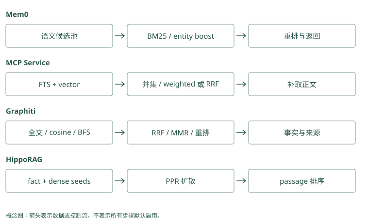

# 检索、重排与上下文预算

## 先用三条记录观察搜索会漏什么

Atlas 的记忆库有三条内容：

```text
A：Atlas 发布前运行 migration_check。
B：数据库结构变更完成后，才可更新线上服务。
C：Atlas 文档站使用深色主题。
```

用户问“Atlas 上线前要检查什么”。A 含项目名和发布检查，容易命中；B 没有 Atlas，也没有“上线”二字，但可能描述同一流程；C 有 Atlas，却和当前任务无关。搜索需要既找准字面对象，也识别不同说法，还要排除只碰巧同名的内容。

在比较相关性前，我们从登录身份确定用户和项目的可读范围。不属于这个范围的记录，不应进入可读候选。给一条记录打再高的相关分，也不能赋予访问权限。

### Mem0：A 能否入池由语义召回先决定

当前内部候选上限是 `max(limit * 4, 60)`。扩大语义池让弱语义但有字面信号的记录有机会被重新评分，但没有保证 A 一定进入。过滤先交给后端；到期记录还在构造 candidates 时排除。候选配额与有效结果配额不同，过期项也可能占据早期召回名额。

### Graphiti：事实边和原文不是同一个候选单位

基础查询可以找 A、B 对应的事实边；若需要完整段落，后续沿来源读 episode。分组通过 `group_ids` 传入，时间通过 `SearchFilters` 指定。搜索到 Atlas 配色边 C 只说明对象相符，必须继续评估关系用途，不能把项目匹配当成答案相关性。

## 关键词检索：认出具体词语

最直接的做法是找共同词。但“的”“项目”到处出现，不能和 `migration_check` 一样有辨识力。BM25 是一种全文排序方法，它大致奖励查询词命中，尤其重视不常见的词，同时避免长文仅因词多就占优势。

如果你问“migration_check 报错”，A 的精确名字通常很有帮助。错误码、函数名和配置键也适合这条路线。如果记录只写“迁移检查”，查询只写英文函数名，关键词路径是否命中就取决于分词和表达，不能假设它知道所有别名。

MCP Memory Service 使用全文索引形成独立候选，TencentDB 在没有远程 embedding 的配置下也能用词搜索。它们让字面强证据有机会出现，不要求先被语义搜索找到。

### Mem0：关键词分数经规范化参与池内排序

正文在写入时生成 `text_lemmatized`，查询也经 `lemmatize_for_bm25()` 处理；支持的后端执行 `keyword_search()`。`get_bm25_params()` 和 `normalize_bm25()` 将原始分数映射后交给评分器。后端返回空或不支持关键词时，这条信号弱化，但语义路径仍可运行；中文与代码标识符需单独测试。

### Graphiti：全文可以独立带回事实候选

`edge_search()` 按配置调用 `edge_fulltext_search(..., 2 * limit)`。全文候选保留在自己的列表里，随后与向量、可选 BFS 候选按 UUID 汇集。因而只在全文命中的 A 也能参加融合。索引分词和查询处理依 driver，称为 BM25 不代表所有后端对中文表达一致。

## 向量检索：把表达转换成可比较的数字

向量检索也常叫 dense retrieval。Embedding 模型把一段文字转换为数字向量。可以先想成文字在一个空间里的位置：“上线”和“更新线上服务”可能靠得较近，具体结果取决于模型和语境。

余弦相似度比较两个向量的方向。拿一个二维玩具例子，查询向量为 `(1, 0)`，候选为 `(0.8, 0.6)`，两者长度都为 1，相似度就是 0.8；候选若是 `(0, 1)`，相似度是 0。真实向量的每个坐标通常没有可直接命名的含义，这个算例只解释方向比较。

向量搜索可能把 B 找出来，也可能混入语义上接近却属于另一任务的内容。相似度高表达“看起来有关”，不是“这条事实已经验证”。项目名、时间和权限仍需单独处理。

### Mem0：query 与正文向量必须来自兼容空间

调用 `embedding_model.embed(query, "search")` 后，后端 `search()` 返回候选与分数。正文写入用 add 模式，检索用 search 模式，某些模型会区别处理；换 provider 时需保留这一约定。相似度只刻画表达关系，不能据 0.8 推断迁移原因有八成概率真实。

### Graphiti：按配置才需要查询向量

搜索总流程检查边、节点或社区配置是否启用 cosine，以及是否启用需要向量的 MMR，再决定生成 query embedding。纯全文配置可避免这项调用。事实 embedding 与节点 embedding 的用途不同，升级模型时应重建对应索引，不能只重新计算查询向量。

## 先合候选，还是只给已有候选加分

假设关键词搜索只找到 A，向量搜索找到 B 和 C。如果取两路并集，A、B、C 都有机会参加后续排序；如果先限定向量池，再按关键词加分，A 没入向量池就无法被补回来。

这正是 MCP 和当前本地 Mem0 路径的一处区别。MCP 的 hybrid，也就是混合检索，会合并全文和向量的候选。Mem0 先多取一些语义候选，再用关键词和实体信号调整这个池里的分数。两者都利用多种信号，但能看见的内容不同。

因此，找不到 A 时先检查它有没有进候选集合。对池外记录，无论重排多聪明都无从评分。Hippo 的池内图排名与池外图邻居补充也应这样区分，图的具体例子见第 11 章。

### Mem0：逐行查看 candidates 的来源

构造集合的循环只遍历 `semantic_results`。关键词命中被整理成按 ID 查的 `bm25_scores`，实体信息成为 `entity_boosts`；两者给集合内记录加信号。A 即使在这两个字典里，没有进入 semantic 集合也不会得到最终输出。调融合权重无法突破这个控制流边界。

### Graphiti：先保留各路列表，再构造 UUID 并集

`edge_uuid_map = {edge.uuid: edge ...}` 汇集各路候选。RRF 使用各列表中的 UUID 名次投票，再从 map 取正文。重复边只占一个身份，但来自多路的排名都可贡献。BFS 是否执行由配置决定，基础 edge RRF 配方并未默认加入图遍历。

## RRF：用名次合并，避免直接相加不同分数

BM25 的 12 分与余弦的 0.8 不在同一量尺上。RRF（倒数排名融合）用每路的名次投票，不直接相加原始分数：

```text
每路贡献 = 1 / (k + 本路名次)
总分 = 各路贡献相加
```

取教学常量 `k=60`，一条记录在关键词第 1、向量第 4，总分约为 `1/61 + 1/64 = 0.0320`。另一条只在向量第 1，总分约为 `1/61 = 0.0164`。第一条得到两路支持，因此这次会排得更高。

MCP 支持这种融合及其他加权方法，Graphiti 也可以通过配置选择 RRF。Hippo 融合后还会结合寿命和价值等因素。常量与额外因子要按实际配置看，刚才的算例不是三个项目共同的默认输出。

### Mem0：当前 score_and_rank 不是 RRF

这条路径输入的是语义评分、规范化关键词分数与实体 boost，按实现的多信号规则计算结果。不能给它套 `1/(60 + rank)` 并声称重现了本地算法。若应用想验证 RRF，需要独立取得各路候选并实现融合，与现有路径使用同一数据和预算比较。

### Mem0 的评分算例：先过语义门，再合信号

[评分实现](../../sources/repos/mem0/mem0/utils/scoring.py) 还有一处容易遗漏的控制条件：`threshold` 先作用于原始 semantic score，未过门槛的候选直接跳过。即使一条记录已经在语义池中，关键词分数和实体 boost 也不能救回低于门槛的项。这与对最后 combined score 应用阈值是不同策略。

BM25 通过 sigmoid 规范化。若 query 归一后不超过三个词，当前参数为 midpoint=5、steepness=0.7；原始 BM25=5 时得到 0.5，原始分数更大时趋近 1。词数变多会改变参数，因此不同 query 的原始 5 分不能直接解释为相同强度。

假设候选 A 的 semantic=0.8、规范化 BM25=0.5、entity boost=0.2，三种信号都活跃时，最终为 `(0.8 + 0.5 + 0.2) / 2.5 = 0.6`。除数由整次查询是否有非空关键词和实体信号决定，不是每条候选分别决定。若候选 B 没有关键词与实体命中，semantic 仍为 0.8，它在同一次查询中为 `0.8 / 2.5 = 0.32`。这让多信号支持改变排序，但不是校准后的事实可信度。

若 threshold=0.1，而 A 的 semantic 只有 0.09，它在相加之前就被丢弃。调大实体权重没有效果。可以通过 `explain=True` 看通过门槛的记录的原始、组合及归一分值，但被丢弃项需要另外记录原始候选。查分数异常时，还要确认后端的 semantic 分数尺度适合当前实现假设。

### Graphiti：RRF 是可选择的明确 reranker

`EdgeReranker.rrf` 把各路结果转换为 UUID 排名列表，调用 `rrf()`，再应用分数和结果限制。名次融合解决分数尺度问题，不验证事实和来源。一条在全文与向量都排名高的旧默认，仍需要时间条件才能退出当前结果。

### Graphiti 的实际常量为什么不能照搬教学公式

[本地 rrf 函数](../../sources/repos/graphiti/graphiti_core/search/search_utils.py) 默认 `rank_const=1`，循环使用从 0 开始的 i，贡献是 `1 / (i + rank_const)`。换成从 1 开始的名次 r，默认贡献就是 `1/r`。前面用 k=60 的算例介绍常见融合思想，并非这个快照的默认常量。

如果边 A 在全文第 1、向量第 4，当前默认得分为 `1 + 1/4 = 1.25`；边 B 只在向量第 1，得 1。头部名次影响明显，不能用 0.0320 与本地结果逐条对比。RRF 输出也可能超过 1，所以不能按概率解读。搜索层接着应用结果限制和可选最小分数，之后才交回调用方。

两种方法控制候选的方式不同。Mem0 在语义池内先检查语义门槛，再合分；Graphiti 的边 RRF 把各路 UUID 合起来，全文单路强命中仍能参加。选哪个应看你的错误码、同义表达与实体问题，尤其比较遗漏是在入池之前、门槛阶段还是最后截断。

## 重排和打包各做什么

重排器再次读查询与候选正文，判断更细的相关性。Cross-encoder 把问题和一条候选一起送进评分模型；Jev 这类服务也可给候选提供判别信号。它们能把 C 降下去，不能自动找回未进入池的 A，也不能绕过权限。

按排序取前 k 条通常叫 top-k，它限制条数，不限制总长度。排序后还要打包。假设留给记忆的预算是 300 token，A 需要 80，B 需要 260，它们一起就超额。程序可以只放 A，或取 B 中有来源的必要片段，但不能仅因为 `top_k=2` 就把两条全文强塞进去。这里的数字是假设目标 tokenizer 已经算出的值。

固定偏好也不必每次搜索。Memobase 可以直接读画像，Letta 的核心记忆已经随输入出现，Basic Memory 在已知笔记 URI 时直接打开。检索方式应服务于“本次需要哪些信息”，而不是让所有信息都经过同一个向量 top-k。

### Mem0：配置与调用开关共同决定重排

初始化时 `RerankerFactory` 创建配置的重排器，但搜索还需传 `rerank=True`。当前外层在已生成的 `original_memories` 上调用重排，所以底层 limit 已排掉的记录不会被补回。重排异常时保留原结果并记录错误；应用应另记录降级状态，而非以为这次一定使用了模型重排。

### Graphiti：cross-encoder 前先做 RRF 截断

边 cross-encoder 路径先对各路候选 RRF 排序，取最多 `2 * limit` 条事实再评分。它重新读 query 与 fact，但截断之前被丢掉的边也不会回来。`fact_to_uuid_map` 按事实文本映射 UUID，重复文本边的返回行为值得检查。之后的 token 打包仍由调用方负责。

## 怎样从“搜不到”一步步定位原因

假设 A 已经保存，最后却没有进入输入。先直接按 ID 读取，确认记录存在且属于当前可读范围。如果用户或时间条件把它排除了，修改相似度权重没有意义；应检查作用域是否设置正确，或它是否确实已经失效。搜索漏掉一条无权读取的记录，本来就是正确行为。

若 A 在可读范围内，再分别查看关键词和向量的候选。关键词可能因为中文分词、函数名写法或别名不同而漏掉；向量可能因为正文太短、项目名缺失或模型不适合该语料而漏掉。两路都漏时，融合没有可用材料。只有至少一路找到 A，并且融合确实允许该路补候选，它才可能进入重排。

进入候选仍不代表进入最终输入。假设 A 排第六，应用只取五条，问题发生在排序截断；假设 A 排第一但全文太长，被预算打包跳过，问题发生在打包。前者可以比较重排，后者需要决定是否取带来源的必要片段，或者调整记忆与其他输入的配额。扩大 top-k 只会改变其中一个边界。

### Mem0：explain 解释评分，不能解释全部遗漏

`search(explain=True)` 可返回 `score_details`，适合核对关键词与实体是否改变某条入池记录的分数。池外 A 没有评分分项，因此还要记录后端语义和关键词原始 ID。用 `get(A)` 核对存在性后，再逐层比较 filters、池、阈值和最终 limit，避免把不存在与低排名混为一谈。

### Graphiti：分对象观察 SearchResults

`search_()` 返回 edges、nodes、episodes、communities 及对应 reranker 分数。节点 Atlas 被找到，不等于批准事实边也被找到。检查 config、每路原始 ID、UUID 并集、重排输出和来源展开；若只有节点结果，先修读取对象，不急着调余弦阈值。

## 留给记忆的预算要从完整调用里算

模型窗口同时容纳系统规则、当前消息、工具结果、记忆和输出。假设一个教学调用允许总计 8,000 token，已有输入占 4,000，计划预留 2,000 给回答，再留 1,000 给后续工具结果，剩下的记忆空间只有 1,000。这些数字不是推荐配置，而是说明不能把整个窗口都当成搜索结果的容量。

在这 1,000 token 内，十条同义发布教训通常不如一条明确规则加一份具体失败证据。去重因此也属于上下文打包：它让有限空间覆盖不同的必要信息。对于批准人这样的多跳问题，A 和 B 构成一组证据；仅放排名更高的 A，虽然句句相关，却无法回答。打包可以考虑证据组合，而不只是逐条选最高分。

如果怎么压缩都装不下必要证据，可以让 Agent 分步读取，或者告诉用户证据不足。没有必要为了填满预算，把不相关的记录补到末尾。预算控制的目标是留下足够支持当前判断的内容，同时给工具和回答保留空间。

### Mem0：source metadata 也占输入长度

应用取 `memory` 后若补项目、来源、置信度和安全 framing，应把完整字符串一起送目标 tokenizer。多条相同规则可以合并展示来源，但不能在合并时丢掉任务例外。对必要证据组保留固定预算，对可选背景再按评分填充；这些都是 SDK 之外的 assembler 工作。

### Graphiti：短 fact 与长 episode 可以分级读取

正常任务先给带时间的事实；遇到归因争议再读相应 episode。这样节省输入，但需要显式记录事实是否已经核验。若 query 要求批准链，应一起保留两条事实及支持来源，不能因为单条关系排名高就挤掉链上另一条必要边。

## 动手检查

给 A、B、C 分别写下：有没有进入候选池、排序在第几、有没有被装入输入。假设系统最后回答只谈深色主题，你会先查哪一栏？

答案提示：先确认 A 和 B 是否在池里，再看 C 为什么排高，最后看实际打包的内容。每栏解决一个不同问题；仅把 `top_k` 从 5 改为 20，可能只让更多无关内容进入模型。

<details class="implementation-notes">
<summary>实现笔记与源码对照（选读）</summary>

## 检索不是一个 cosine 调用

成熟检索通常分四步：

```text
scope/filter → 多路候选 → fusion/rerank → context packing
```

第一步必须先做权限、主体、时间和类型过滤。若先全库近邻搜索再过滤，既浪费候选配额，也可能产生侧信道。

<figure class="concept-diagram" tabindex="0">
<svg viewBox="0 0 760 255" role="img" aria-labelledby="retrieval-title retrieval-desc" xmlns="http://www.w3.org/2000/svg">
<title id="retrieval-title">受权限约束的记忆检索管线</title><desc id="retrieval-desc">先按租户、用户与有效时间限定候选；再并行全文、向量、实体检索；接着融合与重排；最后按上下文预算打包并保留来源。</desc>
<g fill="none" stroke="currentColor" stroke-opacity=".42" stroke-width="2"><path d="M170 106h36m152 0h36m152 0h36"/><path d="m198 99 8 7-8 7m188-14 8 7-8 7m188-14 8 7-8 7"/></g>
<g fill="none" stroke="currentColor" stroke-width="2"><rect x="12" y="55" width="158" height="102" rx="8"/><rect x="206" y="55" width="152" height="102" rx="8"/><rect x="394" y="55" width="152" height="102" rx="8"/><rect x="582" y="55" width="166" height="102" rx="8"/></g>
<g fill="currentColor" font-size="17" font-weight="600" text-anchor="middle"><text x="91" y="91">范围过滤</text><text x="282" y="91">多路召回</text><text x="470" y="91">融合重排</text><text x="665" y="91">预算打包</text></g>
<g fill="currentColor" fill-opacity=".7" font-size="13" text-anchor="middle"><text x="91" y="125">租户 · 主体 · 时间</text><text x="282" y="125">全文 · 向量 · 实体</text><text x="470" y="125">去重 · 相关性</text><text x="665" y="125">证据 · 来源 · 限额</text></g>
<path d="M91 170v23h573v-23" fill="none" stroke="currentColor" stroke-opacity=".42" stroke-width="2"/><text x="378" y="222" fill="currentColor" font-size="14" text-anchor="middle">作用域由可信身份确定；记忆内容只是证据，不是指令</text>
</svg><figcaption>图：先限制可见范围，再召回和排序，最后把证据送入上下文。</figcaption>
</figure>

## 多路候选

- **BM25/全文**：精确术语、错误码、函数名、专有名词强。
- **Dense embedding**：同义表达、抽象意图强。
- **实体匹配**：人、项目、服务、产品等稳定锚点。
- **图遍历**：关系、多跳、来源追溯强。
- **时间过滤**：当前状态、历史状态、即将发生事件。
- **直接读取**：用户画像或固定 core memory 不应每次走向量检索。

同样写着 hybrid，项目实际候选边界并不相同：

- **Mem0** 本地 `_search_vector_store()` over-fetch 语义候选，计算 keyword 与 entity boost 后给语义池排序。BM25-only 命中未必进入最终集合，不能把三信号评分写成三路并集召回。
- **MCP Memory Service** 的 SQLite hybrid 并行取 BM25 与 vector 各两倍候选，按 content hash 并集融合，并回取只有 BM25 命中的正文。这能补语义漏召回，但各路过滤和 query 分词还要独立测试。
- **Graphiti** 在不同 search configuration 中组合 edge/node/episode 的语义、全文与图遍历，返回关联事实与来源。图扩展用来补连接证据，不等于证明边内容真实。
- **HippoRAG** 先找相关三元组，把主体/客体和 dense passage 作为图种子，再用 PPR 给 passage 排序。它通过扩散产生关联收益，与简单合并两个 top-k 不同。
- **Basic Memory** 搜索定位笔记，再从 URI 展开 observation 与关系邻域；已知路径时可以直接读。**A-MEM** 先近邻后尝试补 links 邻居，但本地最终 k 截断可能挤掉邻居。
- **MemoryOS** 先检索主题 session 再给 page 排序，同时检索长期知识；**Memobase** 稳定 profile 直接获取，事件另搜；**Letta Code** core 已在 prompt，详细文件和 recall 由 Agent 主动读。
- **MemOS** 文本 backend 与插件可使用图/向量或 FTS5/向量路径，activation/parametric 不走同一种文本检索。**TencentDB** 在授权资产与 Loadout 内召回，无 embedding 的 standalone 仍可用 BM25。**Cognee** 根据数据与调用配置选择 retriever，不能把所有 recall 都当相同 top-k。
- **Hippo** 本地搜索结合相关性、strength 与可选 reranker；**Hermes Jev Skills** 只处理已有候选；**Beacon** 提供 trace 供下游提取，本身不替代上述检索层。

完整源码路径与限制见 [事实路线](10-fact-profile.md)、[图谱路线](11-graph.md)、[生命周期](12-memory-os.md)、[接入路线](13-integration.md) 和 [Jev](16-jev.md)。

## Fusion 与 rerank

不同检索器的原始分数不可直接相加。常见方法：

- Reciprocal Rank Fusion：只依赖名次，稳健且便宜。
- 归一化加权：便于注入 recency、importance、confidence。
- Cross-encoder：查询与候选成对评分，质量较好但增加推理。
- LLM/判别模型：可判断证据充分性、注入风险、时间匹配，但成本和故障面更大。

RRF 的教学公式是 `score(m) = Σ 1/(k + rank_i(m))`，只累计候选在各路出现的名次，不直接相加 BM25 与 cosine。比如 m 在关键词第 1、向量第 4，另一条只在向量第 1，前者可因两路支持得到更高分；常量 k 调节头部名次差的影响。MCP Memory Service 在此基础上还支持 consensus boost，因此实际结果要按配置复现。

Mem0 则对语义候选结合 BM25 与 entity boost 评分，不应称其本地路径为 RRF。Hippo 可用本地 cross-encoder 逐对评分，或 Jev 对有限候选批量打概率；Hermes 还单独判断注入风险与充分性，云判别异常时保留受本地检查和预算约束的回退。融合、相关性重排和安全过滤是三个操作，消融实验应分别开关。

`top_k=5` 不是设计。应记录候选生成 recall、rerank NDCG/MRR、最终证据命中和任务成功，才能知道错在哪一层。

## Context packing

排序之后仍需打包：

1. 去掉互相重复的候选。
2. 保留来源和置信度。
3. 为核心约束、当前任务、背景知识设置分区预算。
4. 尽量保留原文；摘要必须能回到来源。
5. 显式提示“记忆是证据而非指令”。

Hippo 的一个 Jev 实验报告称，Jev 排名前两条能达到本地 cross-encoder 前五条相近的答题效果，但三项 graded test 没证明最终答案率更高。它说明 rerank 可能首先改善**上下文长度**，不必然改善任务正确率。

## 项目的预算具体放在哪里

Letta 的根文件大小决定每次都支付的 core token，子目录/recall 只有读取后才进入窗口；Memobase 通过短 profile 避免每次加载全事件；MemoryOS 用 page queue 容量控制条数，但还需要 token 限额。Hippo 有 recall token budget，Jev 实验则用更少候选尝试维持答案质量。

MCP hybrid 的 `n_results`、Graphiti 的搜索 limit、Basic Memory 的 depth/max_related、HippoRAG 的 passage 数都是中间预算，不自动等于最终 token。TencentDB Proxy 区分高层注入与低层工具读取，减少反复膨胀前缀；Hermes 的截断限制只约束云判别可见字符，最终读取原文仍可能很长。无论选哪个项目，context assembler 都应统一计数、去重、保留来源，并为工具结果与回答预留窗口。

## 何时图检索值得

如果查询主要是“用户喜欢什么”“上次决定是什么”，平面事实库通常足够。以下情况图开始产生收益：

- 需要多跳关联；
- 同一实体在多来源出现；
- 关系随时间变化；
- 要追踪事实来源和冲突；
- 需要沿项目、服务、人员、决策组织共享上下文。

图不是免费午餐。实体抽取、消歧、边去重和图数据库运维都会增加写入成本。先用失败查询证明单点检索不够，再引入图。

## 把 fusion、rerank、扩展与打包分别比较

### Graphiti：配置决定检索对象和重排方法

[`search/search_config.py`](../../sources/repos/graphiti/graphiti_core/search/search_config.py) 为 edge/node 提供 cosine、BM25、BFS，为 episode 提供 BM25。各对象的候选列表按 UUID 合并，可用 RRF；cross-encoder 路径先 RRF，再取有限事实文本逐对评分。MMR 则以相关性与已选内容相似度的折中避免大量同义事实，node distance 用到中心节点的距离，episode mentions 参考来源引用。这些不是同时默认执行，选择 configuration 时应记录哪种对象、哪些路、哪个 reranker。

### Hippo：同一池内排名融合后还乘生命周期系数

[`src/search.ts`](../../sources/repos/hippo-memory/src/search.ts) 默认 blend，可选 `scoring='rrf'`。BM25 与 dense 对已传入的 entries 排名，RRF 结果之后还乘 strength、recency 和其他 scope/outcome/path 因素。分数变化不能都归因于 embedding。可选 graph stream 把 BFS 邻近的池内记录变成第三路 ranking；缺文档向量、空图或无有效图路时不加入这一路，而不是给空列表随意加常数。另一个 graph recall 机制可能补池外邻居，不能与池内 graph stream 混同。

### TencentDB 与 MCP：都能融合，过滤作用域不同

TencentDB 的候选 helper 优先后端 native dense/sparse hybrid，否则并行 FTS/client-vector 再 RRF。若后端只有词搜索，则不浪费 embedding 调用。用户跨会话搜索与写入阶段同 session 去重可以复用检索算法，但不能复用错 scope。MCP 的 SQLite hybrid 也将两路候选并集，但其 hash 补取与 superseded 条件应分别测 weighted/RRF 分支，两者没有共享身份系统。

### 关联和直接读取：不应硬套 RRF

HippoRAG 的 PPR 把 query seeds 传播到 passage，再读 passage 分数；A-MEM 在近邻后补 link；Basic 从笔记/URI 展开关系。它们增加连接证据的方式不同。MemoryOS 的两阶段主题/page 与 Memobase 直接 profile，减少需要全库搜索的内容；Letta 更依赖 Agent 主动发现文件/recall，搜索未被触发也会失败。

Cognee 的 session lexical 与不同 graph/chunk/Skill retriever，MemOS 的 backend/插件，以及 Hermes 的 relevance/injection/sufficiency 都说明：相同 recall 名字可能经过不同支路。Beacon 是供给原始 trace 的入口，不能当作同类 retriever。最终统一验收应问“期望证据是否在可见池、是否被选、是否装入、是否真的被用”。

</details>

<figure class="concept-diagram" tabindex="0"><figcaption>图：每行返回证据的边界不同；相同 hybrid 标签不表示相同算法。</figcaption></figure>

<details class="comparison-reference">
<summary>项目对照速查（选读）</summary>

## 本章对照结论

| 项目 | 候选怎么来 | 排序/扩展怎么做 | 预算与特殊盲区 |
|---|---|---|---|
| Mem0 | 语义 over-fetch 池 | BM25/entity boost、可选 reranker | keyword-only 可能不入池；应用打包 |
| Memobase | profile 直接读 + event 搜索 | 字段已在写入阶段整合 | 不同读取路径不能共用 top-k 指标 |
| Graphiti | edge/node 全文/cosine/BFS；episode BM25 | RRF/MMR/距离/mentions/cross-encoder 可选 | search limit 非 token；配置需明确 |
| Cognee | route 选 session/chunk/graph/Skill 等 | 各 retriever 自己组织结果 | 返回证据与生成答案要分开 |
| HippoRAG | fact candidates + dense passage seeds | fact filter、PPR passage 排序 | 图错误扩散；reader 与 passage 数独立 |
| MemoryOS | 主题 session 再 page；并行长期知识 | 阈值、page heap | 上层主题漏召回；条数非 token |
| MemOS | textual backend/插件 | 图/向量或 FTS/vector 依配置 | KV/LoRA 不按同一文本流程 |
| Hippo | 本地 entries 的 BM25/dense | blend/RRF、生命周期系数、可选 graph/reranker | 池内排名与池外扩展不同 |
| A-MEM | Chroma 近邻 | 补 links 邻居 | 最后 k 截断可能丢邻居 |
| Letta Code | core 常驻、索引发现、recall/file tools | Agent 决定继续读或回答 | 没触发工具便没有证据 |
| Basic Memory | 搜索或 URI 确定笔记 | observation + 限深关系邻域 | depth/limit 仍需 token 上限 |
| MCP Memory Service | FTS 与 vector 候选并集 | weighted 或 RRF、共识 boost | 各路过滤、全文 query 语义 |
| TencentDB | native hybrid 或 FTS/vector；资产集合 | RRF 与 L2/L3/Skill/Knowledge 读取 | ACL/Loadout、注入缓存、scope |
| Hermes Jev Skills | 调用方已经产生的候选 | relevance/injection 与 sufficiency | 截断/未判别、分支各限 top-k |
| Agent Beacon | trace 查询供下游 | 不据此认定它完成 memory rerank | 需另设提炼与 assembler |
| MemGPT / 旧 Letta | 论文 recall/archival 工具 | 模型主动选择搜索 | 不是当前 SDK 的固定检索算法 |

</details>

