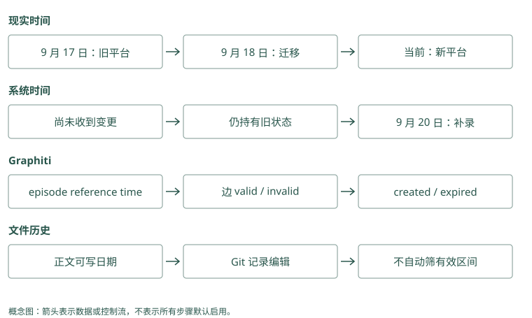

# 时间、冲突与知识图谱

## 两句话相反，也可能都曾经正确

9 月 10 日，Atlas 默认部署到测试环境。9 月 18 日，团队改为默认预发布。9 月 20 日，助手才收到关于变更的消息。

现在问“Atlas 默认在哪部署”，应回答预发布；问“9 月 15 日默认在哪”，应回答测试。我们不能仅保存一个最新值，也不能把两条记录同时扔给模型却不解释日期。

先写成两个有效区间：

```text
测试环境：从 9 月 10 日起，到 9 月 18 日前有效。
预发布环境：从 9 月 18 日起，目前没有确认结束日期。
```

在程序里常用左闭右开的区间。`[10 日, 18 日)` 表示包含开始、不包含结束，这样 18 日切换时不会让两个默认同时成立。

“9 日由 Lin 批准”“18 日起由 Mei 批准”，历史问题查 15 日应选 Lin，当前问题可能选 Mei。Mem0 的到期时间是控制何时不再展示一张卡，不完整表达它在现实中何时成立。Graphiti 的关系可以保留开始与结束时间；搜索时应用仍需把目标日期明确带入，不能只拿分数最高的关系回答。

### Mem0：到期隐藏与现实有效区间不同

当前支持 `expiration_date`，搜索与列举默认隐藏到期 payload，可用 `show_expired` 查看。它表达一条记录何时退出常规视图，没有自动表达测试从 10 日到 18 日有效、预发布从 18 日生效的两段历史。`timestamp` 顶层参数在这个 OSS 快照会被拒绝，不能照搬托管时间接口。

### Graphiti：当前视图需要明确时间过滤

事实边保存 `valid_at` 与 `invalid_at`。业务要求时点 t 有效，通常需 `valid_at <= t`，并满足 `invalid_at` 为空或大于 t；缺开始时间的关系需另外定义策略。`SearchFilters` 提供日期比较，但调用默认空过滤不能等同于自动完成所有当前状态筛选，必须核对所选查询和后端。

## 有效时间和录入时间分别回答什么

有效时间回答“现实中什么时候成立”。录入时间回答“系统什么时候知道”。在这个例子中，新默认的有效时间从 18 日开始，系统知道它却是在 20 日。

因此还有另一个问题：“9 月 19 日，助手根据当时知道的信息会怎样回答？”它那时可能仍认为默认测试。这个回答反映系统当时的知识，不等于真实世界的状态。

同时保留两条时间轴的思路叫双时间。Graphiti 的事实边用 `valid_at/invalid_at` 表达有效区间，还保留创建、过期等系统时间和来源。具体怎样按两种时间查询，要看搜索过滤与应用实现，不能只见到字段就假设所有历史接口已经齐备。

Mem0 的 `created_at` 说明写入时间，不能代替 18 日这个现实变更时间。Letta 或 Basic 的 Git commit 也是一次文字变更的时间；文字可以写“18 日生效”，但 Git 不会自动懂得这个区间。

### 把 Graphiti 的“某日有效”写成实际过滤

下面给出本地 `SearchFilters` 的构造示例，假设我们只接受开始时间已知的边，查询 9 月 19 日有效的关系。它展示参数与布尔语义，不是保证所有后端都已通过本书实测：

```python
from datetime import datetime, timezone
from graphiti_core.search.search_filters import (
    SearchFilters, DateFilter, ComparisonOperator,
)

t = datetime(2026, 9, 19, tzinfo=timezone.utc)
at_time = SearchFilters(
    valid_at=[[
        DateFilter(date=t,
                   comparison_operator=ComparisonOperator.less_than_equal)
    ]],
    invalid_at=[
        [DateFilter(comparison_operator=ComparisonOperator.is_null)],
        [DateFilter(date=t,
                    comparison_operator=ComparisonOperator.greater_than)],
    ],
)
# graphiti 已配置模型与图后端，groups 来自可信授权结果。
# edges = await graphiti.search(
#     "Atlas 默认部署环境", group_ids=groups, search_filter=at_time
# )
```

每个日期字段的外层列表表示 OR，内层表示 AND；不同字段条件再一起约束查询。这里就是开始不晚于 t，并且结束为空或晚于 t，保证左闭右开。若新边从 18 日生效、旧边在 18 日结束，19 日选择新边；把 t 改为 15 日则选择旧边。

如果允许 `valid_at` 为空，需另加 OR 分支或定义未知时间策略。未知不是自动有效：高风险任务可以要求核实。这个例子仅查现实有效时间；要问“19 日系统当时知道什么”，还要限制 `created_at` 和系统过期状态，并确认保存方式能还原那个版本。两条时间轴不能用一组 valid 条件代替。

Mem0 的高级 metadata 过滤可以筛选你自行维护的业务日期，但普通 `search(reference_date=t)` 在本地 OSS 会被拒绝。即使后端支持日期比较，应用还需维护新旧记录的结束条件，查询才有正确数据可筛。传入日期参数与实现完整时间语义之间，还有写入裁决和版本保存两段工作。

18 日才收到“12 日已更换批准人”，录入日是 18 日，业务生效日是 12 日。Mem0 卡片创建时间回答何时进库，应用另存生效信息。Graphiti 的 reference_time 给“昨天”“以后”提供解释基准，不保证所有关系都在材料收到时生效。先把相对日期转换成可核对日期，再检查关系的时间字段。

### Mem0：created_at 不能被当成业务生效日

写入时若没有提供创建值，payload 使用当前 UTC；update 保留原创建时间、更新 `updated_at`。应用可另存 `effective_from` 等业务字段，但需要查询和版本逻辑配合。补录消息不能通过伪装系统创建时间来代替有效时间，否则既丢失录入审计，又未建立正确历史语义。

### Graphiti：reference_time 是相对表达的锚点

Episode 的 `created_at` 来自本次处理时间，`valid_at` 来自 `reference_time`。边提取把该锚点与前序材料交给模型，将“前天”转换为日期；边的现实有效时间仍要看原文。20 日录入“18 日切换”，不能把整份 episode 的时间机械复制到每条边上。

## 三种“冲突”要采取三种动作

**状态变化**：旧默认测试，新默认预发布。我们关闭旧有效区间，保留历史。**来源分歧**：一份值班记录说已切换，另一份说尚未切换。我们保留两份来源，标明分歧，不能凭哪个更新就删掉另一个。**提取错误**：用户说“仅这次预发布”，系统写成“今后默认预发布”。我们应纠正派生事实，回到原话核对。

这些情况语义不同，仅靠文字相似度很难区分。MCP Memory Service 的可选矛盾检测使用相似度区间等启发式，能发现需要检查的相关记录，却不等于已经证明它们互相否定。Hippo 的纠正与替代关系也应和价值衰减分开，旧规则价值低不代表它当时不成立。

同一句“由 Mei 批准”可能是更换批准人，也可能只针对某次演练。Mem0 追加文字后，需要应用或读取逻辑保留这项区别；Graphiti 解析模型也须先判断是否与旧默认矛盾，才决定结束哪条旧关系。日期字段记录裁决结果，不能替代对两句话适用范围的理解。

### Mem0：追加保留分歧，裁决仍需应用

两份相反陈述可能各自追加到事实库。`update()` 能显式改正文，却没有替调用者证明哪份来源可信。应用应先标记报告与验证，再决定替代；错误提取需回原事件重新生成。把创建时间最近的事实强行当真，会混淆状态变化、补录和来源分歧。

### Graphiti：时间关闭只作用于已判为矛盾的候选

`resolve_extracted_edge()` 判断重复与矛盾，`resolve_edge_contradictions()` 再检查时间窗口。两区间不重叠时跳过；旧开始早于新开始且确有替代时，把旧 `invalid_at` 设为新 `valid_at`，`expired_at` 记处理时间。时间函数不负责独立判断语义否定，前面的模型裁决仍可能出错。

## 为什么时间图里还需要认出“同一个 Atlas”

把事实写成关系，可以得到：

```text
Atlas --默认部署到--> 测试环境
Atlas --默认部署到--> 预发布环境
```

每条关系带各自日期和来源。若新消息把 Atlas 写成“Atlas 服务”，系统要判断是不是同一对象。这叫实体消歧或 entity resolution：为各种名字确定规范身份。

合并太少会把一个项目拆成多个小图；合并太多会把两个团队的同名项目串起来。Graphiti 在建图时解析实体身份和关系冲突，所以我们应给它同名但不同团队、别名、补录日期等输入做检查，而不是只看图画得好不好看。

Cognee 可以按数据结构定义抽取这些关系，HippoRAG 可以沿连接找跨段证据。它们并不因此默认采用 Graphiti 的时间维护方式。先问要解决“第二跳在哪”还是“当时哪个值有效”，才能选对机制。

Alice 与 Bob 的项目都叫 Atlas，文字相同但不能共用批准人。Mem0 的实体关联帮助找涉及某个对象的卡片，仍需正确范围。Graphiti 若把两个 Atlas 合成同一编号，边就接到同一对象，错误会延伸到后续查询。身份解析的结果要看编号与来源，不能只看显示名称。

### Mem0：实体关联使用规范文本和近邻匹配

批量链接先对实体名字规范化，优先找精确匹配，否则接受达到实现阈值的语义候选，再合并 `linked_memory_ids`。身份范围参与搜索，但业务项目别名和同名团队仍需仔细限定。错误关联会给别的 Atlas 事实加分，虽未修改正文，也会改变后续检索。

### Graphiti：UUID 映射直接改变关系端点

实体 resolution 比较新对象与已存对象，合并后把临时 UUID 映射到规范 UUID。边抽取结果经映射修正，避免 Atlas 与 Atlas 服务分裂。若把两支团队合并，批准与部署关系也跟着串线，错误比单条 boost 更具结构性；回归题应核对端点，而非只看显示名。

## 晚到的消息为什么不能只按最新一条处理

继续沿着日期推演。19 日有人问默认环境，系统还不知道 18 日的变更，于是回答测试。20 日补录消息后，如果重新问“19 日现实中默认哪里”，应回答预发布；如果问“19 日助手为什么回答测试”，则应解释当时尚未收到变更。两个问题都提到 19 日，却分别查询现实状态和系统当时的认知。

只有有效区间时，可以纠正对现实历史的回答；要解释过去一次决策，还需要当时可用的记录视图。完整的双时间查询不能仅靠两列日期名实现，还要有保存旧系统版本和执行对应筛选的规则。这里可以先掌握业务问题，再检查所选框架究竟支持哪一种查询，不要求起步就实现全部历史能力。

假设 20 日消息又补充：“其实 18 日只改了欧洲区，其他区域仍默认测试。”这不是把所有预发布记录改回测试，而是发现先前记录的范围过宽。应把区域条件补进事实，核对原来源，并纠正受影响的派生结论。时间、身份和适用范围共同决定一条事实是否回答了当前问题，最新时间只能解决其中一部分。

用户 20 日补录“12 日默认已改预发布”，另一条 19 日收到的消息仍讲测试。按最后入库时间选值会出错。Mem0 需要应用保留原事件和业务版本；Graphiti 即使保存了关系有效期，也要区别“当时现实是什么”与“我们当时已知道什么”。后一个问题还涉及录入时间和历史观察方式。

### Mem0：历史回答需要外层事件和版本

`history()` 可解释某张事实卡何时被更新，却未提供任意业务时点的完整知识视图。19 日用到了旧默认，应用需保存那次请求实际取到和注入的 ID、版本，才能解释当时决策。仅在 20 日把当前文本改好，无法重建全部过去输入。

### Graphiti：双时间字段没有免除查询设计

`expired_at` 保留系统何时使旧边过期，支持分析晚到纠正；但任意“当时知道什么”查询还需结合创建、过期与实际保存版本。抽取器修正节点摘要后，当前 summary 也未必能还原旧摘要。解释一次历史决策时，仍应保留实际候选和输入快照的必要标识。

## 单次例外不会自动结束长期规则

“今天为了复现仍用测试”与“以后默认预发布”可以同时成立，因为前者描述一个任务，后者描述默认选择。默认的含义就是没有更具体条件时采用的值。读取时应先找当前任务的显式要求，再在没有例外时使用长期默认，而不必宣布两条记忆冲突。

同样，“Atlas 由平台组维护”和“Atlas 的移动端由客户端组维护”也可能同时成立。若图里所有维护关系都被当作唯一值，新边就可能错误地关闭旧边。定义关系时需要知道它是否允许多个对象、是否按区域或组件细分。实体抽取模型只能依据输入和结构作判断，应用仍需提供这些业务约束。

当两份来源确实对同一范围、同一时间给出相反陈述，可以返回分歧并请求核实。保留不确定状态，比从两个相近分数中挑一个“真相”更可靠。对即将执行的正式发布，核实当前配置或询问授权者，通常比让历史记录自行裁决更合适。

“今天测试”可以作用于演练任务 T1，“以后预发布”作用于项目长期默认。Mem0 的 scope 表示存取范围，应用要规定当前任务记录如何覆盖一般默认。Graphiti 可用任务对象或关系条件保留 T1，不让它结束项目默认边。连的是哪个对象、谈的是哪种用途，要在裁决冲突前确定。

### Mem0：任务 scope 与长期 scope 要有明确读取关系

本次测试环境可以带任务范围，长期预发布默认放项目范围。读取时先处理当前显式例外，再读取默认；不能随意把全部规则都锁进 run_id，否则下一会话会看不到长期约束。scope 选择应对应生命周期，SDK 不会自动把任务事实提升为项目默认。

### Graphiti：关系签名不能忽略组件和情境

默认部署与本次演练应使用不同关系或保留任务限定属性。若都抽成唯一的“Atlas 部署到”，模型可能将例外当作替代。通过任务节点、组件属性或定制 edge schema 表达边界，再检查 resolution 是否关闭了不该关闭的默认边。

## 动手检查

用户 20 日告诉你：“18 日已经切换；不过今天为了复现问题，仍用测试环境。”写下当前默认、当天例外、系统获知日期。若只取创建时间最新的记录，会发生什么？

答案提示：默认预发布从 18 日生效；20 日测试是任务例外；20 日是这次获知时间。把所有内容按录入时间排序，可能把当天例外误判成新的永久默认。

<details class="implementation-notes">
<summary>实现笔记与源码对照（选读）</summary>

## 为什么时间是一等公民

“用户住上海”和“用户住杭州”可能都正确，只是有效时间不同。只保留最新值无法回答“去年住哪”；两条都返回又会让模型困惑。

最小做法是有效时间：

```text
fact: Alice lives_in Shanghai, valid=[2024-03, 2026-01)
fact: Alice lives_in Hangzhou, valid=[2026-01, ∞)
```

更完整的双时间模型还区分：

- **valid time**：现实世界何时为真；
- **transaction time**：系统何时知道或写入。

这能表达“今天才发现上周已经迁移”。Graphiti 的上下文图将事实边与有效窗口、episode 来源绑定，旧事实失效但不删除。

## Graphiti 写入路径

从源码入口 [`graphiti_core/graphiti.py`](../../sources/repos/graphiti/graphiti_core/graphiti.py) 的 `add_episode()` 可以顺着看到典型图记忆流程：

```text
episode
 → 抽取 entity / edge
 → entity resolution
 → edge deduplication
 → 处理 temporal contradiction
 → 更新 entity summary
 → 写图和检索索引
```

项目默认依赖能稳定输出结构化 JSON 的 LLM。README 明确警告：较小或本地模型可能不遵守 schema，导致 ingestion 失败。这项成本常被图检索 demo 隐藏：读取看起来在线，可靠建图仍需要模型、schema 校验和失败恢复。

## 三种冲突

1. **时间变化**：旧值曾为真，新值现在为真。使用 validity/supersession。
2. **来源分歧**：两个来源同时声称不同事实。并存，保留来源和置信度，等待裁决。
3. **摘要漂移**：高层总结与底层 episode 不一致。高层视图应可重建，并在评测中核对证据。

不要让 LLM 在没有来源和时间的情况下直接“选真相”。Graphiti 在 entity/edge resolution 中维护事实有效区间；Hippo 保存冲突与 supersession，读取时可排除失效内容；Letta 的 Git 版本允许查看和回滚 memory 文本，但一个 Git commit 时间不是事实 valid time，分支合并也不能自动裁定事实。它们解决的是不同层的变化。

## 用同一条变化检查三种存储

输入“9 月 20 日才得知 Atlas 9 月 18 日迁到 Kubernetes”，至少有三种时间：现实变更日、来源消息日、系统录入日。Graphiti 可以把 9 月 18 日作为新边 valid_at，把 9 月 20 日作为系统知道的时间，并保留 episode；抽取是否正确仍要看实际字段输出。

Mem0 的追加事实和 created_at 能保留新消息，但仅按创建日期排序不能完整表达这三个时间。Memobase 可以更新 profile 并写事件，不过若原始 blob 在 flush 后不保留，审计需另设保留策略。Basic Memory 或 Letta 文件可以写明日期和来源，但 Markdown/Git 不会自动执行时间区间筛选。

Cognee 与 HippoRAG 的实体/来源连接帮助回查证据，不能自动等同于 Graphiti 的双时间模型。A-MEM 改邻居 context/tag 也不代表保留旧描述的有效区间。选型时应给每个项目同样的晚到事件、未来迁移和错误纠正输入，核对它保存的字段与当前/历史返回结果。

## HippoRAG 的关联检索

HippoRAG 不是会话记忆产品，而是受海马索引理论启发的非参数长期知识检索。其论文组合 LLM、知识图谱与 Personalized PageRank，将查询实体作为种子，在图上扩散到相关 passage。第一版论文报告在多跳 QA 上相对强基线最高约 20% 提升，并称单步检索相较 IRCoT 便宜 10 至 20 倍、快 6 至 13 倍；这些结论限定于论文数据与配置。

HippoRAG 2 把目标扩展为 factual memory、sense-making 和 associativity，强调持续加入新知识时的整合能力。它适合学习“关联检索机制”，但不是开箱即用的用户画像或多租户 memory API。

## 何时不用图

- 数据小，查询基本单跳；
- 写入延迟和模型成本严格；
- 实体定义不稳定；
- 团队没有图数据库运维能力；
- 没有评测证明图比混合检索更好。

Cognee 论文的重要结论之一正是：图+LLM 系统的收益对数据集、指标和超参数敏感，不存在一组通用配置。图应由任务证据驱动，而不是架构审美驱动。

## 冲突裁决：模型判断与相似度启发式

Graphiti 根据 episode 内容、关系语义与时间解析边，适合“当时成立、现在变化”的状态。TencentDB L1 dedup 则先在受限范围召回新旧记忆，再批量 LLM 判断 store/相关动作；它不因此自动拥有 Graphiti 的 valid/transaction 双时间边。Memobase/MemoryOS 整合画像是在压缩当前视图，旧值来源是否仍可读需要单独检查。

MCP Service 的 [`consolidation/contradictions.py`](../../sources/repos/mcp-memory-service/src/mcp_memory_service/consolidation/contradictions.py) 是更弱的可选启发式：查近邻，在默认相似度 0.4 到 0.75 区间找候选，按创建时间定旧新，生成 `CONTRADICTED_BY` 与 `superseded_by`；检测和 on-store 需显式开启。它未用模型逐条确认语义否定，两个不同但相关的事实也可能落在同一区间。不能把这个模块写成可靠的“新事实裁定旧事实错误”，应先 dry-run、人审并测误失效。

Hippo 的 conflict/supersession 与 strength 是不同结构：发现矛盾时保留纠正关系，价值衰减不能决定哪条真。A-MEM 的 context/tag 演化只改变理解视图，Letta/Basic 的 Git 保存编辑历史。三者都需要显式记录有效日期，不能从被替换或 commit 时间推断现实状态。

## 图关联：哪些项目真的改变了到达路径

Basic Memory 的 relation 来自笔记显式链接，读取时限制 depth/max_related；A-MEM 的 link 由 LLM 建议，近邻后追加；Hippo graph stream 从强候选种子限跳 BFS，再只给已在池内的 memory 排名，另一 graph-recall 可补池外内容。MCP 的 typed/association edges 多用于连接、巩固与可选关系服务。它们都能叫“图”，但没有自动变成 PPR。

TencentDB Wiki 是文档页面与链接图，CodeGraph 是符号/调用结构；MemOS 的图属于可配置 textual backend。Cognee 通过 schema 组织异构知识；HippoRAG 的 phrase/passages 图用于概率扩散；Graphiti 的事实边承担时间与来源。选择前要先确定你需要“找第二跳”“解释来源”还是“筛历史状态”。

</details>

<figure class="concept-diagram" tabindex="0"><figcaption>图：有效时间与知道时间必须分开，Git 编辑历史和创建日期不能替代。</figcaption></figure>

<details class="comparison-reference">
<summary>项目对照速查（选读）</summary>

## 本章对照结论

| 项目 | 时间/冲突怎样处理 | 图或版本的实际用途 | 不能据此认定 |
|---|---|---|---|
| Graphiti | episode reference + valid/invalid/created/expired | 时变事实、来源、BFS 等搜索 | 模型抽取永不误判 |
| Hippo | 显式 conflict/supersession；时间价值另算 | 可选限跳图排名/邻居扩展 | strength 能裁定事实真伪 |
| MCP Service | 可选相似度区间 + 创建时间启发式 | CONTRADICTED_BY、association/typed edges | 已证明语义矛盾或双时间 |
| TencentDB | L1 候选批量判断、高层归纳 | Wiki 链接、CodeGraph、资产版本 | 所有 L0 至 L3 都是时间图边 |
| Mem0 | 追加事实、时间 metadata、显式更新 | entity 到 memory 的索引 | entity boost 是完整关系图 |
| Memobase | profile 合并、事件时间线 | 稳定属性与事件视图 | 原 blob 必然保留 |
| MemoryOS | 近期 page/长期分析整合 | 主题与连续性连接 | 当前画像包含全部旧值 |
| Cognee | 随管线/schema 更新；需验配置 | 来源块与异构关系图 | 默认与 Graphiti 同一双时间协议 |
| HippoRAG | passage/fact provenance 和增量知识 | seeds/PPR 关联召回 | 当前/历史状态自动裁决 |
| A-MEM | 改描述与 tag/link | 近邻关联网络 | 旧描述有有效区间 |
| Basic Memory | 正文/语义时间与文件历史 | 人工 relation、URI 展开 | Git 自动提供 as_of 查询 |
| Letta Code | commit/recompile 版本生效 | core 与 deferred 发现 | 编译时间等于事实生效时间 |
| MemOS | textual 后端与配置决定 | cube 元数据、图/向量资源 | KV/LoRA 可逐事实时间查询 |
| Beacon | 动作时间与 observed/inferred | 可审计 session 时间线 | 事件日志已经完成知识冲突裁决 |
| Hermes Jev Skills | 日期锚定、候选判别 | 不持有长期事实图 | relevance 概率能决定历史真相 |

</details>

