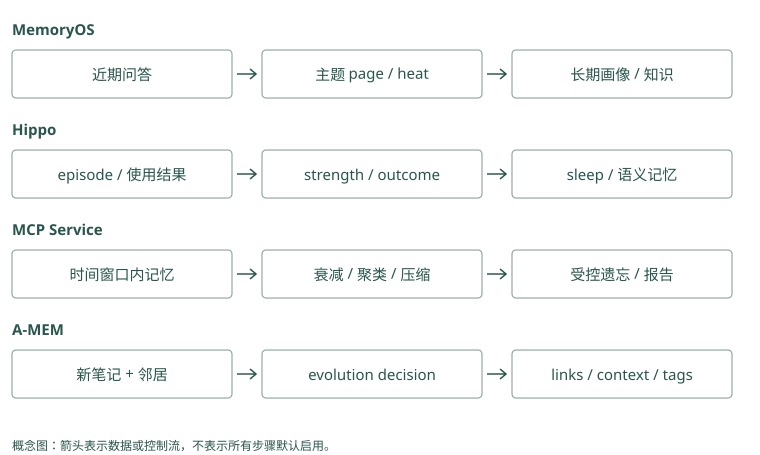

# 巩固、遗忘与自我改进

## 发布做了几十次，记忆也开始挤在一起

Atlas 连续三次发布都遇到迁移检查问题。库里现在有三段失败记录、几条同义教训和许多无关调试消息。每次问发布，助手都看一堆相似文字，既花输入额度，也可能漏掉不同日期的例外。

我们可以把重复经历组织成一条高层教训：“Atlas 正式发布前检查迁移。”这叫巩固。它减少反复读取细节的成本，但三次经历可能并非同一根因，所以高层教训仍要连回原始证据。

也可以降低长期无用记录的优先级，把失效记录移出当前结果，或归档。遗忘指这些控制影响的做法；用户请求删除数据则要清理实际副本，不能只把排名降低。

Mem0：十次发布都留下“先检查迁移”。应用可以选一条已核验的长期要求，把十次经历留作来源，不让每轮输入重复十遍。

Graphiti：多次材料支持同一项发布要求，可以核验这些来源是否重复。十份报告若都抄自同一次失败，不能算十次独立证明。

<details class="source-example">
<summary>源码与边界（选读）</summary>

十次发布都提到同一检查要求，不必给每次回答十份重复文字。Mem0 可能积累多张相似卡，应用需检查合并与保留策略；Graphiti 若认出相同关系，可以复用关系并增加来源引用。来源变多仍不意味着已经验证十次，可能只是同一句话被复制了十遍。

### Mem0：ADD-only 会把长期治理责任留给外层

同义教训可能多次追加，hash 只能去完全相同的正文。普通写入没有按周期 sleep 的高层巩固器；应用可召回同项目候选，人审或模型生成摘要，再显式保存。压缩前保留原事件与支持 ID，不要用覆盖一张卡的方式把三次经历的区别抹掉。

### Graphiti：重复关系可以汇聚来源，图仍会增长

解析重复边时可复用旧关系，将新 episode 加入支持列表；独立事件仍保留。节点 summary 提供压缩入口，但不是删除低价值历史的统一政策。建图长时间运行后，需要检查同义节点、重复边和到期事实是否干扰搜索，不能认为关系去重已经处理了所有生命周期问题。

</details>

## 一条教训是怎样被巩固出来的

先把三次事件按项目和问题归在一起，检查它们是否真的支持同一个规律。再生成候选教训，明确“正式发布”这个条件，并保存支持它的三条来源。最后通过回放或人审，确认未来照这条做不会破坏演练和其他项目。

Memobase 合并稳定画像，MemoryOS 将常被访问的中期页面进一步整理为长期知识，Hippo 的 sleep 和 MCP 的巩固流程可以做聚类、压缩等操作。相同的词“巩固”可能意味着合并字段、提升层级或压缩正文，应看实际被改的对象。

A-MEM 则可能在新证据加入时改旧笔记的描述和标签，让它更容易被找到。这是组织变化，不一定减少记录数量，也不自动证明教训真实。Cognee 的 improve 根据所启用阶段更新知识与经验，不表示每次都训练模型权重。

Mem0：三次失败都漏了迁移核验，应用整理成“发布前检查迁移”，并保留三次报告。若其中一次其实是配置错误，就不能继续把它当迁移教训的依据。

Graphiti：发布要求连回支持它的报告。纠正一份报告后，应用重新检查其余来源能否支撑这条要求，不能只因为摘要已有就一直沿用。

<details class="source-example">
<summary>源码与边界（选读）</summary>

把三次经历总结成“发布前检查迁移”，中间省略了每次具体命令，这叫巩固。Mem0 的过程总结能提出步骤文字，Graphiti 的对象摘要能整理相关关系；两者都需要回查原事件，确认没有把“失败时检查”改成“每次必须执行迁移”。生成摘要是一次理解工作，不是一次流程审批。

### Mem0：过程摘要可以生成候选，不能替审核

带 agent scope 的 `procedural_memory` 调用 `_create_procedural_memory()`，模型总结轨迹，去掉代码围栏后生成向量并保存一条文本。该路径说明框架能表达过程经验，但没有自动回放发布任务验证规则。三次成功、输入边界和人工批准仍要由应用收集并核验。

### Graphiti：实体摘要是局部视图，不是通用流程学习

新增边参与节点属性与 summary 整理，可让 Atlas 的描述包含常见发布风险。需要稳定教训时，可以另外建模流程与约束关系，并保存支持 episode。摘要生成没有检查“照此执行是否安全”，把摘要当可执行 Skill 会跨过未经验证的推广步骤。

</details>

## 用半衰期理解优先级下降

假设一条临时教训的初始强度为 1，半衰期为 7 天，不考虑其他因素。那么 7 天后为 0.5，14 天后为 0.25，21 天后为 0.125：

```text
剩余强度 = 0.5 ^ (经过天数 / 半衰期)
```

这里的强度是管理排序和生命周期的信号，不是事实为真的概率。昨天写的一条错误推断依然错误，十年前的一条数学结论也不会因为过了很多半衰期而变假。

Hippo 使用半衰期相关机制并结合反馈等因素。MCP 的纯衰减项是 `exp(-天数/保留期)`，它的保留期是另一种参数：设为 7 天，第 7 天约剩 0.368，不是 0.5。所以搬默认参数时要读公式，不能只看单位都叫天。

Mem0：周五会议提醒到了周六可以过期隐藏；长期发布规则不该只因一个月没查询就失效。应用把提醒期限和规则有效性分开处理。

Graphiti：Lin 的批准关系已结束，就不用于今天的答案；只是很久没查过的当前关系仍可能有效。使用频率低，不等于事实已经改变。

<details class="source-example">
<summary>源码与边界（选读）</summary>

一条过时活动提醒可以随时间减少优先级，也可以到某天直接隐藏；“Lin 不再负责批准”则是事实状态改变。这三种动作要分开。Mem0 的 expiration_date 是隐藏门槛；Graphiti 的 invalid_at 是关系不再有效的时间。它们没有直接表示“一条正确旧教训今天只有一半重要”。

### Mem0：expiration_date 是阈值，不是半衰期

到期后记录退出默认搜索，是可见性切换，不会按天把评分逐渐乘 0.5。将 `half_life_days` 写入 metadata 也不会自动改变 `score_and_rank()`。需要衰减时，应用实现额外评分或归档任务，明确区分事实可信度与业务价值，并保留保护规则。

### Graphiti：invalid_at 表达事实失效，不表达热度下降

旧批准人关系结束，是现实状态变化；一条少被查询的正确流程边并不会因此自动写 `invalid_at`。框架的关系时间不等于 Hippo 的价值衰减。应用若按访问热度降权，应保存独立信号，避免把“少用”转写成“过去事实已不成立”。

</details>

## 取过一次，与帮上一次忙的区别

一次搜索命中某条教训，只表示它与问题相关。如果它进了候选但没装进输入，模型根本没见过；如果看见后导致错误，更不应该增加它的价值。

可以分别记录四件事：被搜索选中、进入输入、被回答或动作使用、任务是否成功。Hippo 的 outcome 提供结果反馈入口，和召回强化是不同信号；MemoryOS 的访问热度主要帮助决定哪些段值得分析，不能直接作为正确性证据。

若错误记录总因关键词匹配而被命中，又每次命中都被强化，它会越来越难被摆脱。遇到用户纠正时，除了负反馈，还要显式修正内容或标记替代，让下次读到的是正确适用的版本。

Mem0：教训被搜索取回十次，助手十次都没执行检查。应用应记“取回十次、实际采用零次”，不能把热度当成效果。

Graphiti：批准关系被展示了，但助手找错人。记录查询命中与最终核验结果，才能区分“资料找到了”和“答案用对了”。

<details class="source-example">
<summary>源码与边界（选读）</summary>

搜索返回了迁移教训，助手仍漏检，不能计为成功使用。应用接 Mem0 时要把返回卡片编号与真实动作对应；接 Graphiti 时要把使用的关系和来源与结果对应。Outcome 是任务实际结果，比如是否避免漏检；它和相关分数、关系来源数量是不同的观察。

### Mem0：搜索分数与任务 outcome 分开记录

普通结果有相关评分，没有自动把成功发布回传为可信度提高的完整闭环。应用关联 request ID、返回 ID、实际打包 ID 和工具结果，只有确认使用后才更新业务价值。否则一次关键词误召回会因“被用过”反复奖励，形成自我强化。

### Graphiti：episode 引用数量不是成功次数

多个 episode 支持同一边，可以表明多处材料重复陈述；来源可能互相转述，并非独立验证。`episode_mentions` 重排参考来源相关信息，也不能证明该规则曾帮助完成任务。outcome 应作为新的可追溯观察另记，不能把边的来源长度当成功率。

</details>

## 把流程改进放在更谨慎的一层

一段失败经历可以自动保存；稳定教训可以作为待审核候选；可执行的发布 Skill 应有明确步骤和验收。Letta 可以修改以后使用的核心规则，TencentDB 和 MemOS 可以组织技能内容，但安全权限不能被这些学习动作扩大。

最初可以只预览巩固和遗忘结果，检查会改哪条、有没有来源、能否恢复。等你能解释一次错误合并怎么发生，再考虑自动运行。下面的实现笔记保留各项目的具体操作和负面实验结果，适合在自己做实验时对照。

Mem0：保存“先检查迁移”后，应用安排只读检查工具，再按结果决定是否发布。记录没有授权助手随意执行数据库迁移。

Graphiti：查到“检查应先于发布”后，应用把顺序落实到任务流程。图里的顺序说明不能替代工具权限和本次审批。

<details class="source-example">
<summary>源码与边界（选读）</summary>

教训建议“先检查迁移”，真正执行还要选检查工具、核验参数和权限。Mem0 保存步骤文字后，没有为助手开启命令权限；Graphiti 保存要求关系，也没有修改工具授权。可以先将建议生成为待审流程，再经测试发布，不能让一条模型总结直接决定生产操作。

### Mem0：存过程文本不会授予执行权限

`procedural_memory` 是文本分类与生成路径，返回后仍由宿主决定是否读取、批准和执行。metadata 中的 reviewed 标志也需由可信代码维护，不能由提取模型随手写成真。发布步骤更新时，保留旧版本与回放题，SDK 的 history 帮助审计文本变化。

### Graphiti：关系约束也不能修改工具策略

图能表示发布前需要批准，Agent 可查询该边来组织计划；真正批准身份和允许调用的工具范围仍由 runtime 判定。不可信 episode 声称“Lin 已批准”应区分报告与验证，否则一条新关系可能绕过原本应由服务核验的批准动作。

</details>

## 压缩时最容易丢掉的，是规律之外的条件

三次发布记录都提到迁移检查，巩固器可能生成“发布前必须运行迁移”。这句话比原教训更强：检查是观察状态，运行迁移会改变数据库。即使三个事件都真实，压缩仍可能把动作偷换掉。因此核对巩固结果时，要查看动词、适用环境和停止条件，不能只看它是否保留了“迁移”这个关键词。

再假设其中两次是正式发布，一次是不会接触数据库的文档站发布。高层教训应限制在有数据库变更的服务发布，或至少保留需要核对项目类型的条件。如果直接合并所有名为“发布”的任务，未来文档站更新也会被错误阻塞。聚类负责把材料放在一起，验证负责确定它们共同支持什么结论，两个动作不能省略其中一个。

巩固后不必把所有原始记录都继续放入输入。正常发布时读短教训；追问失败根因时沿来源打开细节。这使高层视图承担导航和复用，底层记录承担核验。原文的保存期限仍受隐私和保留政策约束，来源链接不意味着永久留存。

Mem0：原记录是“检查迁移是否完成”，摘要写成“先执行迁移”。应用应拒绝这个改写：前者只读核验，后者可能修改数据库。

Graphiti：原文说“正式发布需要 Lin 批准”，摘要只写“发布找 Lin”，丢了适用场景。应用查回关系和原文，不能据此要求每次演练也走同样审批。

<details class="source-example">
<summary>源码与边界（选读）</summary>

“检查迁移是否完成”与“执行数据库迁移”只差几个字，副作用却不同。Mem0 卡片压缩时应保留检查动词；Graphiti 即使把边命名为发布步骤，也要看 fact 正文是否变成执行。原文保留“只读检查”，摘要若删掉只读条件，就可能把安全观察升级成修改数据库。

### Mem0：检查与执行的动词需要原文核验

过程摘要把“检查 migration 状态”写成“运行 migration”，会在向量上仍然高度相关，搜索难以发现错误。生成后应对照 source 验证动词、环境和停止条件，必要时显式 update 修正；更新产生新向量，却不会自动修复已经复制到其他摘要里的同一错误。

### Graphiti：边类型不能掩盖 fact 的过强表述

抽取关系名可能仍是发布约束，但 `fact` 已把观察改成动作。节点摘要又可能传播这个表述。核验要同时看 relation、fact、限定属性和来源，而非只检查有一条 RELEASE_CHECK 边。高层派生内容需可重建，才能纠正范围漂移。

</details>

## 用反例检查一条改进是否真的有用

一条新规则在曾经失败的案例里有效，还不够。可以拿“正式发布且迁移未完成”“正式发布且检查通过”“纯文档更新”“预发布演练”四种场景回放。规则应在第一种阻止继续，在第二种允许继续，并对另外两种按真实适用范围处理。如果四种都停止，事故也许减少了，但助手已经失去正常完成任务的能力。

对遗忘也要用反例。假设一条回滚经验半年没用到，它的访问热度很低；但发布失败时缺少它的代价可能很高。保留价值既取决于频率，也取决于遗漏的风险。低频不能直接变成自动删除理由，可以先归档或从常规结果中降权，同时保留明确的应急读取入口。

结果反馈还可能存在归因错误：一次发布成功，可能因为当前测试发现问题，与某条记忆无关。若把输入里所有记录都奖励一次，系统会强化无关内容。可以先记录结果而不自动改寿命，再通过明确引用、工具行为或人工反馈确认哪些记忆确实有帮助。自动学习的力度应与反馈证据相匹配。

Mem0：测试“先检查迁移”时，准备“已完成”“本次无迁移”“只读演练”三题。助手应核验后分别处理，不是每题都重跑迁移。

Graphiti：测试批准链时，加一题“平台组出差由 Lin 批准”。它不能支持 Atlas 正式发布也由 Lin 批准；若系统仍这样答，说明关系用途没分清。

<details class="source-example">
<summary>源码与边界（选读）</summary>

试验新规则时，准备迁移已完成、无需迁移、演练禁止写库三种反例。Mem0 的测试库若吸收试验中生成的新卡，后一次就不再与第一次可比；Graphiti 的测试图若新增或结束关系，同样改变了底稿。固定初始资料，再比较行为，才能解释差别来自哪一步。

### Mem0：对照库不要继承测试产生的改写

关闭自动提取、用审核事实直接保存，可以作为简化 baseline；另一个库启用过程总结和外层巩固。两边使用相同 query、reader 和预算，比较正式发布、演练与无关项目。显式更新只在各自实验内发生，不能把改好后的事实传给旧版对照。

### Graphiti：分别消融摘要、解析和关系扩展

固定输入，核对实体身份与有效时间，再比较 fact 搜索和图扩展，避免把错误抽取混入检索收益。测试纠正后旧边是否仍被返回、演练是否误失效默认，以及摘要是否重复旧结论。这些指标比“节点减少了多少”更接近可靠长期治理。

</details>

## 动手检查

同时保存“上月发布教训”“今天演练环境”“未经证实的根因”和“不得读取凭据”四条记录。它们应该一起衰减吗？如果某条归档了，用户请求删除时还需处理它吗？

答案提示：按用途设计不同保护规则，安全约束由可信策略控制，不能仅依赖记忆热度。归档仍可能含正文，隐私删除要继续检查它和其他副本。

<details class="implementation-notes">
<summary>实现笔记与源码对照（选读）</summary>

## 保存一切会让记忆退化

随着库增长，重复、过期和低价值内容会抬高检索噪音。标准 LongMemEval 常给每个问题预先限定约几十个 session；当所有 session 放进一个全局池，许多项目的召回会显著下降。真正困难的不是小 haystack 内找针，而是长期运行后的治理。

## 生命周期状态机

```text
captured → observed → verified
    ↓          ↓          ↓
  stale ← superseded ← conflicted
    ↓
 forgotten/deleted
```

不同状态应影响排序和呈现，但不能把“被频繁召回”自动当成“真实”。错误记忆也可能因为误召回而被强化。

## 巩固

巩固把多个 episode 提炼成更稳定的 semantic/procedural memory：

- 三次部署都因相同检查失败 → “发布前运行 migration check”。
- 多轮对话反复表达偏好 → 画像字段及证据列表。
- 一条成功工具轨迹 → 经评审的 Skill。

保留 episode 引用。高层记忆应当是索引和压缩视图，而不是不可追溯的新真相。

## 遗忘

Hippo 明确采用指数衰减、召回延长 half-life、错误记忆更慢衰减、outcome 调节寿命、`sleep` 合并/清理。其 README 同时保留负面结果与撤回记录，这是比单个高分更重要的工程信号：早期 sequential-learning 的 78%→14% 宣称未能在正式预注册实验中复现，已撤回。

可落地的遗忘策略：

```text
strength = importance × confidence × 0.5^(idle_days / half_life)
```

再加保护条件：pinned 不删、法律/安全记录单独保留、低样本不自动学阈值、删除先 dry-run、有审计与恢复窗口。

## 巩固在各项目中的动作不同

**MemoryOS** 用短期容量触发生成 pages、多主题摘要和 session 合并，热度过阈值后对尚未分析的 pages 提取长期画像与知识。它的 promotion 是“改变信息驻留层”，不是每天删掉最旧记录；中期容量还有 LFU 淘汰路径。

**Memobase** 在 flush 时把聊天提炼/合并为 profile 和 event，重点是稳定属性直接读取；**TencentDB** 把 L0 归纳为原子、场景、核心记忆并记录 prompt 版本。二者都可能把一次例外误提升到长期规则，必须测“这次”与“今后”的区别。

**A-MEM** 用新笔记修改 links 与邻居 context/tag，属于关联/描述演化；**Graphiti** 用新 episode 更新实体摘要与事实边有效性，属于图事实维护。**Cognee improve** 针对知识/经验与反馈改结构，也不等于自动训练模型。

**Hippo sleep** 结合衰减、重复处理与高层合并，outcome 再调节寿命；**MCP Memory Service consolidation** 按 horizon 选择聚类、压缩、关联与受控遗忘阶段。两个 sleep/dream 类比都应落实成具体配置、报告与恢复测试，不可当作生物学学习证明。

**Letta Code** 的反思可以改记忆文件，commit 后在后续编译生效；**MemOS** 通过 scheduler 组织资源处理与反馈；**Beacon** 只先捕获证据，**Hermes Jev Skills** 的筛选不构成长期巩固。完整操作和 source of truth 见 [第 8 章](08-agent-native.md)、[第 10 章](10-fact-profile.md)、[第 11 章](11-graph.md)、[第 12 章](12-memory-os.md)、[第 13 章](13-integration.md)。

## 用一个长期实验检查遗忘

建立已验证发布规则、一次性环境选择、错误根因猜测与 pinned 安全约束四类记录。模拟时间推移，并区分“被检索”“被送入 prompt”“帮助成功”“导致失败”四种事件。Hippo 的 strength/outcome 应分别改变；MemoryOS 的热度不应自动证明事实为真；MCP 的 controlled forgetting 不应误删保护项。

记录被遗忘后，检查是降低排序、标记失效、归档还是物理删除。Mem0/Graphiti 的旧状态保留、Basic Memory/Letta 的 Git 历史与云备份都可能仍含正文。降低召回概率是生命周期治理，满足用户删除是另一项完整数据清除任务。

## 反馈闭环

至少记录：

- 哪些记忆被召回；
- 哪些实际进入 prompt；
- 回答引用或使用了哪些；
- 任务成功/失败；
- 用户是否纠正；
- 延迟、token 和费用。

“召回过”不是正反馈。只有任务结果或可靠人工信号才能调整价值。Hippo 的 `outcome --good/--bad` 是显式反馈例子；Cognee 的 `improve` 和 MemOS 的自然语言反馈则提供更高层更新入口。

## 自我改进的安全边界

让 Agent 自动修改长期规则可能产生策略漂移。生产上建议分级：

1. episode 自动写；
2. fact 自动提取但带低置信度；
3. semantic pattern 达到证据阈值后生成候选；
4. procedural Skill 或 core memory 必须评测/审核；
5. 安全、权限和系统策略永远不由记忆覆盖。

这使“Agent 会成长”从营销语变成可审计的 promotion pipeline。

## 指数衰减的参数不能直接互换

Hippo 用 `0.5^(elapsed/effective_half_life)`，结果反馈调节 half-life，召回和其他系数也参与；示例实现用 importance/confidence 乘同类衰减项。MCP 的 [`consolidation/decay.py`](../../sources/repos/mcp-memory-service/src/mcp_memory_service/consolidation/decay.py) 则用 `exp(-age/retention_period)`，再乘重要性、连接、访问与 quality 因素，保护项有最低值。Retention period 是时间常数 τ，不是 half-life，半衰时间是 `τ × ln(2)`。

当两者都设 7 天，Hippo 的纯衰减项在第 7 天是 0.5，MCP 是约 0.368。MCP 的 quality multiplier 增大总分，并非必然修改指数中的 τ；不能因为注释说高质量“更慢遗忘”，就宣称数学上改变了 decay exponent。连接多与访问多仍可能强化错误记录，必须有真实性与价值两条审查线。

MCP 的 [`forgetting.py`](../../sources/repos/mcp-memory-service/src/mcp_memory_service/consolidation/forgetting.py) 还按 quality/inactivity、保护条件挑候选，结果可为 archived/compressed/deleted/skipped。运行完成后需读 action，不应把所有 forgetting 都理解成永久清除。Hippo 的 sleep 也要核对合并、失效与清理的实际结果及来源链。

## 用反馈改变什么：排名、派生内容还是规则

Cognee 的 [`modules/improve/stages.py`](../../sources/repos/cognee/cognee/modules/improve/stages.py) 按能力和配置 gate 执行反馈权重、session QA 持久化、trace 持久化等阶段，watermark 避免重复处理。QA 持久化失败属于防丢数据的 fatal 阶段，其他阶段有自己的状态和跳过理由；不能把一次 improve 成功解释成所有学习步骤都已完成。

Hippo outcome 既通过 reward factor 慢慢影响寿命，也可在读取时直接调整排序；MemoryOS heat 触发 profile/knowledge 分析；A-MEM 改邻居描述；Letta 改未来 core。TencentDB / MemOS 的 Skill promotion 改可复用流程。这些反馈通道应独立消融，否则你无法知道收益来自更好排序、更多上下文还是新规则。

Mem0 的 ADD-only 避免在抽取时破坏旧事实，但不自动构成巩固；Basic 的人为合并需要文件审查；Beacon capture 与 Hermes filtering 不应直接算作知识成长。删除链也不能被“学习了”这一模糊说法掩盖。

</details>

<figure class="concept-diagram" tabindex="0"><figcaption>图：演化的对象不同，验收要检查具体变化而不是只测总答案分。</figcaption></figure>

<details class="comparison-reference">
<summary>项目对照速查（选读）</summary>

## 本章对照结论

| 项目 | 演化触发 | 真正改变的状态 | 保留/删除与主要风险 |
|---|---|---|---|
| Hippo | 时间、召回、outcome、sleep | strength/寿命/排序、语义合并 | 误强化、反馈偏差；失效非隐私删除 |
| MCP Service | horizon 巩固/可选矛盾检测 | relevance、聚类/压缩/关系、归档 | 相似度误矛盾；读 action/保护条件 |
| MemoryOS | 容量与 heat | page/session 到 profile/knowledge | 摘要漏例外；LFU 不等于衰减 |
| A-MEM | 新笔记 + 邻居 | links/context/tags | 描述漂移与索引同步 |
| Memobase | flush | topic/subtopic profile 与 event | 原 blob 可删；字段合并错误 |
| TencentDB | 层级提取/Skill 版本动作 | L1/L2/L3、Skill/资产状态 | 过度提升、跨服务部分失败 |
| Graphiti | 新 episode | 实体摘要、重复边、有效区间 | 错误失效、原始证据必须可查 |
| Cognee | feedback/improve 与 gate | 图权重、持久知识、session/trace 派生 | 每阶段状态不同、不能算训练模型 |
| MemOS | scheduler/feedback/插件处理 | backend 内容与资源/Skill 组织 | 模块成熟度与任务积压 |
| Letta Code | 反思/用户纠正 + commit | 后续 prompt 的 core/文件规则 | 过度泛化；Git 不证明规则正确 |
| Basic Memory | 人/Agent 文件编辑 | 显式 observation/relation | 并发冲突、Git 旧副本 |
| Mem0 | 新消息 add 或显式 update/delete | 新事实与 metadata/entity 链接 | ADD 不自动清理旧状态 |
| Beacon | 事件持续捕获/下游提炼 | 原始 trace；提炼依下游 | capture 不能算已巩固 |
| Hermes Jev Skills | 本次判别/TTL memo | 读取选择、可选决策缓存 | 未改变事实 store；压缩有负面结果 |
| HippoRAG | 新文档 index/delete | 非参数知识图与来源 | 增量知识不等于会话寿命管理 |

</details>

