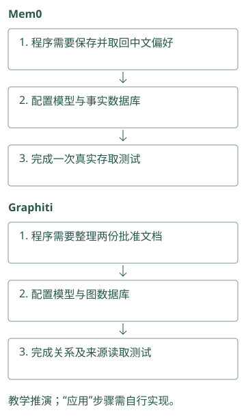
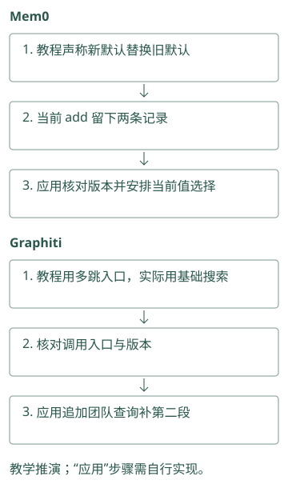
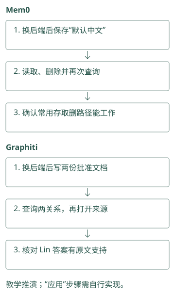
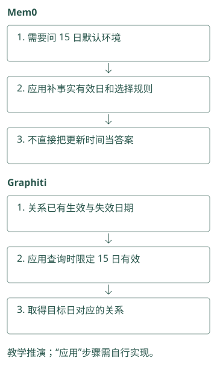
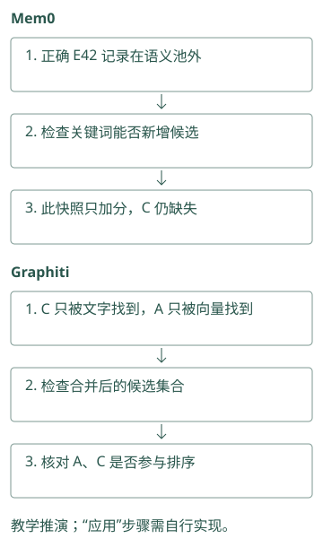
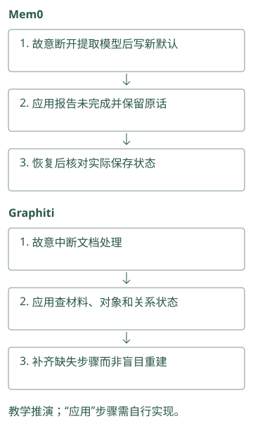
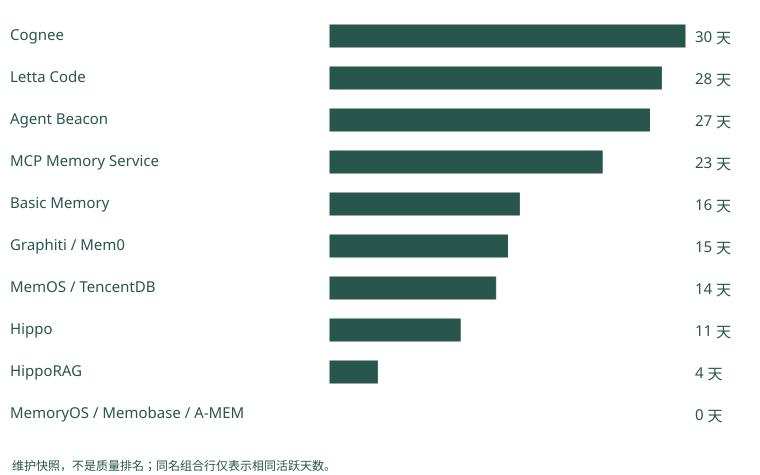

# 怎样读懂一个记忆项目

## 找到了项目，先确认它要替你做哪件事

你在搜索结果里看到三个项目：Mem0、Agent Beacon 和 Hermes Jev Skills，都提到记忆。若直接对比星数，很容易选错层。

带着 Atlas 助手的流程去看：你需要把对话提取为短事实，Mem0 是候选；你缺原始命令和失败证据，先看 Beacon 的采集能力；你已经搜出很多候选但装不下，Hermes 的判别工具才可能有用。后两个项目不能直接替代事实库。

读 README 时，可以先写一条自己的数据路径：“输入是什么 → 项目改了什么 → 输出交给谁”。若这条路径写不清，先不比较宣传分数。第 10 至 13 章会带你走这些数据路径。

Mem0：你的程序调用它保存“默认中文”，再查回这句话。若自建服务，还要配置模型和数据库；代码库可下载，不等于这些服务已替你运行。

Graphiti：你的程序用它把批准文档整理成关系，另需可用的图数据库和模型。先做一份文档的存取试验，再判断维护这些服务是否值得。

源码与边界（选读）

源码对照：

SDK 是接进自己程序的工具包，托管平台是别人替你运行的服务，assembler 是应用里把证据组织成消息的代码。使用 Mem0 或 Graphiti 库，通常仍要配置模型、存储和组装；不能因看到一张完整产品页面，就认为安装开源包已经提供同样的部署、权限与评估功能。

### Mem0：先区分 SDK、平台与业务 assembler

本地 `Memory` 入口负责事实处理和存取，应用管理登录身份与模型输入。即使 README 同时讨论 managed memory，也应追本地 factory 和实际 provider。一个能力若只在平台接口出现，不能通过配置本地 `Memory` 自动获得。

### Graphiti：框架负责建图与搜索，不等于完整托管服务

本地 `Graphiti` 提供 episode ingestion、关系维护和配置化查询。用户线程、团队授权、请求代理和生产 SLA 需看实际部署。判断能否替代现有组件，应先明确你缺的是时间边还是一整套上下文服务。

## 用 Letta 的迁移练习找对仓库

假设你打开旧 Letta 仓，看到近期提交不多。先看 README 是否声明迁移、归档或新主仓，再判断维护状况。这里旧 `letta-ai/letta` 指向当前 Letta Code，历史 API 教程与当前 MemFS 规则不能混用。

这一步的目的不是寻找提交最多的仓库，而是确认你准备接入的代码在哪里。记下实际使用的 commit、版本和后端配置，以后才能知道文档变了还是代码变了。

同样，一个论文仓可能已有稳定的复现版本，暂时没提交；一个平台仓可能天天更新文档。提交时间能提示风险，不能直接证明算法质量。

Mem0：教程说“新默认会替换旧默认”，你实际写入后却看到两条记录。先核对教程与所用版本，再决定由应用更新或筛选，别继续按旧行为写代码。

Graphiti：教程展示一条可多跳查询的接口，你使用的基础搜索却只返回关系。核对版本和入口后，再显式追加团队查询，不能只照搬截图。

源码与边界（选读）

源码对照：

一本旧教程说写入会更新旧默认，新版代码却主要追加卡片，接入就会得到不同状态。核对 Mem0 要看当前 add 真正执行什么；核对 Graphiti 要看使用的是基本 search 还是高级 search_。接口名称像书的目录，实际代码才决定步骤；后文行为只对应本书锁定提交。

### Mem0：版本核对要追真实函数体

`add()` 的旧式说明仍提 ADD、UPDATE、DELETE，而本地普通推断函数已经是分阶段追加。用 commit 固定证据，比较函数体与提示，而非凭 docstring 判断策略。异步 `AsyncMemory` 是另一实现，采用它时还应核对相应函数的差异。

### Graphiti：接口迁移也会影响阅读路线

当前 `_search()` 标记为 deprecated，转向 `search_()`。基础 `search()` 与高级接口的默认配方不同，因此旧教程的函数名和默认值不能直接沿用。记录所用 API、搜索配置和 driver，才能解释一次升级造成的结果变化。

## 把维护数字还原成日常问题

“30 天有 300 次提交”没有告诉我们谁能修严重 bug。若主要由机器人或一位作者贡献，维护风险与多位实际开发者不同。活跃天数表示工作是否持续，作者数帮助看交接能力，但数字都要结合提交内容。

你可以问一个具体问题：“如果 embedding 升级把索引弄坏，我是否找到测试、迁移说明和近期相关修复？”这比只问活跃度高不高更接近采用后的责任。

Cognee、MCP 和 TencentDB 的配置面较广，维护需要覆盖多后端、权限和服务链；Graphiti 要关注结构化抽取和图后端；Hippo、MemoryOS、A-MEM 则要评估自己能否承担维护或补安全包装。做研究时愿意承担这些工作，做生产服务时则要把它计入成本。

Mem0：换数据库后，存“默认中文”→查回答是中文→删除→确认查不到。哪一步没通过，就查该后端支持，不用项目热度替代测试结果。

Graphiti：换图数据库后，写入 Atlas 的两份批准文档→查齐关系并答 Lin→打开两份来源。三步都通过，才说明这条常用路径能工作。

源码与边界（选读）

源码对照：

“后端”指真正保存事实或图的数据库服务，driver 是访问它的连接代码。Mem0 换后端后要检查筛选和词搜索是否一致；Graphiti 换 driver 后要检查同一关系能否写入与查回。提交频率高不能代替这些试验，具体依赖决定故障时你要维护哪一层。

### Mem0：维护应覆盖多后端的一致行为

工厂可以切换向量库，但关键词能力、分值和 list 上限可能不同。查维护时关注批量写入、实体清理和删除分页的测试与修复，不能只数总提交。失败恢复涉及事实库与 SQLite 历史，两者一致性也是采用成本。

### Graphiti：模型输出与 driver 都是维护面

实体抽取、日期解析和关系失效依赖结构化输出，图后端还有索引与查询差异。维护风险应包括 schema 变更、模型 provider 兼容和 group 隔离。一次图搜索测试通过，不足以证明 ingestion 与删除在其他 driver 下也安全。

## 再检查“开源支持”具体指什么

README 可能同时介绍 SDK、托管服务和研究结果。以 Mem0 为例，OSS 中存在事实提取和多信号搜索，并不表示托管评测里的所有专有优化也在本地代码中。Graphiti 框架与 Zep 托管服务也应分开。

判断一种能力时，找它的配置和代码入口；判断质量时，找评测数据与运行协议；判断部署可用性时，找恢复、迁移和权限测试。这三类证据不能互相代替。没有时间查全时，先选一个最小场景试用，别用营销段落填补缺失证据。

Mem0：你想直接问“15 日默认环境”，但当前开源搜索没有替你解释事实有效区间。先做日期筛选试验，不把产品宣传里的“历史”当成这项能力。

Graphiti：关系保存了日期，应用仍要按“15 日有效”过滤。若查询没带这个条件，保存了历史也可能答成今天的批准人。

源码与边界（选读）

源码对照：

OSS 指开源版本。宣传支持历史，不意味着开源 Mem0 的每个搜索参数都能直接问某日状态。Graphiti 有关系时间字段，也需要正确的查询筛选。拿“15 日是谁批准”这一题，检查存了什么、参数被哪里使用、返回哪些记录，比只核对是否有“历史记忆”功能名更可靠。

### Mem0：OSS 的时间参数有明确边界

本地支持 `expiration_date`，但 `add(timestamp=...)` 会抛错，提示该时间能力不在 OSS 参数契约内。托管算法分数也不能归到本地实现。能力调查应逐项写“可调用参数、对应分支、所用后端”，不要笼统写全部时间记忆已支持。

### Graphiti：时间图与业务历史 API 分开验证

本地边保存有效与系统时间，`SearchFilters` 提供日期比较，框架确有时间维护逻辑。但完整历史视图、权限服务与托管延迟不能从这些字段推得。给晚到事件实际查看字段和过滤输出，才是采用本地框架的证据。

## 读源码时，怎样把一个宣传词拆成实际动作

看到“自动记忆”，可以从公开入口往下追。输入是用户消息还是已有笔记？函数是否调用提取模型？提取失败会抛错、重试还是返回空列表？最后保存的是原文、短事实还是画像字段？这些问题让“自动”变成可观察的代码路径。对于 Atlas，你可以暂时只追一条偏好，不必先理解整个仓库。

再从读取入口反向追。返回值若只是候选正文，应用还要组装；若返回生成答案，就要找 reader 和提示；若返回文件地址，宿主还要调用读取工具。三个项目都可以宣称“提供上下文”，交付结果却不同。试用之前明确输出，可以避免同时加载一份项目生成的答案和一份宿主重新生成的答案，最后不知道错在哪里。

README 常把功能放在最顺利的配置上讲。源码里的条件分支会告诉你哪些依赖是可选的，缺 embedding 时怎样降级，某个后端是否支持全文，队列是否真的持久化。先核对你准备使用的分支，其他分支即使能力很强，也不会自动出现在你的部署里。

Mem0：让准确含 E42 的记录 C 不进入语义初选，再搜 E42。检查关键词步骤是否能新增 C；当前评分加分不能替代补候选。

Graphiti：让 C 只被文字搜索找到，A 只被向量搜索找到。检查合并结果是否有 A、C，就能具体核对“两路一起搜”到底做了什么。

源码与边界（选读）

源码对照：

看到“混合检索”，可以把问题缩成：词搜索独自找到 C 后，C 能否出现在结果里？Mem0 要追最终候选来自哪个列表；Graphiti 要追当前配方启动了哪几种搜索以及如何合并。配方是搜索配置组合，不是效果保证；最终编号集合能直接验证这个宣传词对应的动作。

### Mem0：从输入条件追到最后候选循环

检查 `infer`、`agent_id` 和 `memory_type` 分支，再追普通批处理；读 search 时追 candidates 循环，而非停在 keyword_search 调用。这样可以预测某个错误码只被关键词找到时会怎样，而不仅知道项目出现了 BM25 字样。

### Graphiti：从配方追到实际任务列表

`SearchConfig` 写着 BFS，不代表所有调用都选这个 config。`edge_search()` 按枚举创建任务，再汇集 UUID 和重排。核对基础接口的 recipe、实际 enabled methods 与返回对象，能把“支持图遍历”变成具体可验证行为。

## 维护风险要与自己的接管能力一起看

一个原型的主体算法可能只有几百行，你愿意自己补测试和安全包装，那么低活跃度未必妨碍学习和研究。一个跨多个服务的平台，即使主仓活跃，你仍需要理解数据库迁移、版本兼容与故障恢复，否则接口变化就可能超出维护能力。判断采用风险时，项目规模和你的接管能力应放在一起。

试用还可以刻意加入一次小故障：让 embedding 请求失败，或让后台处理暂时停止。观察错误是否明确、原文是否仍在、任务能否安全重试。顺利跑通的示例展示功能入口，失败时的表现展示你之后要承担的工作。这些观察应记录所用版本，不延伸成对项目所有版本的永久评价。

Mem0：测试时故意断开提取模型，再写“默认预发布”。看应用能否报告失败、保留原话并重试；若没人能处理，就先别接入关键流程。

Graphiti：中断文档处理，再检查原文和关系留下了什么。团队应能查清并补齐缺失步骤，而不是失败后只能重新建整个图。

源码与边界（选读）

源码对照：

在测试环境让提取模型失败、让存储中断、让旧默认被补录，再检查原文与派生结果。Mem0 需要核对卡片、历史和对象关联；Graphiti 需要核对材料、节点、关系和时间变化。故障之后你能解释并修复哪些状态，才决定项目复杂度是否适合自己的团队。

### Mem0：小故障实验揭示你要补的状态管理

令提取 provider 超时，核对异常与原文是否已由入口保存；令批量插入失败，核对逐条回退后事实、历史和实体链接。应用能否区分无新事实与依赖错误，直接决定重试和用户状态提示是否可信。

### Graphiti：测试失败之后图有没有部分变化

在抽取、解析和保存阶段分别制造故障，检查 episode、节点、旧边有效时间与索引。框架抛出异常说明调用失败，不等于所有外部状态已恢复。决定接管时，应理解 driver 保存范围与事件重放方式，而非只会重新执行整次请求。

## 动手检查

选下面资料表里的任一项目，写一张四行卡片：解决哪层问题、当前主仓和版本、最小输入输出、你还需自己负责什么。

答案提示：给 Beacon 的卡片不应写“替我维护稳定用户画像”；给 Hermes 的卡片不应写“保存全部长期记忆”。下面的维护表只是 2026-09-21 的阅读材料，不是实时榜单，也不是精确量化评分。

维护快照、项目全景与比较依据（选读）

## 评分原则

本书把维护信号放在首位。数据来自截至 **2026-09-21 UTC** 的本地 Git 历史：最近提交、近 30/90 天提交、30 天活跃天数、作者数；源码快照见 `sources/maintenance.json`。

本章的 A/B/C 是定性投入优先级，维护因素占判断的大部分；“约 60% 维护、40% 其他”仅表达取舍倾向，没有逐项归一化公式和可复现加权分数，不能称为精确量化评分。其他因素包括开源完整度、架构独特性、测试/评测、生产能力和许可证。commit 数只作参考：Cognee、Beacon 等高频仓可能包含自动化；单人项目即使活跃，也可能在唯一维护者离开后无人接手；论文仓低频并不代表论文价值低。

## 维护优先的推荐顺序

| 层级 | 项目 | 最近提交 | 30 天：提交/活跃日/作者 | 判断 |
|---|---|---:|---:|---|
| A | Cognee | 09-19 | 793 / 30 / 40 | 活跃度最高，平台面广；复杂度也最高 |
| A | Letta Code | 09-21 | ≥301 / 28 / 19 | 当前主仓，Agent 自管理记忆路线 |
| A | MCP Memory Service | 09-20 | 291 / 23 / 30 | 自托管、MCP/REST、安全与运维完整 |
| A | Mem0 | 09-18 | 36 / 15 / 15 | 生态成熟；OSS 与托管能力需区分 |
| A | Graphiti | 09-21 | 34 / 15 / 10 | 时间知识图谱路线清晰、维护稳定 |
| A | MemOS | 09-21 | 87 / 14 / 11 | Memory OS、多形态记忆、插件活跃 |
| A | TencentDB Agent Memory | 09-21 | 29 / 14 / 19 | 团队资产、ACL、代码/文档记忆突出 |
| B | Basic Memory | 09-15 | ≥301 / 16 / 11 | 本地 Markdown/MCP 强，AGPL 需评估 |
| B | Agent Beacon | 09-21 | 644 / 27 / 8 | trace 捕获极活跃，记忆提炼仍偏平台层 |
| B | Hippo Memory | 09-21 | 63 / 11 / 1 | 生命周期机制独特；单维护者风险 |
| B | HippoRAG | 09-03 | 6 / 4 / 4 | 研究价值高，产品能力有限 |
| C | MemoryOS | 07-07 | 0 / 0 / 0 | 分层记忆清晰，近期维护弱 |
| C | Memobase | 01-11 | 0 / 0 / 0 | 画像路线值得学，当前仓停滞 |
| C | A-MEM | 2025-12-12 | 0 / 0 / 0 | 论文/原型参考，不建议直接作为生产底座 |

`≥301` 表示本地历史为浅克隆样本，上限截断，真实提交可能更多。`letta-ai/letta` 不列入推荐，因为它已迁移；应使用 Letta Code。Hermes Jev Skills 是候选决策工具，不是长期 memory backend，因此也不混入该存储选型表，它的机制详解在 [第 16 章](16-jev.md)。

该表只给维护与投入顺序，不能代替架构介绍。逐项目的数据流分别见 [Letta/MemGPT](08-agent-native.md)、[Mem0/Memobase](10-fact-profile.md)、[Graphiti/Cognee/HippoRAG](11-graph.md)、[MemOS/MemoryOS/Hippo/A-MEM](12-memory-os.md)、[服务/文件/Trace/Team](13-integration.md)。每个详解都解释输入如何变成记忆、query 如何找回证据、演化如何生效，以及哪些能力仍由应用负责。

## 不能把该表当成统一 SOTA

- Mem0 README 的 2026 新算法分数来自含专有优化的托管平台。
- Hippo 报告的是 retrieval R@k；Mem0/MemoryOS 常报告 reader 或 LLM-judge 后的 QA 分数。
- LongMemEval 的 per-haystack 与全局池结果不可比较。
- Cognee 的 10M BEAM 为探索性设置，问题路由与评分可能用同一问题集。
- Hippo 明确撤回过无法复现的 sequential-learning 幅度。

因此排名回答“在这个快照中更值得投入时间读和试哪个”，不回答“谁在所有任务上最好”。

## 维护信号应怎样影响不同技术路线

平台型 Cognee、MCP 与 TencentDB 有 schema、身份、多后端和运维面，活跃作者多有助于覆盖更多配置，却也可能带来频繁接口变化。Graphiti、Mem0 的主要风险集中在抽取、后端和候选边界，试用要锁定 commit/backend。Letta 必须先追 canonical repo；旧仓迁移后没有提交不代表当前 runtime 无维护。

研究型 HippoRAG、A-MEM、MemoryOS 的目标偏论文机制，低提交频率未必降低算法价值，却意味着你可能要承担部署与安全功能。Hippo 在机制与评测上有可读源码，但单作者是交接和长期漏洞响应风险。Beacon 的高频提交主要改善遥测面，不表示事实检索质量提升；Hermes 工具维护活跃也不能弥补云 API 数据政策与不可用风险。

下面的图仅展示活跃天数，合并行只因为数值相同，不合并项目能力，也不将 commit 数折成模型正确率。

<figure class="concept-diagram" tabindex="0"><figcaption>图：2026-09-21 快照的维护信号。浅克隆、机器人与作者集中度仍需另查。</figcaption></figure>

项目对照速查（选读）

## 本章对照结论

| 路线与项目 | 维护要解决的技术风险 | 即使活跃仍要验证 | 表中数字不能证明 |
|---|---|---|---|
| Mem0、Memobase | 提取/画像、依赖模型与 SDK | 最新后端、flush/合并、OSS 边界 | 用户事实长期正确 |
| Graphiti、Cognee | 建图、schema 与多存储 | 结构化输出、迁移与恢复 | 所有任务图优于平面检索 |
| HippoRAG、A-MEM、MemoryOS | 论文版本与实现一致 | 能否复现、谁补生产缺口 | 原型可直接公网部署 |
| MemOS、Hippo | 调度/多形态或生命周期 | 每模块成熟度、单作者与消融 | “OS/sleep”有通用学习保证 |
| Letta Code / 旧 Letta | 主仓迁移与运行环境的记忆协议 | 提交后是否生效，接口是否仍可用 | 旧仓统计等于当前维护 |
| Basic、MCP、TencentDB | 文件同步、共享服务、资产安全 | 许可证、可读范围、撤销与删除 | 活跃度等于配置安全 |
| Beacon、Hermes | 动作有没有漏采，判别接口是否可靠 | 直接观察还是推断、数据外发和超时处理 | 日志覆盖或排序分数等于答题正确率 |

