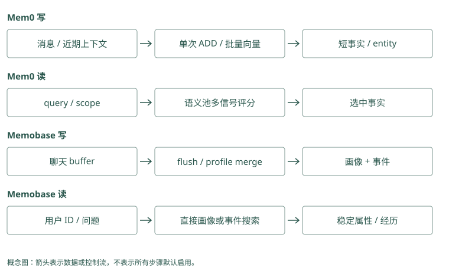

# 事实与画像路线：Mem0 / Memobase

## 同一位用户，两种不同的问题

Alice 在几次聊天里说过：默认中文、Atlas 默认预发布、上周发布漏了迁移检查。今天有两个问题：“怎样称呼和回答 Alice？”以及“Atlas 上周为什么失败？”

第一个问题需要稳定用户属性，第二个需要具体经历与证据。Mem0 和 Memobase 都能保存文字信息，但它们把整理工作放在不同位置。用同一段输入走一遍，就能理解这种差别。

下面的记录形状都是便于学习的示意，不是接口返回保证。真实函数入口和版本说明保留在本章实现笔记中。

### Mem0：同一个 user scope 不意味着所有事实都该出现

默认语言适合直接读取审核后的稳定记录，失败原因适合 query 搜索。普通事实池可以表达两者，但没有自动把语言整理成唯一 profile 字段。应用先决定读哪类内容，再选择 get、get_all 或 search，避免以发布查询的相似度决定沟通偏好。

### Graphiti：用户属性与项目经历需要不同主体

语言偏好可以关联 Alice，发布失败关联 Atlas 与对应事件，两者共享来源却不应共享关系范围。以 Alice 为中心找偏好，以 Atlas 为中心找发布资料，读取时仍限定可见组。图把对象区分开，前提是写入正确解析了主体。

## Mem0：先形成卡片，再按问题挑选

应用把聊天消息和可信用户范围交给 `add()`。Mem0 当前本地推断路径先参考近期消息和召回到的已有记忆，再请模型提取新增事实。近期消息帮助解释“以后都这样”里的“这样”，旧记忆帮助避免重复抽取。

理想的教学结果像三张卡片：

```text
M1：Alice 默认用中文沟通。
M2：Atlas 默认部署到预发布。
M3：用户报告上周 Atlas 发布漏了迁移检查。
```

这些卡片批量生成 embedding，存入后端，并维护文字、时间等信息。文本 hash 检查完全重复，实体链接把 Alice、Atlas 等对象连到相关记忆 ID。批量处理减少逐条请求的开销，但模型仍可能提取错，应用仍要检查来源与输出。

今天问“Atlas 上周为什么失败”，`search()` 先取多一些语义候选，再利用关键词和实体匹配给这个池里的记录加分。M3 可能因“发布失败”的意思与 Atlas 对象更相关而排高，M1 不应只因为是同一用户就占据主要输入。

搜索结果还不是模型回答。应用需要把选中的正文和来源放进当前输入，并让模型区分“用户报告”和“已验证原因”。如果不做这次组装，SDK 存得再好，回答也看不到。

### Mem0：卡片从模型输出走到两种持久状态

提取 JSON 的 `memory` 列表后，`embed_batch()` 为全部有效 text 生成向量。构造 records 时加入 hash、词形和 metadata，批量 insert 写事实，再 `batch_add_history()` 记录 ADD。接着跨本批事实汇集唯一实体，为实体生成向量并查找已有对象，更新关联 ID。失败时逐条回退或跳过，所以结果应分别核对事实和辅助索引。

### 追一次 Mem0 调用的输入、内部形状与输出

下面仅展示已配置 Memory 对象的调用，真实 `m` 的创建需要选择 LLM、embedding 和 vector store。不要用未声明的模型配置去运行这段代码：

```python
messages = [
    {"role": "user", "content": "默认用中文。"},
    {"role": "user", "content": "Atlas 今后默认预发布，今天演练仍用测试。"},
]
written = m.add(
    messages,
    user_id="alice",
    metadata={"project_id": "atlas", "source": "session-42"},
)
found = m.search(
    "Atlas 默认部署环境",
    filters={"user_id": "alice", "project_id": "atlas"},
    top_k=5,
    explain=True,
)
```

返回的 `written["results"]` 表示这次构造的事实结果，形状通常包含 `id`、`memory` 和 `event`；`found["results"]` 另含搜索评分等字段。它们都不是原始 messages 数组。一次消息可以产生零条、多条事实，而提取器会不会正确拆出长期默认与当天例外，需要检查实际正文。

内部 payload 的教学形状如下，实际值由模型、时间与 provider 决定：

```json
{
  "data": "Atlas 今后默认部署到预发布",
  "user_id": "alice",
  "project_id": "atlas",
  "source": "session-42",
  "hash": "正文的文本指纹",
  "text_lemmatized": "用于关键词索引的规范文本",
  "created_at": "本次系统创建时间",
  "updated_at": "本次系统更新时间"
}
```

`source` 和 `project_id` 来自应用，不是模型验证过的证据。还有一个写入范围细节：普通路径检索既有记忆时，代码从 filters 中抽出 user、agent、run 这几个身份键；不能假设自定义 project_id 同时限定了所有内部上下文和实体索引。若同一个用户有多个同名项目，需测试串线，必要时通过专门 agent scope、实例隔离或外层提取保证边界。

正常写入还把近期消息保存到 SQLite，下一次用于解释“以后都这样”。然而每张卡的 source 不会自动细化到 messages 中哪一句；多来源批次可以由应用拆开、维护事实到原事件的映射，或核验后补来源。缺少这一步，source 指向整个会话只提供粗粒度回查，不能证明具体陈述出自哪次观察。

### Graphiti：相同消息被拆成对象与关系

Graphiti 先创建 episode，解析 Alice、Atlas 等节点，然后抽取“偏好语言”“默认环境”“失败报告”等关系。规范节点 UUID 修正边端点，边 resolution 返回重复、新增和失效集合。summary 只使用新关系参与更新，最终保存 episode 与关联。它保留关系语义，但写入比生成三张短卡片涉及更多判断。

## 一个细节：Mem0 没看见的卡片不会被关键词救回

假设 M3 没有进入语义候选池，关键词搜索即使发现它很匹配，当前 `_search_vector_store()` 的池边界仍可能使它不返回。这里的关键词和实体主要给已有池加分，并非一定把各路独立命中合成完整并集。

你可以用一个只含精确错误码、但语义相似度不高的例子检查这个边界。对比 MCP 的全文与向量候选并集，就能看出“都叫 hybrid”不代表同样的漏召回模式。先观察候选 ID，再考虑换评分权重。

### Mem0：实体 boost 也无法补回 M3

`_compute_entity_boosts()` 找查询实体关联的 memory IDs，并按匹配相似度和实体关联数量计算 boost。关联特别多的泛化实体会减弱影响。最终 candidates 仍来自 semantic results；M3 仅被 Atlas 实体命中，也未必输出。测试时同时记录三种信号的 ID，而非只看最终 score。

### Graphiti：独立全文路可补向量遗漏

edge RRF 配方同时取全文和 cosine 候选，全文单独找到的失败边可以进入 UUID 并集。若只找到 Atlas 节点，基础边查询仍未完成，应使用组合配置或另查节点周围关系。Graphiti 增加可达路径，但不保证任何缺失事实都能被图救回。

## Memobase：提前整理用户资料，经历另放事件

Memobase 先收下聊天 blob，也就是一份原始输入内容，把它放进该用户和项目的 buffer。Buffer 是待处理区，flush 是开始处理这批内容的动作。

处理时，模型从聊天提取候选属性，结合旧 profile 整理和合并，再形成事件信息。学习时可以想成一张资料页和一个事件列表：

```text
资料页：Alice，沟通语言=中文。
事件：上周 Atlas 发布漏检，来源为当时聊天。
```

问怎样回答 Alice，应用按用户 ID 读取短画像，不需要让一次近邻搜索决定“中文”有没有被挑中。问上周失败经过，再搜事件。它把部分理解工作前移到写入阶段，以换取更确定的稳定属性读取。

若 Alice 刚说“今后默认英文”，而 buffer 还没有 flush，长期资料页可能暂时仍是中文。本次模型输入应直接包含这条新消息。最终一致性就是这种“保存成功与整理结果可读之间存在窗口”的情况，不表示系统必然丢了数据。

### Mem0：没有 buffer flush 合并画像的同等协议

近期消息用于解释新增事实，历史库保存消息，但普通路径没有 Memobase 的用户 buffer 状态机。AsyncMemory 也只是异步调用形式。若应用想批处理偏好，应自行聚合消息、控制顺序和完成状态，再决定追加或显式修改稳定记录。

### Graphiti：previous episodes 提供理解上下文

`retrieve_episodes()` 在限定 group 和时间下获取前序材料；调用者也能提供 `previous_episode_uuids`。它们帮助解释省略表达，不等于正在等待 flush 的消息队列。episode 的抽取完成状态和近期未处理消息，仍需由宿主编排。

## 两种路线怎样处理同一句例外

旧偏好中文，新消息“这封邮件英文”。Mem0 应提取有“这封邮件”边界的候选，不把它和长期中文默认简单混合；Memobase 的合并也应保留中文字段，将英文作为本次任务或事件。模型如果误解，两条路线都会犯错，只是错误放在不同结构里。

对“今后默认英文”，Memobase 可以形成新的当前字段；Mem0 的追加路径可能保留中文和英文两条事实，让读取时解释变化。需要历史查询时，不能仅凭新字段或最新创建时间，要补适用日期和来源。

MemoryOS 用访问热度等条件决定画像提升，Letta 让 Agent 编辑常驻用户记忆，Graphiti 可以把偏好表达为带时间关系。它们共享“稳定属性应可靠出现”的目标，但触发更新的机制不同。

### Mem0：一次例外追加，永久变更需指定策略

“这封邮件英文”应保留任务限定，不能 update 长期中文卡片；“今后英文”可以产生新默认候选。应用确认后可替代当前视图，保留变更日志。仅用 latest created_at 选择会把补录与单次例外混入，需明确业务生效时间。

### Graphiti：同一用户也可以有情境化偏好

中文默认与邮件英文可以分别连用户默认和任务需求，不应互相失效。新长期英文关系才可能结束旧中文关系。自定义 schema 允许表示任务节点或限定属性，随后核对被 invalidated 的边，确保结束的是默认关系而非所有中文使用记录。

## 从下一次读取，反推事实库和画像库的代价

Alice 的默认语言几乎每轮都需要。用事实库时，应用必须保证这条偏好参与读取：可以搜索，也可以用固定类型和身份直接取。若所有内容都只按当前问题搜索，“Atlas 迁移检查”可能与“默认中文”没有足够相似度，偏好就会漏掉。问题不在于事实库不能保存语言，而在于应用选错了读取方式。

画像库提前把语言归入一个字段，生成前按 Alice 的身份取当前值，减少了这类遗漏。代价则转移到了字段更新：当模型把“这封邮件英文”错误合并进去，之后每轮都会读到错误默认。事实库的错误可能只在特定查询下出现，画像错误可能持续影响全部对话。读取越确定，写入的核验越值得投入。

还需要考虑未完成的整理。Alice 连续发两条消息，先说“今后英文”，又说“算了，仍然中文”。如果后台处理分批、重试或乱序完成，当前字段不能仅凭最后完成的任务更新。应用需要检查处理顺序或版本，确定最终值对应最新有效表达。这里讨论的是接入时应验证的行为，不代表 Memobase 的每种部署都已解决这一问题。

### Mem0：直接读降低漏召回，也放大错误写入

稳定记录 ID 固定后，`get()` 可避免 query 表达变化造成遗漏；返回前仍要核对所属身份及当前版本。若 update 错了正文，每轮直接读取都会受影响。历史提供回查，应用须有字段核验、版本切换与缓存失效，不应把稳定读取误认为稳定正确。

### Graphiti：summary 热读取需要事实校验规则

按已知用户 UUID 读取 summary 可以快速获得个性化入口，却可能含旧属性或过度概括。对语言、环境等必须确定的字段，应读对应有效关系而非随意解析摘要。若缓存 summary，键要包含 group、节点身份与内容版本或受控失效机制。

## 画像里写什么，才不会越整理越偏

画像适合稳定属性，但“稳定”需要从语义和使用场景判断。用户一天内多次要求英文，可能只是正在写英文邮件；用户只说一次“以后默认中文”，却已经给出明确的长期边界。重复次数能提供线索，不能替代对“这次”“以后”等条件的理解。

假设聊天里同时出现“我偏好简短回答”和“请详细解释这次迁移”。当前任务应得到详细解释，长期字段仍可以保留简短偏好。默认值只在没有更具体要求时起作用。组装输入时，可以明确表达当前任务覆盖一般默认，避免模型把画像当作不可改变的命令。

画像也可能包含未知状态。Alice 没说过部署环境，就不应为了填满 schema 推断她偏好预发布；同名用户的记录也不能补过来。读取端收到空字段时，可以使用应用默认或请求澄清，并标明这不是已知的个人偏好。结构化字段让数据更容易读取，也会让猜测看起来更像确定事实，因此空值有时比流畅的补全更准确。

对于 Atlas 的失败经过，画像只能提供入口，不能代替事件证据。即使有字段“发布需检查迁移”，用户追问“上周为什么失败”时，仍要回到那次事件，区分报告、猜测和工具验证。两条路线可以配合：稳定属性直接读取，任务经历按问题搜索，最后在一个组装位置合并，并保留各自来源。

### Mem0：缺失偏好不能靠结构默认伪造

候选未提及部署环境时，不应由应用为 metadata 补一个看似用户事实的值。业务默认可以另标来源。对“简短回答”与“本次详细讲解”，assembler 明确当前要求优先，SDK 搜索没有自动解决偏好与指令优先级。

### Graphiti：属性抽取应允许未知与情境

用户 schema 定义字段，并不要求模型从没有证据的聊天猜出值。节点属性和偏好边应保留来源与限定，任务细节不要直接压进永久 summary。抽样比较 episode、属性、fact 和 summary，可发现同一次猜测在多层被写成确定值。

## 动手检查

准备三轮输入：“默认中文”“这封邮件英文”“今后默认英文”。每轮写下期望的稳定语言字段、单次任务约束和历史证据。再分别思考 flush 前后和追加事实库里的结果。

答案提示：前两轮长期默认仍中文，第三轮才改英文；第三轮发生前的历史仍应能解释。Memobase 的原 blob 是否保留取决于配置，不能只因为有 profile 就假设总能回看原话。

<details class="implementation-notes">
<summary>实现笔记与源码对照（选读）</summary>

事实库把长对话转换成可搜索的短陈述；画像库把稳定属性整理成能直接读取的字段。两者都可能使用 embedding，但读取路径不同：问“上次为什么改部署方式”需要检索证据，问“用什么语言回答这个用户”通常只需要按用户 ID 读取画像。

本章按本地源码快照解释行为。下文的部署偏好例子用于教学，不是项目 benchmark，也不表示项目默认具备完整时间审计。

## Mem0：给应用增加通用记忆层

Mem0 提供同步和异步 `add/search/update/delete` 等接口，通过 factory 选择 LLM、embedding、vector store 和 reranker。应用在一轮对话后提交消息，在下一轮生成前搜索记忆，再把返回的文本放进自己的 prompt。SDK 负责记忆处理，应用仍负责可信身份、授权和最终上下文组装。

### 一次 add 实际做了什么

本地 [`mem0/memory/main.py`](../../sources/repos/mem0/mem0/memory/main.py) 的 `_add_to_vector_store()` 已采用注释所称的 V3 phased batch pipeline。不能再把当前 OSS 简化成“模型每次决定 ADD/UPDATE/DELETE”，也不能因为 README 的 benchmark 属于托管平台，就推断 ADD-only 只在云端存在。

```text
消息 + user/agent/run scope
 → 读取近期消息、检索同作用域既有记忆
 → 单次 LLM 生成新增事实
 → 批量 embedding
 → 文本 hash 去重、生成 metadata
 → 批量写向量与历史
 → 抽取实体、建立实体到记忆 ID 的链接
 → 保存消息上下文
```

近期消息用于解释“那个环境”“以后都这样”等省略表达，既有记忆帮助模型避免重复抽取。代码先把既有记忆 UUID 映射为短整数标签，减少模型编造 ID 的机会；这是一种输出约束，不能替代事实核验。

提取结果不是一整段聊天摘要，而是一组带 `text` 的记忆。代码批量生成向量，并将 `data`、用于 BM25 的词形归一文本、hash、时间以及可能的归属信息放进 payload。hash 去重覆盖本批次和已召回记录，因此是局部、精确文本去重，不等于扫描全库，也不能识别所有同义句。

实体链接另建实体存储：抽取实体后按规范化文本和相似度寻找已有实体，再维护 `linked_memory_ids`。比如“Atlas 项目迁到 Kubernetes”和“Atlas 的发布前检查需要更新”，可以通过 Atlas 聚合候选，不必要求两条事实与 query 都高度相似。这个实体索引不应被误称为 Graphiti 那种带时间关系边的知识图谱。

`infer=False` 走另一条路径：跳过系统消息，直接把各条有效消息 embedding 后写入，保留 role 和 actor 元信息。它适合应用已完成筛选的输入，但跳过提取也意味着应用要承担噪音控制和敏感数据检查。

### search 如何使用三路信号

`search()` 接收过滤条件，读取路径组合向量、BM25 和实体信号。向量抓住“部署平台”和“运行容器的方式”的语义联系；BM25 抓住 `Atlas`、`Kubernetes` 等字面词；实体链接把 query 指向的对象映射到相关 memory IDs，提供评分 boost。可配置 reranker 对 query 与候选重新评分，但它不会补回从未进入候选的事实。

一个重要实现细节是：本地 `_search_vector_store()` 的最终 candidate set 来自 over-fetch 后的 semantic results，keyword 与 entity 信号用于给这个集合评分，并非三路候选直接取并集。若一条记忆只被 BM25 命中而没进入语义池，当前路径可能不会返回它。README 的“三信号融合”不能自动理解成完整的三路独立召回，排查漏召回时要检查这个候选边界。

应用必须检查所选后端的全文能力与实际降级路径，不能仅凭三路算法说明，就假设所有 vector store 配置返回相同结果。用户、Agent、run 的过滤条件也不是登录认证：客户端能传入 `user_id`，不意味着它有权代表该用户访问。

### 用偏好变化理解 ADD-only

用户先说“Atlas 默认发到测试”，后说“以后 Atlas 默认发到预发布”。ADD-only 保留新事实，不让提取模型在这一步删除旧事实。旧陈述仍可能被召回，读取时需要结合时间和语境判断当前默认值。

仅有 `created_at` 不足以证明现实生效时间。补录旧消息、预告未来变更、一次性例外都会使“最近写入就是现在有效”出错。需要严格回答“当时默认在哪”时，应用应额外定义 valid time 与 supersession，或采用下一章的时间图谱。Mem0 显式提供更新、删除接口，也说明“抽取采用追加”不等于“用户数据永远不可删除”。

### 成本、失败与开源边界

一次推断写入包含 LLM 提取、query embedding、候选搜索、新事实 embedding、持久化和实体处理。批量接口摊薄调用开销，不能消除模型成本。源码在部分 embedding、插入和历史写入失败时逐条回退，提取调用失败则会抛出 `LLMError`；生产应用应分别处理“没有新事实”和“依赖不可用”，并检查多存储之间的部分成功。

2026 README 的 92.5 LoCoMo、94.4 LongMemEval 等数字来自包含专有优化的 managed platform。当前 OSS 已有若干同方向机制，仍不能从机制相似推出分数相同；时间推理、后端优化和线上服务能力需要分别验证。

它适合通用聊天、客服个性化和希望少改业务代码的应用。试用至少覆盖同义重复、偏好变化、主体串线、显式删除和提取失败五类输入，记录真正写入的事实与实际送进 prompt 的内容。

## Memobase：把用户画像放在读取热路径

Memobase 以用户 profile 与 event timeline 为中心。画像保存相对稳定的属性，事件保存发生过的事情。用户说“平时喜欢素食，周五和同事去了一家川菜馆”，长期偏好与单次活动应进入不同结构，避免把一次吃饭推断成永久口味。

### buffer 如何降低在线写入成本

源码入口是 [`controllers/buffer.py`](../../sources/repos/memobase/src/server/api/memobase_server/controllers/buffer.py)。消息先作为 blob 保存，buffer 记录 blob ID、用户、项目、类型、token 数和状态。达到容量阈值、后台空闲条件或显式 flush 后，系统才把同一作用域内的聊天按时间取出处理。

```text
原始 blob
 → 用户/项目 buffer：idle
 → flush：processing
 → 聊天处理：画像提取、整理/合并、事件摘要
 → 更新 profile 与 event
 → done；失败则 failed
```

这把多数模型工作移出了每轮回复热路径，也提供了失败状态。代价是最终一致性：刚说出的偏好在 flush 前可能尚未进入 profile，当前会话仍需保留近期消息。多个 worker 同时 flush 同一用户还需要锁或幂等键，本地源码明确留有并发重复 flush 的 FIXME，不能把状态列当成完整并发控制。

### 画像提取与合并怎么工作

`controllers/modal/chat/` 下的 `extract.py`、`organize.py` 和对应 profile prompts 把信息按 topic/subtopic 组织。提取阶段从聊天得到候选事实，整理与合并阶段结合既有画像，决定哪些属性重复、补充或需要改变。schema 帮助应用限定关注哪些维度，但模型仍可能把暂时状态错当长期属性。

设旧画像是“沟通语言：中文”，新聊天是“这封邮件用英文”。合并策略应保留中文长期偏好，并把英文记录为这次任务约束。若新聊天是“今后默认英文”，才有长期更新的证据。这里的更新发生在 profile 字段，查询无需每次找回所有原话；高风险应用应为字段额外保存证据引用。

### 为什么画像直接读取，事件另行检索

构造个性化 prompt 时，应用按用户获取 profile，把语言、长期目标和稳定偏好作为短上下文。问“周五见了谁”则走 event timeline，结合时间、标签和语义查活动摘要。这样不必让一次近邻搜索决定最基本的用户属性是否出现。

这是一种读写不对称：离线写入愿意花成本整理结构，在线读取尽量走少量数据库查询。README 的低于 100ms 热读取、固定三次 LLM 调用及成本下降约 40% 至 50% 是特定版本的项目自报结果，不是每种配置的延迟保证；事件搜索也不能套用 profile 直接读取的数字。

### 保留与维护的限制

flush 成功后，若 `persistent_chat_blobs` 关闭，代码会删除原始聊天 blob。它节省空间，也会削弱原文审计与重建能力。不能把本书建议的“始终保留来源直到保留期结束”误写成项目默认行为，部署时要明确配置和隐私策略。

本地维护快照最后提交为 2026-01-11，近 90 天无提交。它适合研究陪伴、教育、销售等画像密集应用的模型，但作为生产依赖，需要考虑 fork、并发补强、安全维护与数据导出。

## 两种路线的关键差别

Mem0 把应用交来的消息转换成通用可搜索事实，读取时由 query 和多路索引选择内容；Memobase 优先整理用户结构，稳定属性直接获取，具体经历再检索。前者的主要风险是候选噪音与时间消歧，后者的主要风险是画像合并错误、更新滞后和丢失原文。不要用同一个 top-k 指标评判两者：应分别测事实召回与字段正确率，再看最终个性化任务是否改善。

## 同样保存偏好，其他项目怎样做

MemoryOS 不在每次读取前按用户全量 flush，而是短期容量触发中期组织，热段达阈值后分析未处理 pages，更新完整 profile。反复表达稳定偏好可能提升，一次较冷但重要的明确纠正则可能受阈值影响，当前会话要直接携带这条信息。Memobase 的阈值用于批处理，MemoryOS 的 heat 用于进一步提升，它们不是一个参数。

TencentDB 从 L0 抽取 L1，再归纳 L2 场景和 L3 core；生成 prompt 的绑定与版本决定关注点。稳定偏好应限定 team/agent/user 和适用情境，不能把某个任务内“英文邮件”扩成团队默认。Letta 由 Agent 自己把稳定偏好写进 core、详情放 deferred，commit 后重新编译；它减少每次偏好检索，却增加 self-edit 的正确性责任。

MemOS 当前 cube 可以启用 preference memory 模块，与 text/act/para 配置分开；最终怎样获取和注入仍依 backend 与宿主，不应把一个模块名当作完整 Memobase profile schema。Graphiti 则可把“用户偏好语言”表达成实体属性或关系，适合连接与变化追踪，但需要检索/时间筛选，并非同样的直接字段热读取。

Basic/Hippo/文件规则也能保存偏好，Cognee 可以经 schema 或 preference 相关管线组织个性化知识，MCP 可以存带类型内容；这里应明确表示“能够表达此内容”，不是“已自动实现同一种画像合并”。A-MEM、HippoRAG 的笔记/文档结构同样可以含偏好文本，但不据此称为画像优先产品。Beacon 和 Hermes 分别只提供输入证据与读取选择。

</details>

<figure class="concept-diagram" tabindex="0"><figcaption>图：在线延迟下降来自写入阶段更多整理，代价是更新滞后和合并风险。</figcaption></figure>

<details class="comparison-reference">
<summary>项目对照速查（选读）</summary>

## 本章对照结论

| 项目/实现 | 偏好怎样进入稳定视图 | 在线访问 | 与 Memobase 不同的责任 |
|---|---|---|---|
| Mem0 | 推断 add 为新增短事实 | query 多信号评分 | 多条偏好需时间/语境消歧 |
| Memobase | 用户 buffer flush、topic/subtopic merge | profile 直接读、event 搜索 | 原文保留与并发 flush 配置 |
| MemoryOS | 热中期 pages 分析为完整 profile | 长期画像加多层知识召回 | heat/promotion 与冷纠正可见性 |
| TencentDB | L0/L1 到场景/core、prompt 版本 | Proxy 高层注入/低层工具 | scope/资产与生成溯源 |
| Letta Code | Agent self-edit core/deferred | core 编译常驻，详情主动读 | commit/recompile、规则评审 |
| MemOS | 可选 pref/text module | 依 backend/宿主组织 | 模块选择不等于固定字段协议 |
| Graphiti | entity/edge/summary 中组织偏好 | 图/全文/语义与时间筛选 | 实体消歧和边失效 |
| Cognee | schema/typed entries/个性化管线 | 按配置 recall | 路由与反馈设置需要核对 |
| Hippo、Basic、MCP | 偏好内容存为本地记录/笔记/typed memory | 检索或显式读取 | 由应用定义稳定属性与合并规则 |
| A-MEM、HippoRAG | 笔记/文档可表达偏好 | 关联检索 | 不能只因有文本就称画像服务 |
| Beacon、Hermes | trace 或判别候选 | 供下游提取/选择 | 不维护用户画像 source of truth |

</details>

