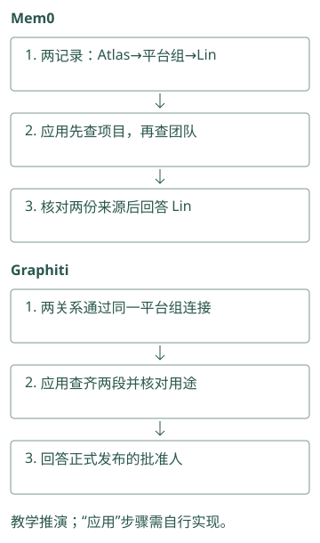
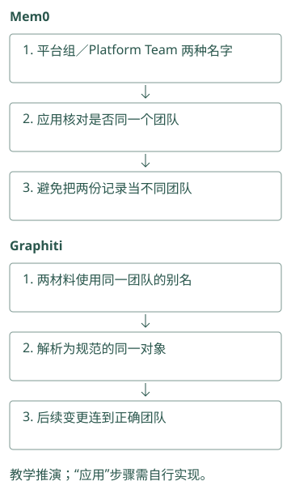
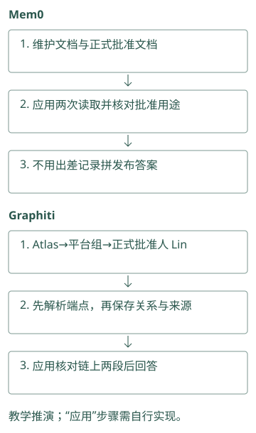
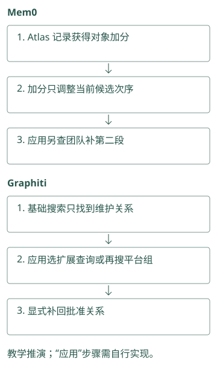
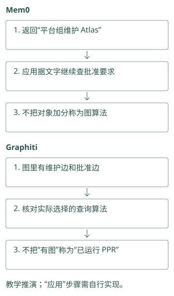
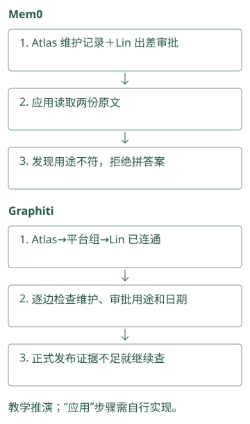
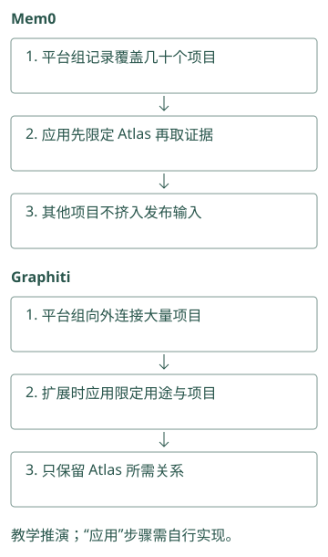
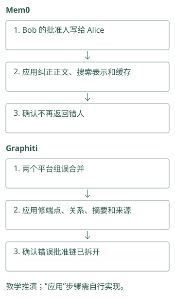
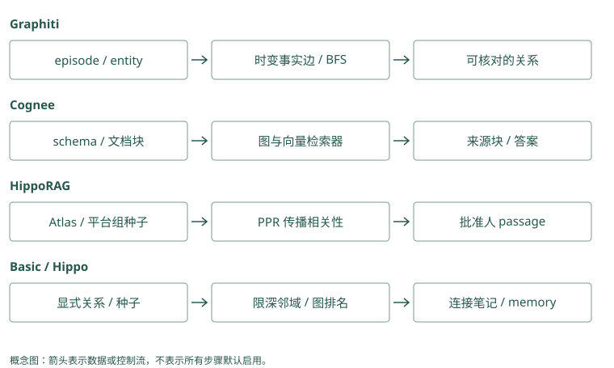

# 图谱路线：Graphiti / Cognee / HippoRAG

## 一份文档没有答案，两份合起来才有

我们有两段资料：

```text
文档 A：Atlas 由平台组维护。
文档 B：平台组的正式发布由 Lin 批准。
问题：谁批准 Atlas 的正式发布？
```

A 很像问题，却没有批准人；B 有批准人，却不含 Atlas。分别对段落做相似度排序，可能只取到 A。图方法试着把“平台组”这个共同对象保存下来，让查询有路通向 B。

图由节点和边组成。节点可以是项目、团队、人员或段落；边表示它们之间的连接。先理解每条边说了什么，再看搜索怎样利用它。Graphiti、Cognee 和 HippoRAG 的差别正落在这两处。

Mem0：一条记录说“Atlas 由平台组维护”，另一条说“Lin 批准平台组发布”。应用先查 Atlas，再用平台组查第二条，核验后回答 Lin。

Graphiti：两条关系通过同一个平台组相连。应用查齐两段及其来源，确认它们谈的是同一团队的正式发布，才能回答批准人。

<details class="source-example">
<summary>源码与边界（选读）</summary>



源码对照：

“第二跳”就是先由 Atlas 找维护团队，再由团队找批准人，两次沿关系查找。Mem0 可以先返回维护卡片，应用拿平台组继续查询；Graphiti 可以保存两段连接，但基本搜索仍不保证沿图继续走。BFS 是从起点一层层找邻居的遍历方法，需要对应配置，不能用“建了图”代替“此次查询走了第二跳”。

### Mem0：实体关联只能提供第二跳线索

A 可以成为“Atlas 由平台组维护”，B 成为“平台组发布由 Lin 批准”。直接问 Atlas 时，B 不含 Atlas，可能不在语义池。应用可以读 A 后再查平台组；实体索引为同名对象相关事实加分，但当前路径不会自动演绎 Atlas 的批准人。

### Graphiti：两份材料通过规范团队节点连接

A、B 分别提交为 episode，平台组 resolution 到同一 UUID，两条关系形成可探索路径。基础 search 不默认 BFS，想补第二跳应选启用 BFS 的高级配置或显式限定节点查询。成功后返回两条 fact 和各自 episode，reader 再核验关系组合。

</details>

## Graphiti：把变化中的事实连回原始输入

Graphiti 把一次原始输入保存成 episode，可理解为“这次收到的消息和来源”。提取模型从 A 得到 Atlas、平台组及维护关系，从 B 得到平台组、Lin 及批准关系。

然后它要判断两次出现的平台组是不是同一对象。若第二次写“Platform Team”，这可能是别名；若另一个公司也叫平台组，合并就是错的。Entity resolution 用于解析这类身份，edge resolution 则检查关系重复、变化和冲突。

得到教学图后，沿 Atlas 的维护关系到平台组，再沿批准关系到 Lin。具体查询能否完成这次扩展仍取决于搜索配置与范围，图存在并不保证每个 search 都自动走这条路径。回答还应附上 A 和 B 的来源。

若 18 日批准人改为 Mei，Graphiti 的时间关系可以保存旧 Lin 关系曾有效，以及新关系从何时有效。当前问题与 15 日的历史问题应选择不同版本。图的作用在这里包括关系和时间，而不仅是让相似度更高。

Mem0：两条记录分别写“平台组维护 Atlas”“Platform Team 负责 Atlas”。应用核对它们是否同一团队，避免重复或混用，搜索命中不能替代这个确认。

Graphiti：确认两个名字指同一团队后，让两份材料连到同一个对象。后来批准人变更，才会改到正确团队的关系，而非一个同名团队。

<details class="source-example">
<summary>源码与边界（选读）</summary>



源码对照：

“平台组”和“Platform Team”若是同一团队，应归同一个对象；若分别属于不同公司，应分开。Mem0 的实体合并主要影响哪些卡片被归到这个对象。Graphiti 的节点合并还会影响维护边和批准边接到哪里。后者错了，甚至可能把两个公司的正式批准要求拼成一条看似完整路径。

### Mem0：相近名字合并只影响实体索引

实体批处理优先规范文本精确匹配，其次接受高相似度近邻，更新 `linked_memory_ids`。它没有把“维护”“批准”单独变成带方向的类型边。查询可能更容易命中同对象文字，但时间替代和关系链仍需外层处理。

### Graphiti：节点解析与边解析要分别阅读

`resolve_extracted_nodes()` 解决“Platform Team 是否同一对象”，`resolve_extracted_edges()` 解决“这条批准关系是否重复或取代旧关系”。前者输出 UUID map，后者先查两端已有边再搜索全组失效候选。把两个阶段分开测试，才能判断错误来自身份还是关系裁决。

</details>

## Cognee：先规定希望从资料里整理出什么

Cognee 可以处理文档、代码、会话等输入。为了把 A 和 B 整理成可用知识，我们可定义关注的对象和关系：项目、团队、人员、维护和批准。这类结构定义称为 schema，可以想成给提取器的一份填写格式。

加载器读出原文，分块把长文切成可处理单位，抽取过程按 schema 形成知识，再写入相关存储和索引。若格式没有“批准关系”，或者分块丢了前文“该组”的指代，后面的图搜索就可能找不到正确连接。

读取时还要选择 retriever，也就是“这次用哪种取资料的方法”。直接问一段文档内容，可以取块；跨对象问题可以用图相关路径；经验和 Skill 有其他入口。`recall()` 的名字没有指定唯一算法，有些路径还会生成答案，应用要分清返回的是证据还是已经加工过的结论。

对我们的案例，可以分别固定块检索和图路径，检查是否返回 A、B，再用同一回答模型比较。这样才能知道改善来自连接证据，还是来自不同提示或更大的输入。

Mem0：输入两份文档，分别保存“Atlas 由平台组维护”和“平台组发布由 Lin 批准”。应用查询时核对“发布”，不能把另一份出差审批记录拿来拼答案。

Graphiti：两份文档整理成“Atlas→维护团队→平台组→正式批准人→Lin”。应用确认两段都指这个平台组的正式发布，再带着原文回答 Lin。

<details class="source-example">
<summary>源码与边界（选读）</summary>



源码对照：

### 把两份文档写入 Graphiti 的完整调用形状

下面使用两个消息时点，按顺序等待处理。`graphiti` 应已经配置 LLM、embedder 和 driver，并建立相应索引；代码是接口讲解，不能替代模型与后端部署。分组值在真实服务里来自授权映射：

```python
from datetime import datetime, timezone
from graphiti_core.nodes import EpisodeType

when = datetime(2026, 9, 10, tzinfo=timezone.utc)
a = await graphiti.add_episode(
    name="Atlas 维护关系",
    episode_body="Atlas 由平台组维护。",
    source_description="文档 A，审核版 v1",
    reference_time=when,
    source=EpisodeType.text,
    group_id="team-a",
)
b = await graphiti.add_episode(
    name="平台组批准关系",
    episode_body="平台组的正式发布由 Lin 批准。",
    source_description="文档 B，审核版 v1",
    reference_time=when,
    source=EpisodeType.text,
    group_id="team-a",
)
facts = await graphiti.search(
    "谁批准 Atlas 的正式发布？",
    group_ids=["team-a"],
    num_results=10,
)
```

这里的 `graphiti` 是已配置对象，`await` 表示等待这次异步操作完成。`a`、`b` 分别接收两份材料的处理结果，`facts` 接收一次查询返回的边列表。写入用单个 group_id，读取用 group_ids 列表，表示允许查询哪些分组；分组值应由应用确定，而不是由模型任意选择。

基础 search 未默认启用 BFS，因此最后一次调用不保证自动返回整条批准链。它先比较全文和向量事实；若 B 未找到，可以选含 BFS 的高级 recipe，或读 A 后继续以规范平台组搜索。代码顺序展示写入契约，返回证据的覆盖程度要用具体结果验证。

`a.episode.uuid` 与 `b.episode.uuid` 分别标识来源。理想图里两个结果的 nodes 共享同一个平台组 UUID，而 A、B 的事实边 UUID 不同，分别有各自的 episodes。实体显示名相同不够，需要核对规范 UUID；关系名也可能受 schema 和抽取结果影响，不能要求所有版本使用本书示意的中文字串。

### 关系裁决为什么先给模型短索引，再由代码验范围

边维护将同端点的重复候选编号为 0 到 n-1，把全组可能失效的候选接在后面编号。模型返回 duplicate_facts 与 contradicted_facts 的索引；代码检查索引范围，丢弃越界选择，再映射回实际边。这个设计减少模型直接编造 UUID 的风险，但没有消除错误地选中合法索引的风险。

若正文与端点完全一致，fast path 复用旧边并追加新 episode 引用，不必进行同样的模型裁决。若语义同义，则模型可以选择旧边 UUID；若是真实状态变化，后续时间函数关闭相应旧区间。最后 `new_edges` 按解析后的 UUID 是否仍等于新抽出 UUID 判断，节点摘要只用这些新增关系。由此可见，写入一段材料可能主要增加来源而不增加事实条数，也可能改变已有关系的有效状态。

核验一次 ingestion 时，先看 episode 原文是否正确，再看规范节点、边端点、fact、来源列表和被失效的旧边，最后检查 summary。只数返回 edges 或只看图形连线，会遗漏真正影响未来答案的更新。

Schema 是提取器要填写的结构：谁是项目，谁是团队，允许表达哪种关系。Mem0 可按提示把“谁批准谁”写清楚，但普通结果仍是文字卡片；Graphiti 可以配置 Project、Team、Person 等对象类型，并限制合法连接。类型限制是帮助提取的格式约束，不能证明正文确实讲的是发布批准。

### Mem0：自定义提示不能凭空创建 schema 图

自定义提取指令能要求主体明确、保留批准对象，输出仍走普通 text 卡片。应用可将审核后的结构附 metadata，但读取时需要代码解析和查询。不能把 Mem0 的实体链接与 Cognee 的 typed schema 当作同一关系模型。

### Graphiti：entity_types 与 edge_type_map 约束合法组合

比如定义 Project、Team、Person，再允许 Project 到 Team 的维护关系、Team 到 Person 的批准关系。Pydantic 模型帮助校验属性形状，`edge_type_map` 指定节点签名对应关系。遗漏一种合法类型可能漏抽事实，定义过宽又会增噪，schema 应用真实失败输入验证。

</details>

## HippoRAG：把相关性沿连接传播

HippoRAG 的索引会把段落中的事实提取成三元组：主语、关系、宾语。比如 `(Atlas, 由谁维护, 平台组)`。OpenIE 是这种开放信息抽取的做法，不要求预先枚举每一种关系名称。

索引中还有事实、实体短语和 passage，也就是段落之间的连接。查询先找到相关事实及直接相关段落，把它们作为种子；种子表示这次问题从图的哪些位置开始有相关性。

随后 Personalized PageRank（PPR，个性化 PageRank）反复分配相关性：一部分回到种子，一部分沿连接往外走。用一个与真实索引分开的小算例，看传播怎样发生：

```text
玩具图：A -- B -- C，初始质量全部在 A。
每步 20% 回到 A，80% 沿边走。
第 1 步：(A=0.20, B=0.80, C=0)
第 2 步：(A=0.52, B=0.16, C=0.32)
```

第 2 步中，B 的 0.80 沿两条边均分，再乘 0.80，给 A、C 各 0.32；加上 A 的 0.20 重启份额，就得到 A 的 0.52。原来没有直接质量的 C 也被连接带到了。这是两步示意，实际 PPR 会继续迭代，并使用具体的权重、种子和收敛条件。

在文档例子中，Atlas 和平台组相关的种子可以把相关性传到包含批准人的段落 B。最后取高分段落让回答模型读 A、B 原文。PPR 分数表示图中的查询相关程度，不是“Lin 一定正确”的可信概率。

Mem0：查询 Atlas 时给已有相关记录加分，不会因此自动发现“平台组→Lin”这一步。应用需要再查平台组，补齐另一条证据。

Graphiti：基础搜索先找相关关系；要扩展到邻居，应用另选支持扩展的查询。不能因为数据存成了图，就认定搜索已经走遍批准链。

<details class="source-example">
<summary>源码与边界（选读）</summary>



源码对照：

Mem0 对 Atlas 相关卡片加分，属于当前候选的局部调整。Graphiti 的 BFS 可以找附近关系；PPR 则像把一份相关性质量不断分配给邻居，再部分拉回查询起点。三种操作的输入、循环和输出不同，PPR 的数值也不是批准权限概率。下面算例用于理解传播，不能套给任何带图的库。

### Mem0：实体数量权重不等于 PageRank

实体 boost 对同一实体关联过多的记忆降低权重，避免“项目”之类泛化锚点支配评分。这是局部信号，没有随机游走、重启分布或全图迭代。若要测试关联传播，应建立相应索引并独立比较，不能给现有 boost 起 PPR 名字。

### Graphiti：BFS 与距离重排也不等于 PPR

搜索配置支持限深 BFS，或以中心节点距离重排边。BFS 把邻域候选补进集合，距离调整已有关系次序；PPR 反复传播概率质量。两者解决相关可达性但运算不同，Graphiti 这一搜索路径不能据“知识图谱”自动称为 HippoRAG 算法。

</details>

## 为什么不同的图不能交换算法名字

Basic Memory 的笔记关系由显式链接形成，读取时限深展开；A-MEM 可以由模型建议笔记连接；Hippo 有池内图排名与池外邻居补充；TencentDB 的 CodeGraph 保存代码符号和调用连接。它们的边不是同一种意思。

一条代码调用边不能回答谁有发布权限，文件索引链接也不会自动带有效时间。先写下需要走的具体路径，再确认项目建立了这些边、读取真的走了它，最后核对原文。图上能到达只是找证据的条件之一。

Mem0：搜索返回“Atlas 由平台组维护”，它是一条有用文字，不表示系统执行了沿图传播。应用还得查平台组的发布批准人。

Graphiti：关系搜索返回了维护边，也不表示执行过 PPR。要确认算法，检查实际调用；“有图”和“运行某种图算法”不是同一件事。

<details class="source-example">
<summary>源码与边界（选读）</summary>



源码对照：

谓词就是关系说的动作，比如“维护”“批准”。Mem0 的对象索引列出 M1、M2，只说明两张卡都谈到平台组，没有说明谁维护谁。Graphiti 的边明确两端与关系文字，但也可能把“Lin 批准出差”误用于发布。对象有关联与结论被支持之间，还需要阅读关系用途和原文。

### Mem0：memory_id 列表没有关系谓词

实体记录关联 M1、M2，仅表示它们谈到该对象，不表示 M1 的结论推出 M2。应用从正文读出关系后，需继续检查发布范围、团队身份和日期。若关联来自错误近邻，修正应包括清理实体链接，不能只修改 fact 正文。

### Graphiti：关系名、端点和 fact 都要一致

边包含源、目标 UUID、关系名和自然语言 fact。名为批准的边若正文其实讲采购，不支持发布答案；方向错误也会改变含义。episode 是最后核验入口。关系可达、语义适用与来源可信，是三个独立检查。

</details>

## 沿着批准链核对每一步，而不是相信连接本身

查询从 Atlas 到平台组，再到 Lin，只找到了一个可能的答案。我们还需读回两段原文，确认维护关系是否对应当前项目，批准关系是否适用于正式发布，而非采购或其他操作。如果 B 写的是“Lin 批准平台组的出差”，图中同样能到达 Lin，却完全不能支持发布答案。

Graphiti 的类型化关系与时间有助于筛选这样的条件，但抽取可能丢掉限定词。Cognee 的 schema 可以要求提取批准对象，却可能因为 schema 过窄漏掉真实表达。HippoRAG 的传播主要负责发现相关段落，尤其不能把每条传播路径解释成有方向的逻辑证明。三者都需要让 reader 对照原文判断关系链是否支持结论。

可以想象图检索带回 A、B 和另一段关于 Lin 的介绍。介绍有助于说明 Lin 是谁，却不是批准权限的证据。把可回答问题的来源与仅供背景的来源分开，能避免回答因资料更多而看起来更确定。证据不完整时，回答“已知 Atlas 属于平台组，但尚未找到当前批准人”也是合理结果。

Mem0：两条记录看似能拼出 Lin，但第二条原文说“出差由 Lin 批准”。应用核对来源后，应回答正式发布证据不足，而不是照着人名猜。

Graphiti：即使 Atlas、平台组、Lin 已连成路径，第二段也可能是出差关系。逐条检查关系用途和日期，不能把“连得上”当成“答得对”。

<details class="source-example">
<summary>源码与边界（选读）</summary>



源码对照：

先找到 Atlas 属于平台组，再找到 Lin 批准平台组，回答需要同时保留两份证据。Mem0 的两次搜索若换了用户范围，不能拼接；Graphiti 的两条边若中间不是同一个对象编号，也不能拼接。Reader 指最终读证据并回答的模型，它需要看到链条的每一步，而不是只看到最后的人名。

### Mem0：两次检索的证据需要成组打包

第一次找到维护关系后，第二次以平台组检索批准资料，两次 filters 必须保持同一可信范围。若 B 来自另一个团队，不能凭同名拼链。应用保存两个候选的 source、当前有效条件和查询关联，最后把 A、B 一起交 reader，而非只注入第二次结果。

### Graphiti：fact 与来源链要逐跳回读

Graphiti 返回两条边后，检查中间 UUID 是否真正相同，边在目标日期是否有效，再通过 `episodes` 读两份原文。边路径不是证明书，抽取可能把限定词丢掉。若其中一跳没有发布批准语义，应继续找或明确证据不足。

</details>

## PPR 为什么能找第二跳，也为什么会被泛化节点带偏

在玩具图中，质量沿边传播，所以与种子相隔两步的节点也能得到分数。真实图里，平台组可能连接几十个项目；如果查询先命中一个泛化节点“发布”，它还可能连接数百段资料。传播范围越广，不相关内容获得质量的机会也越多。

重启分布把搜索拉回本次问题，避免完全变成与查询无关的全图排名。沿边传播比例小一些时，更偏向直接种子；比例大一些时，连接结构的影响更强。两者都可能适合某些问题，不能简单理解成越大越能推理。图里的边权、错误连接和高连接度节点也会影响结果。

对批准人案例，值得检查的收益非常具体：dense 已找到 A，却漏 B；加入传播后，B 是否进入相同预算的返回段落。如果只多返回了十份资料，最后 reader 碰巧答对，并不足以说明连接方法比更大的普通检索更有效。固定段落数量或 token 预算，再观察必要的第二跳来源是否被补回，才容易解释收益。

Mem0：搜索“平台组”找到几十个项目的记录。应用先限定 Atlas，否则其他项目的批准要求可能挤掉真正需要的那条。

Graphiti：平台组连着几十个项目，扩展邻居会带回很多关系。应用限定项目和用途后再取证据，不能把所有邻居都当 Atlas 的规则。

<details class="source-example">
<summary>源码与边界（选读）</summary>



源码对照：

Fanout 表示一个对象向外连接多少邻居。平台组连接几十个项目，Graphiti 多走一层也会带回其他项目；Mem0 多查一次平台组，同样可能取到无关卡片。比较时固定最终给模型的输入长度，观察批准证据是否补齐，以及噪音是否挤掉必要来源，不能以查得更多直接判定更好。

### Mem0：先增大语义池和多次查询作简化对照

第二跳失踪可能只是 B 从未进入池；用已知平台组再查一次，能区分关系需要与表达问题。固定最终输入预算后比较一次 query 和两次受限 query，记录新增调用成本。这样的对照帮助判断是否真的需要全图关联系统。

### Graphiti：BFS 深度与 fanout 影响噪音

高级配方可从初始边的源节点补 BFS 候选，再参与融合。连接很多项目的平台组会带回无关边，增加深度未必更好。记录第二跳是否入池、无关边数量和最终 token，不能只看遍历了多少节点。

</details>

## 建图的成本，还包括错误怎样撤销

假设两个不同公司的平台组被合并成一个节点，之后又接入很多文档。纠正身份时，不只是改一个名字，还要核对哪些关系属于各自公司，哪些摘要和索引由错误合并派生。来源记录在这时非常重要，因为它允许回到原文重新分配连接。

同样，删除一份文档时，某条关系可能仍有另一份文档支持。按文档来源维护关系，比简单删掉所有出现过的实体更稳妥。图带来的连接收益，也意味着更新和删除要沿连接传播。试用时既要看第二跳有没有找到，也要看误合并、纠正和重建有没有可操作的路径。

Mem0：一条记录把 Bob 的批准人写给 Alice。应用纠正正文后，还要重建相关搜索表示并清掉旧缓存，确认查询不再返回旧答案。

Graphiti：两个平台组被误合并，应用修对象和关系后，还要检查摘要与来源引用。只改团队名字，不能保证错误批准链已经拆开。

<details class="source-example">
<summary>源码与边界（选读）</summary>



源码对照：

若错把两个平台组混在一起，修正正文只是第一步。Mem0 还要检查旧对象索引是否仍指向卡片；Graphiti 还要检查错误节点周围哪些边和摘要需要重建。删材料时，某条关系可能还有另一份来源支持；删除操作有没有保住合法支持、清掉错误派生，需要实际核验，不能只看接口成功。

### Mem0：正文更新会清理旧实体并重新链接

`_update_memory()` 在 text 改变时先从旧实体记录移除 memory_id，再对新正文重新提取链接。清理失败是非致命的，可能留下辅助索引残留。纠正同名团队后应核对所有关联 ID，并检查应用摘要和缓存，而非仅看 update 成功信息。

### Graphiti：删除来源的当前实现需要谨慎审计

`remove_episode()` 按 episode 的 `entity_edges` 找边，当前使用 `edge.episodes[0] == episode.uuid` 判断创建来源，节点则检查是否仅被一个 episode 提及。这不是完整的“所有合法支持重新分配”算法。共享来源、旧边失效与摘要重建都需额外验证，不能承诺删一份资料只影响它独有的信息。

</details>

## 动手检查

给文档 B 改成“另一个平台组的发布由 Lin 批准”，再加入“Atlas 所属平台组由 Mei 批准”。系统必须保存什么身份信息，才能不串线？只增加图遍历深度能修复吗？

答案提示：需要区分团队的规范身份和所属范围。错误合并发生在建图阶段，增加遍历深度会放大错误，而不是自动纠正。

<details class="implementation-notes">
<summary>实现笔记与源码对照（选读）</summary>

三个项目都把文本转换成连接结构，但连接承担不同任务。Graphiti 组织随时间变化的事实；Cognee 组织异构数据处理和多种检索；HippoRAG 在事实与段落之间传播查询相关性。下文的 Atlas 部署例子是教学用例，不是实测结果。

## Graphiti：从 episode 到带时间的事实边

Graphiti 是增量知识图谱框架。Episode 保存一次输入及其来源，EntityNode 表示人、项目、地点等对象，EntityEdge 保存对象间的关系与事实。实体摘要是压缩视图，不能替代 episode 和具体事实边。

### 写入为什么需要 resolution

从 [`graphiti_core/graphiti.py`](../../sources/repos/graphiti/graphiti_core/graphiti.py) 的 `add_episode()` 可以跟踪抽取和解析过程：

```text
episode + reference time + group scope
 → 读取相关历史 episode
 → 抽取实体
 → 解析同名、别名与已有节点，生成 UUID 映射
 → 抽取关系，修正边端点
 → 查找重复/矛盾边，处理时间有效性
 → 更新实体属性/摘要
 → 保存节点、边、episode 引用与索引
```

输入“Atlas 改用 K8s”时，抽取可能得到 Atlas 与 K8s 两个节点。Entity resolution 决定它们是否与既有 Atlas 项目、Kubernetes 平台为同一对象，再把抽取时的临时节点 ID 映射到规范节点 UUID。没有这一步，同一项目会分裂成多个小图；过度合并则会把同名但不同团队的项目串起来。

关系解析既做去重，也找矛盾。重复证据可以关联到已有边；新事实明确取代旧状态时，使旧边的有效区间结束，并记录新边。它需要理解关系语义：“采用 Kubernetes”可能取代“采用 Docker Compose”，但未必否定“开发机使用 Docker”。一句新事实不应让所有相似边失效。

### 时间字段分别回答什么

`created_at` 记录系统写入时间；`valid_at`、`invalid_at` 描述事实何时成立和失效；`expired_at` 记录边在系统中被标为过期的时间。Episode 的 reference time 为“昨天迁移”提供锚点。双时间思想允许表达“9 月 20 日收到消息，得知 9 月 18 日已经迁移”。

查询“9 月 17 日 Atlas 怎么部署”应选择那时有效的旧边；查询“现在怎么部署”应选择新边。只有 embedding 相似度无法完成这个判断。时间抽取和冲突裁决仍依赖模型，必须用晚到事件、未来事件、纠正事实和单次例外做回归测试。

### hybrid search 怎样回到证据

Graphiti 为边、节点和 episode 提供不同搜索结构，组合语义搜索、全文/BM25 与图遍历，并通过搜索配置选择融合或重排方式。语义搜索先找到“部署方式”相关事实，全文抓住项目名，图遍历沿 Atlas 到平台、服务和来源拓展。检索返回事实及关联信息，应用再组装上下文，并可根据 episode 引用回查原文。

图遍历没有自动事实核验能力，沿错误合并节点扩展会放大错误。生产集应分别测实体合并、边失效和证据命中，而不只是最终回答。

### 依赖与交付边界

图数据库保存结构，LLM 执行实体与边抽取，embedding 支持语义索引。项目支持多种图后端并提供 MCP/FastAPI 接入，但仍需要配置、建索引、重试和后端运维。README 提醒小模型可能不能稳定遵循结构化输出，这影响写入成功率，不只是回答风格。

Graphiti 的开源框架与 Zep 的托管 Context Graph Engine 不是同一交付物。用户/线程管理、规模化部署和服务延迟要按实际产品验证。它适合关系变化、历史有效性和来源追踪占主导的应用。

## Cognee：把异构输入变成可检索知识

Cognee 的当前上层 API 是 `remember/recall/improve/forget`，底层仍能看到 `add/cognify/search` 等管线。它把文档、代码、会话、反馈和执行轨迹送到统一框架，而非仅维护一张聊天事实图。

### remember 与 Extract-Cognify-Load

[`remember.py`](../../sources/repos/cognee/cognee/api/v1/remember/remember.py) 路由不同输入和配置。普通数据进入 add 与 cognify 路径，特定 memory entry、session、Skill 和代码输入有自己的处理逻辑。不能假设每个 `remember()` 参数组合都执行同一套固定步骤。

概念上的 ECL 管线是：

```text
Extract：加载、识别内容、规范化、分块
 → Cognify：用 schema 提取实体关系与知识结构
 → Load：写入关系元数据、图结构和向量索引
```

关系库维护用户、dataset、文档与处理状态；图存实体、关系和来源连接；向量库帮助 query 找到语义相近的块或图元素。这三种存储配合提供不同访问路径，不代表每份全文在三个库中都重复一份。

Pydantic/schema 限定抽取对象类型。一个项目文档可以抽取服务、责任人、接口和约束，代码入口则可以组织符号关系。schema 决定哪些知识有结构可用，也可能漏掉定义之外的重要信息，因此保留原始块很重要。

### recall 为什么要选 retriever

[`recall.py`](../../sources/repos/cognee/cognee/api/v1/recall/recall.py) 与 query router 根据调用配置组织搜索。向量块检索适合直接问文档内容，图相关检索适合跨对象关系，session/lesson 或 Skill 路径适合经验复用。某些检索方式会直接组织生成答案，另一些返回上下文；应用需要辨别返回的是证据还是已经生成的结论。

当前 `_search_session()` 还展示一个容易忽略的轻量路径：对缓存里的 question/context/answer 分词，按与 query 的词重叠排序，而非每次都查询图。Session owner 解析要结合 caller 与授权 dataset，防止同名 session 串线。路由到 lexical/coding rules 后空结果也有回退约定，因此必须记录实际使用的 route，而不能只写“本次调用了 recall”。

比如两份文档分别写“Atlas 由平台组维护”和“平台组的发布批准人为 Lin”。段落近邻可能只抓到第一份，图结构能通过平台组连接第二份。若关系抽取漏了批准人，图检索同样无法补救。应同时保存 query、命中的块、图路径和 reader 输出，定位失败层。

### improve 与 forget 的含义

`improve` 接收已有知识和反馈，针对内容、关系或经验进行改进；它不是“每次调用都会训练基础模型”。反馈造成的结构更新仍应留痕，错误反馈也可能使库退化。自动改进应先离线测，不应把所有用户抱怨直接提升为全局规则。

`forget` 提供删除入口，但一个输入可能派生块、向量、实体、边、session lesson 或缓存。用户删除场景必须实际检查所用配置的影响范围，不能从 API 名称推断所有副本都会同步清除。

### 平台能力与成本

本地仓库包含多租户/授权、API、UI、MCP、迁移及多后端配置。可选择 GLiNER 和本地 embedding 路线减少云 LLM 依赖，但抽取能力与 schema 适配范围需要另测，不能默认等价于大模型复杂关系抽取。

大型管线还有后台任务生命周期、批次重试和跨存储一致性问题。当前 `remember.py` 对后台任务保留强引用并登记等待机制，是避免任务在返回 HTTP 后丢失的工程细节；它不等于持久化消息队列，进程故障恢复仍要按部署验证。

Cognee 适合有数据工程和运维能力的企业知识平台。其论文也强调图与 LLM 收益依赖数据、指标和参数。高维护活跃度支持试用，不能代替你的成本与准确性实验。

## HippoRAG：用 Personalized PageRank 做关联召回

HippoRAG 是研究检索框架，目标是让非参数知识索引支持多跳与持续新增知识。它没有替应用完成用户身份、长期画像和团队 ACL。第一版和 HippoRAG 2 机制有差别，下文以本地 `HippoRAG.py` 的事实种子与 passage 节点实现为主，不把两版混写成一个算法。

### 索引包含哪些连接

文档被分成 passage，OpenIE 抽取 `(subject, predicate, object)` 三元组。实体/短语节点通过事实关联，同义短语可以建立连接，passage 节点连接它包含的实体。实体、事实和 passage 的 embedding 分别支持候选定位。

```text
passage A：Atlas 由平台组维护
       Atlas ←→ 平台组 ←→ Lin
                  ↑          ↑
              passage A   passage B：Lin 批准平台组发布
```

本地图还保存来源相关信息，避免删除一篇文档时误删另一个来源仍支持的事实。OpenIE 与同义链接都可能出错；高连接度的错误节点尤其容易把随机游走带偏。

### 从 query 到 PPR 的四步

[`HippoRAG.py`](../../sources/repos/hipporag/src/hipporag/HippoRAG.py) 中 `retrieve()`、`rerank_facts()`、`graph_search_with_fact_entities()` 和 `run_ppr()` 展示了读取路径：

1. 计算 query 与 fact 的相似度，产生候选三元组，再通过 fact rerank/filter 选择更相关的事实。
2. 把选中事实的主体与客体映射到图节点，以事实分数产生 phrase seeds。代码还考虑实体出现的 passage 数，降低泛化实体支配种子的风险。
3. 做 dense passage retrieval，把归一化 passage 分数乘以较小的 passage weight，与 phrase seeds 合并。这样即使实体信号不完整，也保留直接段落相关性。
4. 对整张图执行 Personalized PageRank，读取 passage 节点的稳定分数，按分数排序返回原始段落。

PPR 可写成教学公式：

```text
r_next = (1 - d) × s + d × Pᵀ × r
s：由 query 相关实体和段落形成的重启分布
d：沿图连接继续传播的比例
P：归一化后的连接转移矩阵
```

每一步有一部分概率回到查询种子，另一部分沿连接扩散。反复迭代后，既连接重要种子又处在相关邻域的 passage 获得较高分。本地 `run_ppr()` 对来源图的无向投影运行加权 PPR；它传播相关性，不是在图上逐条演绎关系方向。

### 为什么可能找回低相似度证据

问“谁批准 Atlas 发布”，query 可能首先命中 Atlas 与平台组。PPR 把相关性传播到 Lin 及包含批准规则的 passage B，尽管 B 不直接出现 Atlas。这补充了独立段落近邻的盲区。最终 reader 仍应读取 A、B 原文验证链条，不能把 PageRank 分数当成事实置信度。

若没有相关事实种子，读取路径还需要依赖 dense 检索的回退。调高扩散程度不总是更好：过多跳数与泛化节点会引入无关段落。应该与同一 reader 下的 dense、BM25、hybrid 基线比较。

### 研究结果和生产缺口

第一版论文的多跳 QA 提升及相对 IRCoT 成本/速度数字只适用于论文协议。HippoRAG 2 的 factual memory、sense-making、associativity 是扩展目标，不能自动证明长期会话产品质量。

本地索引 manifest 绑定模型、endpoint、归一化与组件身份，防止新旧 embedding 静默混用，这是可以借鉴的工程保护。应用仍需自行实现 tenant filter、删除政策、在线抽取调度和权限治理。

## 如何验证图是否值得

对 Graphiti 测新事实是否让正确的旧边失效、晚到事件是否保留历史；对 Cognee 测 loader/schema/retriever 组合是否覆盖真实异构数据；对 HippoRAG 测图扩散能否找回 dense 未命中的第二跳证据。三者共同需要记录建图 token、写入延迟、错误实体合并、来源丢失和增量重建成本。一个能画出关系图的 demo 还不能回答这些问题。

## 与其他图实现逐项比较

### 笔记 link：Basic 与 A-MEM

Basic 的关系由文件语法明确写出，再解析目标 entity；`build_context` 取有限深度邻域。这种图可由人直接核对，漏链接时要编辑文件。A-MEM 的 LLM 从新笔记与相似邻居建议连接，还会改变邻居的 context/tag。它更自动，也更容易描述漂移；最终截断甚至可能让已追加的邻居不返回。两者适合组织笔记，均不等于 HippoRAG 在整个 phrase/passage 图迭代分配概率。

### 候选图路：Hippo 与 MCP

Hippo 的 [`graph-stream.ts`](../../sources/repos/hippo-memory/src/graph-stream.ts) 从强 lexical/dense seeds 读其实体，按限跳 BFS 扩展两向关系，分数随 hops 衰减，映射回池内 memory 再作为 RRF 第三路。默认图跳数与 fanout 有限制，种子本身不重复得图分。它与补池外邻居的 graph-recall 分开；若你想找 dense 池外第二跳，仅启用 graph stream 可能无效。

MCP 的关联/typed graph 与矛盾边服务连接、来源与巩固。关联可由相似/聚类或推断产生，`CONTRADICTED_BY` 的可选检测还可能仅使用相似度区间。边标签存在不代表关系已经由模型和原文验证，应该先查看生成方式，再决定是否用于答案。

### 知识内容图：TencentDB 与 MemOS

TencentDB Wiki 把文档转换成结构化页面与链接，CodeGraph 解析符号/调用/文件结构；更新依 ingest/git sync 和状态 callback。问“发布批准人”适合 Wiki 内容，问“改函数影响谁”适合 CodeGraph，不能交换这两种边的语义。MemOS 的图在 textual backend 中，由所选 reader/backend/schema 组织；cube 并不强迫所有 module 都是一张图，KV 与 LoRA 不是 entity edges。

Mem0 的 entity linking 只把实体映射到 memory IDs、提供评分 boost，既不保证类型化关系边，也不自动做 PPR。Letta 的 Markdown 索引链接是发现文件的路径，MemoryOS 的 page 连续性和主题归组是组织对话，不能因为可画连接图就归为 Graphiti 式时间知识图。

</details>

<figure class="concept-diagram" tabindex="0"><figcaption>图：图的边语义决定可回答问题，扩展算法决定证据能否到达。</figcaption></figure>

<details class="comparison-reference">
<summary>项目对照速查（选读）</summary>

## 本章对照结论

| 项目 | 边或连接是什么 | query 如何利用它 | 主要收益/成本 |
|---|---|---|---|
| Graphiti | 带时间关系及原材料引用 | 按配置用全文、向量、邻域扩展与重排 | 查当前和历史关系；抽取与身份核对成本高 |
| Cognee | 按结构定义抽取的关系、文本块和来源 | 选择图或文本块等检索方法 | 能组织多类资料；配置与多存储一致性复杂 |
| HippoRAG | 实体短语、事实、段落及同义连接 | 用相关事实和段落作起点，沿图传播 | 补多跳证据；抽取错误和泛化连接会增噪 |
| Basic Memory | 人/Agent 显式 relation/wikilink | URI/笔记命中后限深展开 | 可编辑可重建；漏链接/同步 |
| A-MEM | LLM 建议笔记 links | 近邻后追加邻居 | 自动关联；演化漂移/截断 |
| Hippo | memory 的实体关系图 | 池内 graph stream/RRF 或池外 graph-recall | 图与生命周期组合；需分清池边界 |
| MCP Service | association/typed/contradiction 等 | 关系/巩固与配置化服务 | 运维统一；关系证据强弱不一 |
| TencentDB | Wiki 页面链接、CodeGraph 符号/调用 | 授权资产内工具探索 | 团队文档/代码上下文；构建/同步链 |
| MemOS textual | reader/backend 组织的图知识 | 后端检索与调度 | 可组合资源；配置/模块差异 |
| Mem0 | 对象对应一组相关记忆编号 | 给语义池中谈到同一对象的记录加分 | 帮助定位对象；不等同自动多跳搜索 |
| Letta / MemoryOS | 文件发现链接 / page 连续性与主题 | 主动读 / 分层读取 | 有组织性，但非本章事实图协议 |
| Beacon / Hermes | 动作关联 / 判别控制数据 | 供下游索引或筛选 | 不据此称为长期知识图后端 |

</details>

