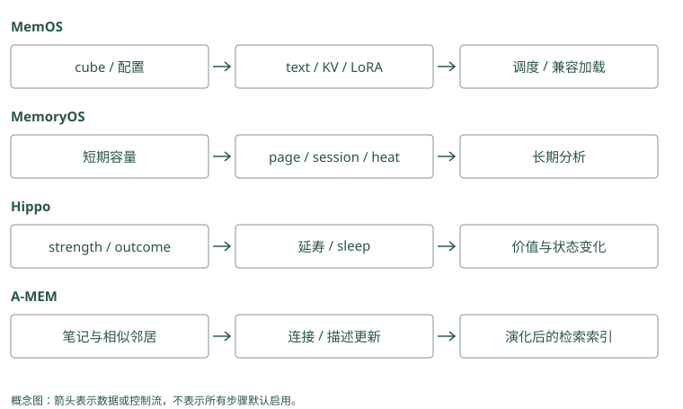

# Memory OS 与生命周期路线

## 四个项目，都在“整理记忆”，整理的却不是同一件东西

Atlas 助手已经工作了几个月。它面临四个不同问题：近期聊天太多；旧教训干扰新任务；新证据使旧笔记难理解；不同记忆资源需要统一调度。

MemoryOS、Hippo、A-MEM 和 MemOS 分别提供理解这些问题的路线。名字里的 OS、层级或演化不能直接交换。下面给每个项目一份输入，观察状态到底怎样改变。

Mem0：一页聊天整理成“发布前检查迁移”，主要改变了保存的文字。应用还要检查短句有没有删掉“仅正式发布”这个条件。

Graphiti：聊天说“Atlas 正式发布前检查迁移”。整理出的关系也应保留“正式发布”；若改成“任何任务都先查迁移”，应用按原话纠正，不能只看摘要变短了。

<details class="source-example">
<summary>源码与边界（选读）</summary>

“整理记忆”可能只是从长话形成短卡，也可能改变对象摘要或事实时间。Mem0 主要让新话形成可搜索陈述，并关联谈到的对象；Graphiti 还要决定对象是不是同一个、关系是否重复或变化。理解整理时，先写出被改的是正文、索引、摘要还是有效期，避免把它们混成一次自动学习。

### Mem0：组织主要发生在事实提取和实体关联

普通路径从近期消息得到短事实，再维护实体到 memory IDs 的索引。它没有同名的短中长期 page 提升，也不管理 KV 或 LoRA。应用可以借鉴分层思路，但应把新增加的队列、热度与摘要任务标成外层组件。

### Graphiti：演化主要发生在身份、关系和摘要

新 episode 可以改变实体归一结果、旧边有效时间和节点 summary。可选社区更新整理更高层区域，但不是按访问热度把 QA 搬到长期层。描述“会学习”时，应指出究竟哪类图对象被改动。

</details>

## MemoryOS：近期问答装满后，搬到按主题组织的页面

假设近期队列只能保留三条问答。我们依次讨论 Atlas 发布、用户语言和发布迁移问题。第四条到来时，最旧的问答不能一直占据有限队列，但也不该立刻消失。

MemoryOS 会把要移出的问答组织成 page，也就是带 ID、时间和内容的一份页面记录。模型判断连续性并生成主题摘要和关键词，再把页面放入合适的中期 session。这里的 session 更接近主题段，不一定等于一个真实聊天窗口。

```text
近期问答 → 页面 → 发布主题段
                      ├─ 第一轮部署讨论
                      └─ 迁移检查讨论
```

读取先找相关主题，再在主题下选页面，长期画像和知识又提供另一部分上下文。粗到细有利于减少扫描，但主题摘要如果遗漏迁移，下面正确的页面也可能没机会被选中。

访问会影响主题热度，热度达到条件后再分析页面，提取长期画像和知识。这叫提升：改变内容驻留的层。它不表示热内容自动为真。一次明确纠正若还没达到提升条件，本次任务仍应通过近期消息获得它。

Mem0：用户先说“Atlas 用预发布”，紧接着说“以后都这样”。近期消息帮助理解“这样”；并不表示所有旧对话已自动整理为一个发布主题。

Graphiti：把本次材料和旧关系一起核验，有助于认出 Atlas 的环境要求。长期维护的对象摘要仍要检查，不能代替每次材料的具体关系。

<details class="source-example">
<summary>源码与边界（选读）</summary>

参考最近几句，是为了理解“以后都这样”；把多次经历提升成主题页面，是另一个处理动作。Mem0 读取近期消息，Graphiti 读取前序材料，都可帮助当前抽取，却没有因此形成 MemoryOS 的层级页面。是否长期保留、何时合并、下一次按什么入口读取，要分别检查。

### Mem0：近期十条消息是提取上下文，不是 page 层

`get_last_messages(..., limit=10)` 帮助解释“那个环境”，并未把移出的消息自动提升成主题 pages。消息持久化与提取窗口限制也不是同一回事。若要主题分层，需要独立整理任务和 source 映射，再将候选按需保存或读取。

### Graphiti：previous episodes 与主题提升不同

前序 episode 为抽取提供上下文，saga 可关联一组经历，社区可聚合实体区域。它们不自动采用 MemoryOS 的容量与 heat 阈值。选择时看需要事件顺序还是主题页，而不是把所有带 session 的结构归为同一层。

</details>

## Hippo：内容可以不变，影响力随时间和结果变化

Hippo 可以保存“Atlas 发布前检查迁移”这条本地教训，给它强度、寿命和结果反馈。最简单的纯衰减例子，半衰期 7 天，初始为 1，14 天后为 0.25；实际代码还会结合其他因素。

若这条教训被检索命中，系统可以做召回强化；若它真正帮助一次发布成功，可以另记录好的 outcome。反之，一条导致失败的旧规则应收到坏的结果反馈或纠正。被检索和帮上忙分别是选择信号与结果信号。

Sleep 是集中巩固操作的入口，可能处理重复、合并和低价值内容，不是程序像人睡觉一样学习。观察报告里的具体改动，才能知道是降低排序、生成语义教训，还是移除了记录。

和 MemoryOS 相比，这条路线更直接改变“某条教训下次有多大影响”，而不只是把近期内容提升到长期层。

Mem0：旧迁移教训半年没用但仍正确，应用可以降低展示优先级；已经被纠正的错误教训，则应退出当前使用，不能只是少展示。

Graphiti：Lin 的批准关系已经结束，查今天时排除它；当前 Mei 的关系就算很少被查询，也不因此失效。热度与有效性分开看。

<details class="source-example">
<summary>源码与边界（选读）</summary>

旧教训今天仍正确，却很少再用，可以降低优先级；旧批准人今天已不负责，则要停止当作当前事实。Mem0 需要业务评分表达前一种变化，Graphiti 的关系结束时间表达后一种变化。热度是使用价值信号，有效性是事实是否成立，两者不能共用一个数值随意替代。

### Mem0：价值变化需要业务评分配合

普通 search 的关键信号是语义、关键词和实体，outcome 或 half-life metadata 不会自动被当作 Hippo 的 strength。外层重排可以注入审核后的价值因子，但应单独消融。到期隐藏是离散政策，不能伪装成连续遗忘实验。

### Graphiti：事实时间与访问价值应分字段

`invalid_at` 不能用来表达“最近很少被用到”，否则历史查询会把正确事实误当成现实失效。可在外层记录访问和任务结果，再影响排序，不改事实有效区间。社区或节点高连接度也不是成功使用次数。

</details>

## A-MEM：新笔记可以改变旧笔记的理解线索

旧笔记只有“Atlas 发布失败”，关键词很泛。后来加入新笔记：“核查后发现失败来自数据库迁移漏检。”A-MEM 分析新内容的 context、keywords、tags，找到相似邻居，请模型决定是否连边或更新邻居的描述、标签。

理想的教学变化是：旧正文仍描述当时失败，派生描述增加迁移相关线索，两条笔记建立关联。下次查询迁移问题，旧笔记更容易被发现。若新输入只是“猜测可能漏检”，描述不能擅自写成“已核查确定”。

读取通常先搜近邻，再尝试补链接邻居。本地最终有 k 截断，初始近邻若已占满名额，追加邻居可能不出现在最后返回结果。所以检查演化是否有效，需要同时看修改后的描述、索引是否更新、最终 ID 列表。

这一路改变的是笔记的关联与描述，不是 Hippo 的寿命，也不是 Graphiti 的历史有效区间。

Mem0：新报告确认失败原因是配置错误，应用纠正旧“迁移失败”记录。下次搜故障原因，要检查旧文字及旧缓存是否还在返回。

Graphiti：新材料撤回旧原因，应用核对相关关系和 Atlas 摘要。若摘要仍写“迁移导致失败”，纠正还没覆盖完整读取路径。

<details class="source-example">
<summary>源码与边界（选读）</summary>

将“迁移失败”纠正成“配置错误”，Mem0 应使之后的文字和向量搜索指向新正文；Graphiti 则要检查事实关系与对象摘要是否仍保留旧猜测。索引重建是让查找结构对应新内容，不是模型重新学习参数；只改一处显示文字，其他搜索线索可能仍旧。

### Mem0：更新正文会重建检索描述

显式 update 改 `data`、hash、词形和 embedding，并重新链接实体。它直接改变事实正文，不是只调整 A-MEM 的邻居 context。若只需补搜索线索，应用应分开保存原始陈述与派生描述，避免把新猜测写成旧事件的确定内容。

### Graphiti：summary 更新与时间边维护同时存在

新增关系可影响节点摘要，也可使旧关系失效。二者分别改变发现线索和事实状态。核验新根因时，既查看原 episode 和具体 fact，也检查 summary 是否过度确定；摘要演化不能取代带条件的证据。

</details>

## MemOS：先认清管理的是文本还是模型资源

MemOS 的 MemCube 可以理解为带配置和身份的记忆资源容器。它能按配置创建文本、激活、参数化及偏好等模块，不是每个容器都必须装全。

文本模块保存可引用的外部事实，问发布步骤时可以检索，再放进输入。KV cache 是模型之前计算出的键和值缓存；同一模型处理兼容的前缀时，可以复用部分计算。它不是一条可以按关键词搜索的发布教训，换模型或换不兼容前缀可能不能复用。

LoRA 是一种小规模参数适配方式，加载适配器会改变模型运算。它和一份文本笔记的使用与删除完全不同：文本可逐条引用或清除，参数里的某条知识不能简单删一行 SQL。

Scheduler 是调度器，为资源处理任务记录身份、状态并决定立即执行或排队。若输入已排队但后台未完成，检索可能仍只看到旧状态。先把文本模块和队列运行清楚，再尝试模型资源，容易定位兼容性和处理延迟。

Mem0：把“先检查迁移”存成文字和搜索用数字，下次取回后再给模型。这个动作没有修改模型参数，也没有自动复用模型计算缓存。

Graphiti：保存“Atlas 由平台组维护”及其来源，是建立可查询关系。查询后仍要把证据发给模型，不等于关系已经进入模型内部。

<details class="source-example">
<summary>源码与边界（选读）</summary>

Mem0 为文字保存的向量，是搜索用数字，Graphiti 的对象或关系向量也如此。模型激活则是模型计算内部产生的中间数值，模型参数是长期权重。把正文向量存进库，没有让下一次模型计算自动继承上次内部状态，也没有更新它的权重。这三类数字必须按用途区分。

### Mem0：embedding 向量不是模型激活记忆

向量存储保存文本表征，用来比较问题与事实，不能作为回答模型的 KV cache 加载。事实摘要也没有训练模型权重。即使 provider 缓存计算，仍应与应用记忆存取分开描述，删除向量只处理外部检索数据。

### Graphiti：图索引也不管理参数化知识

图中的 fact embedding 和节点连接是外部显式资源。Graphiti 不通过这些字段保存或加载 LoRA。LLM client 用模型生成抽取结果，模型是否保留供应商请求数据属于另一政策问题，不能把图删除理解为模型遗忘。

</details>

## 把四条路线放回你的实际问题

近期细节太多，先观察主题组织和分层是否漏证据；旧规则长期干扰，先观察价值和纠正机制；描述跟不上新证据，检查关联演化；需要管理多模块和异步任务，再看资源容器与调度。Memobase 的批处理、TencentDB 的高层归纳、Letta 的核心与按需文件也能借鉴其中思想，但不会自动采用相同参数。

Mem0：教训已存却没被搜到，先查候选和查询范围。若问题只是初选太窄，加一层长期摘要也未必能救回它。

Graphiti：两份批准文档里的平台组被认成两个对象，先修对象身份。多写一段项目摘要，不能自动接上断开的批准链。

<details class="source-example">
<summary>源码与边界（选读）</summary>

漏掉迁移卡片，先查它是否存下、是否进入 Mem0 候选，未必需要复杂层级整理。需要追问上周批准人、默认何日改变时，Graphiti 的关系与时间更贴题。选机制先对应失败：找不到文字、接不上关系、选错历史版本，分别需要不同处理，不因名字带“OS”就认定功能更完整。

### Mem0：先判断问题是否还在候选层

若事实正文正确而找不到，观察语义池与全文信号；若原话已被错误提取，先修写入。只有明确需要长期整理时才增加巩固任务。SDK 接法较小，但不自动承担所有演化责任，外层改动应有独立版本。

### Graphiti：需要变化关系时才用边维护收益

若主要失败是同名身份或历史批准人，resolution 与时间边直接相关；若仅正文措辞不易命中，先比较全文和向量。图后端与抽取成本只有在对应失败改善后才值得保留，不应为“分层”一词默认引入。

</details>

## 同一条纠正进入四种系统，会发生什么

设原教训是“Atlas 正式发布前手动检查迁移”，后来团队说明“现在由流水线自动检查，失败时才需人工介入”。近期聊天层可以直接保留这次纠正，保证当前任务知道新规则。长期层是否同步变化，还要看系统自己的演化动作。

在 MemoryOS 的思路中，纠正可能先成为 page，再进入主题段，之后经过长期分析改变稳定知识。如果只依赖热度提升，明确但低频的新规则可能没有立即到长期层。因此读取需要照顾近期纠正，而不是让旧画像无条件压过新消息。可以用一次纠正后的立即查询和一次提升后的查询，检查两个时点是否一致。

在 Hippo 的思路中，降低旧教训强度能减少它的干扰，却不能表达具体的新步骤。应另外保存新内容并明确替代关系；否则旧规则在高度相关的查询下仍可能出现。反馈改变价值，纠正改变语义，这两个操作可以同时发生，但不能互相替代。

在 A-MEM 的思路中，新笔记可以连到旧笔记，并改变旧笔记的描述线索。若描述写成“当前已由流水线检查”，原始正文仍需保留它是过去的手动规则。否则读取到正文和新描述时，会看到没有解释的矛盾。还需检查搜索索引使用的是更新后的描述，单改内存对象不保证检索已经变化。

在 MemOS 的文本路径中，需要看处理任务是否完成、目标 cube 是否可读、后端是否返回新状态。即使同一个资源容器还保存 KV 或参数化模块，这条发布规则也不会因为容器里有这些模块就自动同步到模型参数。可以逐项检查文本结果与调度状态，避免把多形态容器理解成一个无所不包的学习动作。

Mem0：原记录要求手动检查，新话说流水线已自动完成。应用纠正长期记录；下次助手应查看流水线结果，不再机械要求人工重复检查。

Graphiti：保存新的流程变化，并核对旧手动要求的适用区间。查变更前的发布仍可看到旧要求，查今天则使用新关系和来源。

<details class="source-example">
<summary>源码与边界（选读）</summary>

用户把“发布前手动检查”纠正为“检查已由流水线自动完成”，Mem0 追加新卡后旧卡仍可能被搜索到；Graphiti 若把新条件当成同一规则变化，应核对哪些旧边结束。读取时应保留“确认自动检查结果”的实际含义，不能再要求人工重复操作，也不能误读为完全无需检查。

### Mem0：自动检查的新规则不会自动取代旧卡

新消息可追加“流水线自动检查”，旧手动要求仍可能搜索命中。应用审核后明确更新当前规则或维护业务替代版本，必要时设到期。仅降低旧记录相关性，无法表达“失败时人工介入”这个新条件。

### Graphiti：纠正要检查失效边和新增条件

新 episode 抽取自动检查关系与人工介入条件，resolution 可能关闭旧手工步骤。应核对旧边结束时间、新边适用范围和 summary。若流水线只用于生产环境，不能把演练流程也失效；条件提取仍需反例测试。

</details>

## 分层省下的工作，可能会在维护时回来

用主题摘要筛选 pages，减少了每次扫描细节的数量；但摘要错误时，需要重建主题视图。用寿命降低旧记录的影响，减少了常规噪音；但关键低频教训需要保护规则。用动态描述提高可发现性，减少了人工补标签的工作；但要审计描述是否越来越偏离原文。

每一种组织方式都在做取舍。你可以先保存一份静态记录作为对照，让同一批问题分别经过分层、衰减或演化，再看哪条必要证据消失了。尤其要加入不会频繁出现却非常重要的纠正，才能发现热度机制的盲区。

如果最终只是要让 Atlas 下次先检查流水线，一条可追溯的新规则加明确替代，可能已经足够。只有近期历史规模、价值差异或资源调度真正成为负担时，才需要更复杂的组织。学习这些系统的意义在于理解它们改了哪种状态，而不必把四套机制一起装入助手。

Mem0：只保留“发布要小心”的摘要，想恢复“先检查哪一步”就很难。应用保留原始报告，才有材料重新整理出具体教训。

Graphiti：关系和摘要出错后，保留的原文可用于重建。重建仍要核对对象和日期，不能只因重新处理了一遍就相信旧错误全消失。

<details class="source-example">
<summary>源码与边界（选读）</summary>

重建表示从保留资料重新生成可读状态。Mem0 若只剩短摘要，原先的“本次例外”可能已无法还原；Graphiti 即使保留原材料，新提取也可能得到不同对象合并和时间判断。重建前后对照原文、身份、条件和当前答案，不能只确认数据库重新能搜索。

### Mem0：重建不能只依赖摘要

保留入口事件和提取版本，才能在 prompt 变化后重新形成事实；消息历史和现存卡片不足以保证完整工具轨迹。删除 source 时也要追外层巩固摘要，否则节省输入的派生视图可能继续泄漏原内容。

### Graphiti：重建要核对实体与时间是否重现

从同一批 episode 按顺序重建，比较规范节点、关系支持和有效区间，而非只比较总节点数。模型输出可能变化，因此版本和中间结果重要。summary 是可重新生成的视图，但重新生成不保证逐字一致，需要业务事实验收。

</details>

## 动手检查

对每个项目回答一句话：“加入新证据后，哪一个字段或对象会改变？”不要只写“它会学习”。

答案提示：MemoryOS 可改变页面归组和长期知识；Hippo 可改变强度、寿命和反馈；A-MEM 可改变描述、标签和链接；MemOS 可改变所选模块内容和任务状态。这样描述后，才知道测试应该检查什么。

<details class="implementation-notes">
<summary>实现笔记与源码对照（选读）</summary>

MemOS、MemoryOS、Hippo 和 A-MEM 都研究记忆的组织与演化，但“层级”含义不同。MemOS 统一不同物理形态的记忆；MemoryOS 把对话按驻留层提升；Hippo 根据时间与反馈维护价值；A-MEM 让笔记关联与描述随新输入变化。它们不能互相当作同名替代品。

## MemOS：把多形态记忆放进资源容器

MemOS 论文区分三种形态。Plaintext 是外部可读事实、文本与图结构；activation 是模型计算中的状态，例如 KV cache；parametric 是模型参数中的知识，例如 LoRA adapter。三者的持久化与调用方式不同，不能统一成“都做向量搜索”。

### MemCube 怎样封装内容

[`mem_cube/general.py`](../../sources/repos/memos/src/memos/mem_cube/general.py) 的 `GeneralMemCube` 根据配置通过 `MemoryFactory` 创建 text、activation、parametric 模块，当前代码还可配置 preference memory。后端标为 `uninitialized` 时对应模块可以不存在，因此一个 cube 不一定同时启用所有形态。

```text
MemCube 配置与身份
 ├─ text_mem：文本/图事实的存取
 ├─ act_mem：运行时状态的保存与加载
 ├─ para_mem：参数化记忆的后端
 └─ pref_mem：可选偏好模块
```

`load/dump` 调用各模块自己的序列化逻辑，load 会检查配置 schema 是否匹配，dump 要求目标目录为空。这使容器可以按 memory type 导入导出，但不能保证模型状态跨任意模型兼容。KV cache 依赖模型、token 序列与执行布局；LoRA 依赖基础模型、层和参数形状。

### 文本记忆的写入与调度

文本输入经 reader 处理后进入 textual memory，图/向量后端负责存取。MOS 层管理可访问的 cubes，scheduler 则组织异步任务、记忆处理与上下文更新。可以把它理解为：存储模块回答“有哪些内容”，调度层回答“此时应处理、取出或更新哪些内容”。

```text
会话/文档输入 → reader → textual memory
                          ↑          ↓
                    scheduler ← 反馈/任务
                          ↓
                  检索与上下文组织 → Agent
```

[`mem_scheduler/base_mixins/queue_ops.py`](../../sources/repos/memos/src/memos/mem_scheduler/base_mixins/queue_ops.py) 的 `submit_messages()` 给任务关联 trace、时间、用户与 cube，登记状态，再按 orchestrator priority 分为立即处理与排队。当前实现有 local/Redis queue 路径，按 user/cube/label 分组后派发 handler，并记录 enqueue/dequeue 和等待时间。Scheduler 因此是具体的任务分发与观测机制，不是模型凭空决定任意知识怎样成长。

异步调度减少主对话等待，却带来积压、重试与最终一致性。新消息在后台写入完成前可能无法检索，最近会话仍要直接提供给 Agent。部署时应监控任务状态与队列，而不只看 search API 是否在线。

### 三类记忆怎样被使用

问“Atlas 的发布检查是什么”时，plaintext 路径召回规则与来源，作为 prompt 文本。复用同一模型计算过的长前缀时，activation 路径可尝试加载兼容的 KV 状态，避免重复计算；这不是检索一条用户偏好。使用特定 LoRA 时，parametric 路径改变模型运算，无法像普通文本那样逐条引用来源或立即删除某条知识。

三种形态的收益与风险要分开测：plaintext 看证据正确与 token，activation 看缓存兼容和计算节省，parametric 看能力变化与遗忘副作用。论文的统一资源管理目标不等于三条路径已拥有相同的生产成熟度。

### 插件里的分层与核心框架的区别

OpenClaw、Hermes、DeepSeek Harness 等本地/云插件把捕获、召回和反馈接到宿主生命周期。本地插件的轨迹、策略、世界模型及结晶化 Skill 是内容语义分层；plaintext/activation/parametric 是存储形态分层。L1/L2/L3 插件经验不能直接对应三种模型记忆。

项目 README 报告的 LoCoMo 88.83、LongMemEval 89.20 和 OmniMemEval 是特定评测入口与配置的结果。应用应优先验证实际启用的 plaintext backend，再决定是否需要 KV 或参数化实验。当前快照活跃，但上线仍要检查所选模块的测试与失败恢复。

## MemoryOS：短、中、长期对话如何提升

BAI-LAB/MemoryOS 的短期层保存近期问答，中期层组织主题 session 与 page，长期层保存 user profile、用户知识与助手知识。它主要处理外部显式记忆，不是 MemOS 的 KV/LoRA 管理器。

### 短期满了以后发生什么

本地代码直接位于 `memoryos-pypi/`。[`updater.py`](../../sources/repos/memoryos/memoryos-pypi/updater.py) 的 `process_short_term_to_mid_term()` 在短期容量触发时弹出最旧问答，生成带 ID、时间、前后连接与 metadata 的 pages。

它用模型判断 page 与前一段是否连续，为连续链更新 meta information，再对本批问答生成多主题摘要与关键词。中期插入根据主题相似度决定并入已有 session 还是新建 session。一个 batch 可涉及多个主题，不能把“一个 session”简单理解成“一个真实聊天窗口”。

```text
近期问答队列
 → 淘汰旧问答，但转成中期 pages
 → 连续性判断、主题摘要与关键词
 → 匹配已有主题 session / 新建 session
 → 更新访问热度
 → 热段分析后更新长期画像与知识
```

### heat 与长期提升如何区别

[`mid_term.py`](../../sources/repos/memoryos/memoryos-pypi/mid_term.py) 维护 segment heat、访问次数和时间相关信息。相关查询命中 page 后，会更新 session 的访问与热度。热度为哪些段值得进一步分析提供信号；容量淘汰另有 `evict_lfu()`，不能把热度提升与所有淘汰逻辑写成同一个 LRU 算法。

长期分析生成 profile/private/assistant_knowledge 等内容。Updater 可把新 profile 作为已整合画像替换，并逐条追加知识。用户说“总是中文回复”多次出现时，有机会提升为长期画像；一次性“这次英文”应该留在 page。错误提升会让一次事件变成持久默认，必须测试例外与纠正输入。

### 读取不是把三层全倒进 prompt

[`retriever.py`](../../sources/repos/memoryos/memoryos-pypi/retriever.py) 并行检索中期 pages、用户长期知识和可选助手知识。中期检索先按 session 相关性与阈值筛选，再给 pages 打分，使用有容量限制的 heap 保留跨 session 高分 pages。长期 profile 在主流程组织上下文时使用，与这些知识搜索结果分开。

这类似粗到细检索：摘要帮助缩小主题范围，page 保留具体证据，profile 提供稳定个性化。摘要漏掉主题会使下面的 page 没机会被搜索；page 数量上限也不是 token 上限，长 page 仍需由应用预算控制。

### 适合学什么

源码适合学习容量触发、连续性、主题合并、heat 与 profile promotion。论文/README 的 F1、BLEU-1 相对提升属于其 reader 和数据配置，不可直接与 Recall@k 比较。近 30 天无提交使生产维护需要降权。工程采用前还应核对 `memoryos-pypi/`、ChromaDB 与 MCP 版本的差异，不要用一个目录的参数解释另一个版本。

## Hippo Memory：让记忆价值随时间与结果变化

Hippo 是本地优先的 TypeScript 记忆系统，采用 SQLite 与 Markdown mirror，组织 buffer、episodic、semantic 等内容。它额外支持轨迹、图和多种检索/重排实验。核心学习价值是把“忘记”和“反馈”做成能检查的运算。

### strength 不是一个永久常量

[`src/memory.ts`](../../sources/repos/hippo-memory/src/memory.ts) 的 `calculateStrength()` 根据经过时间、half-life、召回强化与情绪因素计算 strength，pinned 记录有保护。默认以时钟衰减，也有 session/adaptive 路径；下式只解释指数衰减项，不是完整源码公式：

```text
decay = 0.5^(elapsed / effective_half_life)
effective_half_life = half_life_days × reward_factor
```

half-life 为 7 天时，未强化记录的衰减项在 7 天后为 0.5，14 天后为 0.25。实际结果还受其他系数、边界与配置影响。召回可以刷新时间、延长寿命，负面或关键经历有不同保护；这提高可用性，也可能强化被误召回的错误内容。

### outcome 与召回次数是两条信号

`applyOutcome()` 累积正负反馈计数，reward factor 调节有效 half-life。可靠的正反馈延缓衰减，负反馈加快衰减。一次 `recall` 表示系统选中了它，`outcome --good/--bad` 才表达使用结果，两者不能互相替代。

比如“发布前先做 migration check”被用于避免一次事故，可以给予正反馈；如果错误规则导致构建失败，应登记负反馈或纠正，并保留 supersession。不能仅靠降低 strength 修复事实错误，因为它仍可能出现在高相似度 query 中。

### sleep 如何巩固和清理

[`src/consolidate.ts`](../../sources/repos/hippo-memory/src/consolidate.ts) 组织 sleep 的巩固路径：检查价值衰减、重复/相似内容、合并与高层记忆等处理，并维护来源、冲突或替代关系。具体启用步骤依配置而变。候选合并应保留来源与可恢复路径，privacy redaction 也要在共享/导出前完成。

三次同类失败可以生成稳定教训，但只有一次失败且根因未验证时，应该保留为 observation。高层 semantic memory 离原始轨迹更远，检索时必要的话应回查源记录。

### 当前源码里的物理评分实验

[`src/physics.ts`](../../sources/repos/hippo-memory/src/physics.ts) 将记忆映射为 embedding 单位球面上的粒子。Mass 由 strength 和召回次数导出；query gravity 用 mass 与正 cosine 的平方评分；巩固时有相似记忆吸引、冲突排斥和速度阻尼，还包含 cluster amplification。

这些是启发式排序/巩固算法，不能解释成真实神经系统。修改粒子状态也不等于训练 embedding 模型。应做关闭 physics、关闭 recall boost、关闭 decay 的消融，区分收益来自哪项机制，并防止旧运行的强化状态泄漏到对照组。

### 风险与诚实的负面结果

当前近 30 天只有一位作者，维护与审计负担要考虑。项目曾撤回无法在正式实验中复现的 sequential-learning 幅度；Jev 的检索提升也没有稳定转换成优于本地 cross-encoder 的最终答题分数。它适合生命周期实验与本地 coding memory，但不能把 README 中每种实验都默认视为成熟生产功能。

## A-MEM：每条笔记都可以改变关联网络

A-MEM 受 Zettelkasten 启发。MemoryNote 除 content 与时间，还有 context、keywords、tags、links 等描述。新笔记既被存入索引，也可能改变相邻旧笔记的描述和连接。

### 写入时的两次理解

[`agentic_memory/memory_system.py`](../../sources/repos/a-mem/agentic_memory/memory_system.py) 中，`analyze_content()` 生成笔记描述，`add_note()` 创建对象并进入 `process_memory()`。后者检索约五个相关邻居，把新笔记与邻居交给模型，请求结构化 evolution decision。

```text
新内容 → context/keyword/tag
       → 相似邻居
       → should_evolve + actions
           ├─ strengthen：添加连接、调整新笔记标签
           └─ update_neighbor：更新旧笔记 context/tags
       → 存储与索引更新
```

比如旧笔记只有“Atlas 部署失败”，新笔记解释“原因是数据库迁移漏检”。演化可以让旧笔记的 context/tag 从泛化故障转向 migration，后续 query 更容易定位。原始 content 与派生描述要区分，演化描述不等于已确认根因。

### 关联检索与本地实现限制

`search_agentic()` 先用 Chroma 获取相似笔记，再尝试补入 links 指向的邻居；这与 HippoRAG 的全图 PPR 不同。A-MEM 链接由模型建议，HippoRAG 主要沿抽取事实和 passage 图传播。

本地函数最终返回 `memories[:k]`。初始近邻已占满 k 时，追加邻居可能被截掉，因此“建立 links”不能自动证明 links 改善了返回证据。需要在自己的测试中记录候选和返回列表。`process_memory()` 改邻居属性后，持久化及索引刷新也应顺着 `add_note/consolidate_memories/update` 核对，不要只看 prompt 描述。

仓库长期无近期提交，论文复现另有入口。它适合研究动态描述与连接的价值；生产采用必须补充权限、删除、演化审计、索引一致性与模型失败测试。

## 四种演化不要混为一谈

MemOS 调度和导入不同形态的资源；MemoryOS 把近期问答提升成主题段与长期知识；Hippo 改变记录价值、寿命和巩固状态；A-MEM 修改笔记关联与派生描述。共同评测应包含重复、例外、纠正和长期增长，但每个项目还需要针对自己的演化操作做消融。保留更多信息与压缩更少 token 都只是中间指标，最终要看是否少用错旧规则。

## 分层方案的共同点与不能迁移的参数

MemoryOS 的容量、session similarity、heat 与 page queue 分别决定淘汰、归组、提升和读取；Hippo 的 buffer/episodic/semantic 与 strength/outcome 决定可复用内容和价值；A-MEM 的 k 邻居决定模型看到的演化局部。一个项目的“7”可能是候选条数，另一个是天数，复制默认值没有架构意义。

Memobase buffer/profile/event 与 TencentDB L0/L1/L2/L3 也做原始到高层组织，但前者主要服务稳定用户属性，后者还涉及场景、核心原则与资产；Letta core/deferred 的边界是“每次驻留/按需”，不是热度达标就自动晋升。MCP horizon consolidation 用时间窗口处理聚类/压缩，Cognee improve 用阶段 gate 与 watermark 管理处理进度。它们能借鉴分层思想，不能直接共享提升阈值。

KV/LoRA 仅是 MemOS 多形态路线中的模型资源。Letta 编译小 core 或 TencentDB 尽量稳定 Proxy 前缀可以改善普通上游缓存利用，但不是把 KV 导出为可移植 MemCube；Hermes memo 缓存小决策也与模型 activation 无关。没有兼容性证据时，不应把参数化记忆当作可交换文本资产。

</details>

<figure class="concept-diagram" tabindex="0"><figcaption>图：四种状态变化要分别测，不能共用一个“学习率”解释。</figcaption></figure>

<details class="comparison-reference">
<summary>项目对照速查（选读）</summary>

## 本章对照结论

| 项目/路线 | 组织轴 | 何时改变 | 读取与失败边界 |
|---|---|---|---|
| MemOS | text/act/para/pref 可选 cube modules | scheduler/feedback/load/dump | 文本检索或资源加载；模型兼容 |
| MemoryOS | short QA/mid sessions/long profile | 容量、主题相似、heat | 粗到细 page 与长期知识；摘要漏信息 |
| Hippo | buffer/episode/semantic、value | recall/outcome/time/sleep | blend/RRF/重排；误强化与删除链 |
| A-MEM | 笔记属性/link 网络 | 新笔记与近邻演化 | Chroma+links；索引刷新与 k 截断 |
| Memobase | buffer/profile/event | flush/merge | 直接 profile；滞后与原文保留 |
| TencentDB | L0 至 L3 + 多类资产 | 后台提取/归纳、版本更新 | 高层注入+低层工具；ACL/状态链 |
| Letta Code | core/index/deferred/recall/skills | self-edit/commit/recompile | 常驻+主动读；漏发现/未生效 |
| MCP Service | 时间 horizon 与质量层次 | 阶段巩固与受控遗忘 | hybrid 候选；归档与同步一致性 |
| Cognee | typed entries/dataset/stage | remember/improve 的 gate/watermark | retriever 路由；部分阶段跳过 |
| Hermes memo | exact-match/TTL 小决策缓存 | shadow/on、过期和容量清理 | cache hit/miss；不是 KV 或事实层级 |
| Graphiti/HippoRAG/Basic | 事实/来源图或笔记关系 | 新知识/文件同步 | 可组织连接，不据此认定 OS 模型资源 |
| Mem0/Beacon | 短事实索引/原始 trace | add/捕获 | 提供内容，不自动拥有上述提升协议 |

</details>

