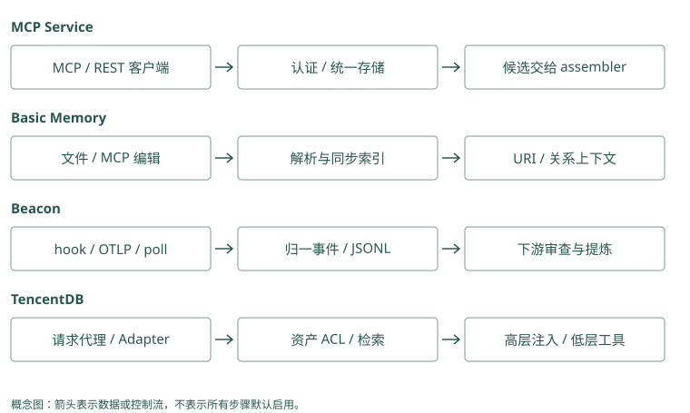

# 工程接入路线：MCP / 文件 / Trace / Team

## 代码已经会存和取，怎样让真实助手调用它

第 4 章的记忆程序要你手动运行命令。真实助手需要在任务结束后写入，下次生成前读取，或者让模型调用读取工具。接入解决的是“谁在什么时机调用这段程序”。

用一次 Atlas 发布画完整流程：用户发任务，助手执行工具，工具失败，教训写入，下一次任务读取。现在分别看服务、文件、日志和团队资产怎样参与其中。它们可以组合，不是四种互斥的搜索算法。

Mem0：发布前，应用查回“先检查迁移”并放入当前消息；发布后，保存已核验的新教训。只接上保存按钮，没有回答前读取，助手仍用不到历史。

Graphiti：回答批准人前，应用查询关系并取来源；收到新组织文档后，再更新资料。只有建图任务，没有回答前查询，也不会自动改善答案。

<details class="source-example">
<summary>源码与边界（选读）</summary>

在助手代码里找到两处位置：回答前读取历史，任务后保存允许记忆的新材料。Mem0 放进这两个位置即可形成存取闭环；Graphiti 还可能把材料整理作为独立服务，查询作为另一服务。Ingestion 就是接收并整理输入的过程，query 是读取问题；部署分开后仍要记录何时整理完成。

### Mem0：生成前读取、生成后写入需要业务安排

应用在调用回答模型前执行 search 并组装结果，任务结束后把审核或待提取消息交 add。也可以把搜索暴露为模型工具。两种接法的检索触发者不同，SDK 没有自动知道你的任务生命周期，应分别记录输入和调用时机。

### Graphiti：ingestion 与 query 服务可分开部署

接收事件后后台 await add_episode，查询端用固定 group 和搜索配方返回关系。必须让近期未处理纠正仍进入当前回答。图服务返回候选并不替宿主调度发布工具，服务化只是把调用边界放到了网络上。

</details>

## MCP Memory Service：让不同客户端叫到同一个服务

MCP（Model Context Protocol）是模型客户端连接工具和资源的一种协议。可以把它理解成双方约好的调用格式。协议本身不决定记忆内容怎样提取，也不保证两个服务的工具参数相同。

接 MCP Memory Service 后，客户端调用存储工具，提交正文、标签和来源；服务按后端配置存内容、向量和全文索引。下一次客户端调用检索工具，服务返回候选，客户端将有限内容交给模型。

```text
助手客户端 → 存储/搜索工具 → 记忆服务 → 后端数据库
助手客户端 ← 候选与来源 ← 记忆服务
```

两个客户端可以共用一份后端，减少各自维护不兼容库的工作。但身份如何认证、每个客户端能读哪些记录、最终注入多少内容，仍要明确。远程服务不可用时可以降级为没有个性化的回答，不能降级成绕过认证读取全库。

SDK 是供程序直接调用的开发库。Mem0 SDK 和 Graphiti Python 接口属于这种接法，业务程序在代码里调用它们。服务和 SDK 改变调用边界，里面的候选与提取机制还要按项目理解。

Mem0：聊天客户端和发布助手都调用同一个“搜索教训”工具。服务端从登录身份确定 Alice 的范围，不能相信客户端随手传来的 Bob 身份。

Graphiti：Alice 在聊天端和发布端查自己的批准链，都能读到平台组与 Lin。若其中一个客户端改查 Bob 的链，服务端拒绝；共用工具不扩大权限。

<details class="source-example">
<summary>源码与边界（选读）</summary>

MCP 是让客户端以约定协议调用服务工具的一种方式。把 Mem0 搜索或 Graphiti 查询包成 MCP 工具后，模型可以提议查什么，服务端仍应从已验证身份确定用户或组。模型若在参数里写 Bob，不能因此获得 Bob 的 Atlas 资料；传输协议不会替服务做最终授权。

### Mem0：工具封装不能让模型替用户挑 scope

MCP server 可以内部调用 Memory，但 user_id 应由认证会话解析，工具参数只接查询和允许的业务类型。传输认证之后还要在每次 search、get 和 update 检查对象归属。按 ID 接口尤其不能因 ID 难猜就省略授权。

### Graphiti：MCP 的 group_ids 也是隔离参数

服务应将 caller 映射为允许的 groups，限定 search 和直接 UUID 读取。即使高级工具允许查询节点，也不能开放任意全图 driver 操作。MCP 协议标准化消息，不标准化 Graphiti 与别的记忆服务的边和来源语义。

</details>

## Basic Memory：把人能编辑的笔记作为原始资料

假设我们把发布教训写进 `atlas-release.md`，再明确链接到数据库迁移笔记。Basic Memory 解析 Markdown 中的观察和关系，形成搜索索引。人可以在编辑器修改，Agent 也可通过 MCP 工具写入。

搜索用于找到笔记；已知 `memory://` URI 时，可以直接读取并按有限深度展开关系。URI 可理解为稳定的笔记地址，深度限制决定沿链接多走几步，仍需另控制最终输入长度。

如果数据库索引损坏，文件还在，可以重新解析。这使人审和迁移更直观。代价是文件改完到索引同步之间可能有窗口，重命名和未解析链接也会让搜索暂时找错。Git 删除文件后，旧提交仍可能保留正文，文件工作流不自动解决隐私清除。

Letta 的 MemFS 也是文件视图，却另有提交与提示编译协议；Hippo 的 Markdown mirror 是镜像，应按它自己的真相来源约定处理，不能默认所有 Markdown 都支持同样的双向编辑。

Mem0：Alice 把笔记里的默认环境改成预发布，事实库还留着测试。应用重新同步并处理旧记录后，搜索才应使用新默认。

Graphiti：组织文档把批准人改成 Mei，应用处理新材料并检查旧关系。只修改原文件，不会让所有已保存关系自动跟着变。

<details class="source-example">
<summary>源码与边界（选读）</summary>

人把 Markdown 里的默认环境改了，数据库中的旧派生记录不会凭空消失。Mem0 接入文件时需决定重写哪张卡；Graphiti 可以把文件版本作为不同材料，但要检查旧关系是否该结束。同步策略就是定义文件变化如何对应新增、修改与删除，原文可编辑与搜索状态已更新是两件事。

### Mem0：文件可以是输入，数据库仍需同步策略

人审笔记通过 infer=False 保存，metadata 记录路径、文档版本和来源 ID。文件改名或正文修改不会自动通知 SDK；应用根据稳定文档身份 update 或重新提取，避免旧文本与新文本共存而无版本说明。

### Graphiti：文件版本可以各自成为来源 episode

新版本输入保留来源描述和版本映射，抽出的关系与旧关系进行解析。修改一份文件不等于原 episode 原文也被改写；原始经历与当前知识需分角色。删除文件时还要决定旧来源保留政策与派生边清理，不能只删搜索入口。

</details>

## Agent Beacon：把“做过什么”留成可以核对的时间线

助手说“已修复发布”，我们还需要知道它先执行了什么命令、为什么失败、改了哪个文件、哪次测试通过。Beacon 根据运行环境，通过事件回调、插件、遥测接口或轮询采集活动，把它们整理为统一事件。

事件回调常叫 hook，指运行到某个时机时触发一段采集逻辑；trace 是关联起来的一组活动记录。保存 session 和工具调用 ID 后，就能把失败、修改与验证连成时间线。

有的动作直接观察到，有的只能推断。Beacon 通过 fidelity 等信息标出这种区别，下游提炼教训时应保留证据等级。它保存时间线，不会自动证明“某个修改就是成功根因”。提炼和评审仍是下一环节。

因此，可以用 Beacon 捕获，再让人把验证过的教训写入 Basic Memory，或交给事实提取器。原始事件含命令参数和源码，采集前后都要按政策处理敏感信息。

Mem0：检查工具明确返回“迁移未完成”，应用保存这条结果及事件编号。不要只保存助手随后写的“似乎失败”，否则丢掉了直接证据。

Graphiti：把清洗后的工具报告作为材料，关系连回该报告。回答为什么暂停发布时，可以指出“检查未通过”，而非引用助手自己的猜测。

<details class="source-example">
<summary>源码与边界（选读）</summary>

Trace 指工具和任务的执行记录，可能包括参数、输出与时间。Mem0 可从脱敏结果整理教训，Graphiti 可从事件材料形成带来源关系；两者都不应把密码或完整生产日志直接永久化。原始事件负责核对做过什么，派生事实负责下次复用，保存范围和保留时间可以不同。

### Mem0：工具 trace 应先脱敏再形成事实

把失败命令与验证输出摘要交给 add，写 source ID、session 与工具调用映射。普通事实提取不捕获完整工具顺序，role 字段也不能证明根因。入口保留可追溯 trace，让“已修复”的模型文字回到实际测试结果核验。

### Graphiti：episode 序列可保存事件顺序线索

事件分别作为 episode，saga 可把相关经历关联起来。observed 与 inferred 等证据等级来自采集器，应在来源或自定义属性中保留。图抽取的因果关系仍是派生判断，不能仅凭先修改后成功就宣布该修改是唯一原因。

</details>

## TencentDB：多人共享时，先决定谁能看到哪份资产

现在两个团队都叫自己的项目 Atlas。Alice 的助手能读 A 团队发布资料，Bob 的助手只属于 B 团队。共享一个数据库不够，读取集合还要受权限控制。

TencentDB 把会话记忆、Skill、Wiki 和 CodeGraph 等作为可管理资产。ACL 是访问控制规则，决定谁有权读取；Loadout 是给某个 Agent 配置的可用资产集合。可以先理解为“有权的书”和“这次带上的书”，两者共同限定它实际可用的资料。

MemoryCore 管会话层和资产元信息，MemoryKnowledge 管文档页面或代码结构内容，MemoryProxy 在模型请求前后接入。代理先处理身份和可见资产，注入部分高层上下文，详情由工具按需读取；生成后再回流会话材料。

把模型请求地址（endpoint）改为代理地址，可以省去部分业务重写，仍需部署服务、配置身份并处理失效缓存。撤销一本共享书后，旧注入内容也不能一直留在后续输入里。CodeGraph 的符号和调用边帮助探索代码，不等于团队成员的访问权限。

Mem0：Alice 只能读自己的发布教训，审核员还能读团队审核记录。应用根据角色筛选；给记录写“私有”两个字，不会自动执行权限检查。

Graphiti：用户可以读公开维护关系，但不能读私有审批原文。应用分别检查关系与来源的权限，不能查到边后就把全部原文返回。

<details class="source-example">
<summary>源码与边界（选读）</summary>

ACL 是访问控制规则，例如 Alice 能读自己项目，审核员能读团队发布资料。Mem0 的 user、agent、run 字段与 Graphiti 的 group 字段帮助定位数据，但请求者写出这些值不证明有权使用。服务先判断能访问哪些对象，再构造过滤条件，按编号读取也要遵守同一判断。

### Mem0：user、agent、run 不等于完整团队 ACL

这些 scope 限定事实所属范围，应用还需解析共享项目、成员权限和撤销。稳定项目教训不宜全部锁在临时 run 下；私有用户事实也不能为跨会话方便去掉过滤。团队资产管理和直接 ID 读取必须由外层一致执行。

### Graphiti：group 是图分区，不是授权证明

调用者传 group_id 并不表示有权访问。服务先验证身份，再选择组与可共享关系；跨组查询需有明确授权策略。把两个团队的同名 Atlas 放进同一组会增加消歧难度，因此建图分区和业务可见性应一起设计。

</details>

## 把一次失败从工具输出交到下一次任务

设 Atlas 发布工具返回数据库版本不匹配。采集层为这次动作留下事件 ID，保存可公开的错误输出和所属会话。此时只知道动作失败，还没有得出原因；如果紧接着用户指出漏跑检查，这条消息应作为另一个来源，与工具事件关联。

提取器根据两份材料生成候选教训，并连回事件。人审核后，可以写入 Basic Memory 的项目笔记，也可以放进事实存储。下一次发布，检索服务在可信项目范围内找到教训，最终组装器把正文、适用条件和来源放进输入。模型再调用当前检查工具，得到新的结果。这个完整过程需要几类组件协作，却不要求每类都来自不同项目。

如果宿主本来已经保存工具日志，就可以先利用原生日志，不必立即再部署采集平台。如果只有一个客户端，本地数据库也可能足够。要统一多个 harness 的事件时，Beacon 的归一能力才更有意义；要让多个客户端共用存取时，服务接口才解决实际重复工作。先理解交接需要什么，再选组件，数据流往往会更短。

Mem0：事件 T7 报告漏检迁移，应用保存教训并带上 T7。下一次发布查回它，再打开 T7 核对检查要求，不把失败后的猜测当已验证流程。

Graphiti：T7 作为来源材料，支持本次检查失败关系。后续要形成长期要求，仍需审核；单次事件不自动变成所有发布的规则。

<details class="source-example">
<summary>源码与边界（选读）</summary>

工具事件 T7 可能让 Mem0 产生 M1、M2，也可能让 Graphiti 产生材料 E1、多个节点和关系。应用保存 T7 到实际返回编号的对应表，才能回答“这条教训来自哪次运行”和“重试该补什么”。这些编号分别标识原事件和派生对象，不能因为都长得像 UUID 就随意互换。

### Mem0：为一次事件维护派生 memory IDs

入口保存工具事件，提取 results 中的 ID 与原 source 关联，下一任务 search 后记录 packed IDs。纠正时用映射定位受影响事实，不靠相似句猜哪张卡来自该事件。事实结果 ID 随写入生成，稳定源 ID 应由应用拥有。

### Graphiti：保存 AddEpisodeResults 的实际身份

返回 episode、nodes 和 edges，应用应存 episode UUID 及原事件映射。下一任务从边的 episodes 回到原材料，便能检查教训从哪来。重复边可能复用旧 UUID，所以新增事件不等于每次新增一条边；来源和事实身份需分别关联。

</details>

## 多个入口同时写入时，怎样避免摘要套摘要

假设 SDK 在对话结束时提取一次，MCP hook 又提取一次，代理还保存一份高层摘要。三者可能把同一失败分别写成“迁移未检查”“数据库发布异常”“部署流程需调整”。如果彼此再把对方的摘要当新证据，库里会不断出现没有新增观察的结论。

解决这个问题需要明确原始事件的身份，以及谁拥有派生动作。同一事件可以生成不同视图，但每个视图都应标明来源和生成版本。用于回放的事件保留当时观察，面向搜索的事实负责短陈述，面向常驻输入的摘要负责入口。它们不应在回写时被误当成三个独立来源。

最终组装也要统一。服务可以返回很多候选，宿主决定哪几条入输入；如果代理已经注入高层规则，宿主应知道它包含哪些来源，避免再全文注入相同规则。唯一组装责任意味着有人掌握完整预算与去重视图，不意味着系统只能有一个数据库。

Mem0：聊天摘要和任务报告都写“迁移是根因”，其实都来自同一次猜测。应用记录共同来源，不因有两条记录就提高可信程度。

Graphiti：两份材料重复同一结论，关系有两个来源编号；回查后发现第二份抄了第一份，就不能当作两份独立证据。

<details class="source-example">
<summary>源码与边界（选读）</summary>

聊天摘要写一次“迁移是根因”，任务报告再抄一次，同一猜测就经过两个入口。Mem0 两张卡片文字不同，指纹去重未必认出；Graphiti 两份材料也不代表独立观察。保留它们共同引用的原事件，才能避免把转述次数当作证据数量，再不断生成更强的总结。

### Mem0：hash 去重不能识别跨摘要转述

同一事件被三个入口改写为不同 text，hash 都不同，甚至可能进入不同 scope。先统一事件 ID 和唯一提取责任，再让其他入口只传引用或视图。将源 ID 放 metadata 后仍需外层幂等检查，SDK 不会自动据它合并所有转述。

### Graphiti：多个 episode 不一定是多份独立证据

图可能将三份摘要解析为同一边并增加 episodes，来源列表因此增长。需标明 derived_from 关系或外部映射，区分原始观察与二次概括。摘要再进入提取器会提高漂移风险，不应把重复支持数量当作真实性增强。

</details>

## 权限撤销，要沿着实际读取路径走

Alice 原来能读团队发布 Skill，后来权限被撤销。只在资产列表上隐藏 Skill 还不够：旧 URI 是否仍可直接读取，内容服务是否重新检查身份，代理是否还复用此前注入的摘要，都需要验证。

尤其是已进入会话的内容，它不会因数据库 ACL 改变而自动从模型输入消失。后续调用需要避免重新注入失去授权的内容，并按产品政策处理已有会话状态；已经向用户展示过的信息则无法通过撤销让人遗忘。因此共享前的权限判断和撤销后的缓存控制承担不同责任。

可以从一次真实请求画反向路径：模型输入来自哪份候选，候选来自哪个资产版本，资产可见性根据谁的身份计算，详情由哪个服务读取。沿这条路径做拒绝测试，比只看到管理面板上的“已撤销”更能说明权限真正生效。

Mem0：Alice 离开团队后，应用拒绝她搜索和按编号读取团队记录，并清掉旧查询缓存。只让搜索结果为空，不能阻止另一条直接读取入口泄漏。

Graphiti：撤权后，她不能再查私有关系，也不能凭旧来源编号打开原文。应用把这两条路径和缓存一起检查。

<details class="source-example">
<summary>源码与边界（选读）</summary>

Alice 离开团队后，搜索结果、直接读取、原文回查与缓存都应停止暴露团队材料。Mem0 过滤搜索还不够，已知 M1 编号的读取也需核验；Graphiti 隐藏关系后，按 E1 取原材料也不能绕过权限。沿实际访问路径逐项检查，权限撤销才不会只作用于一个入口。

### Mem0：撤销后要覆盖搜索与按 ID 读取

filters 限制 search，但应用之前缓存的 MemoryItem、固定 ID 与已打包 prompt 仍可能含正文。失去项目权限后清理该 caller 的注入缓存，并在 get、update、delete 前核验归属。用户看不到最终回答不证明服务没有读取旧私有数据。

### Graphiti：关系与来源全文都要经过授权

事实边限定了 group，后续按 episodes 读取全文也应检查组和来源权限。节点 UUID 入口、中心距离查询和直接图工具同样不能绕过服务。权限变更后使缓存失效，并检查下次输入是否还包含旧 fact 或 summary。

</details>

## 动手检查

画出你要部署的一条路径，给每个箭头写“传了什么”和“谁负责”。再圈出唯一一个决定最终输入内容与预算的位置。

答案提示：如果 Beacon、MCP hook 和业务 SDK 都把同一事件各自摘要并注入，容易重复且难追来源。可以保留多种入口，但要统一事件 ID 和最终组装责任。Hermes 只筛已有候选，不能替代存储服务或权限系统。

<details class="implementation-notes">
<summary>实现笔记与源码对照（选读）</summary>

这四个项目在管线中承担不同角色。MCP Memory Service 是多个客户端访问的服务；Basic Memory 是人机共同编辑的笔记与索引；Agent Beacon 统一捕获行为事件；TencentDB Agent Memory 管理团队记忆和知识资产。MCP 是传输协议，Markdown 是可编辑源，trace 是证据，ACL 是可见性控制，它们都不是记忆算法本身。

## MCP Memory Service：统一存取与运维边界

`doobidoo/mcp-memory-service` 通过 MCP tools、REST、CLI 与 Dashboard 暴露存储和检索能力。多客户端共用同一服务，避免每个 harness 自建不兼容的记忆库。当前支持 SQLite、Cloudflare hybrid、Milvus 等后端；具体能力依部署和后端而异。

### 保存一条记忆的路径

客户端提交内容、tags、类型与 metadata，服务生成内容标识、embedding 后持久化，并维护搜索索引。SQLite 路径使用本地向量存储和 FTS5。Local ONNX embedding 让这一步可以不发送到云模型，但正文仍可能通过 remote MCP、同步或备份离开本机。

```text
MCP/REST 请求 → 认证与请求检查 → memory storage
                                      ├─ 原文与 metadata
                                      ├─ 向量索引
                                      └─ 全文索引
```

直接 store 接口不会自动证明内容值得长期记忆。是调用方显式写笔记，还是 hook 自动捕获、再由巩固处理，要根据接入方式区分。客户端也要给出来源，不能只保存一个无法回查的模型摘要。

### 混合检索是如何实现的

[`storage/mixins/hybrid.py`](../../sources/repos/mcp-memory-service/src/mcp_memory_service/storage/mixins/hybrid.py) 的 `retrieve_hybrid()` 并行执行 BM25 与向量搜索，每路获取最终数量的两倍候选，再按内容 hash 合并。

Weighted 路径将 BM25 转到有限分值区间后与 semantic score 加权；RRF 路径按两路名次累计 `1/(k + rank)`，可加两路共识 boost。只在 BM25 中出现的候选还要回数据库取正文。返回的 debug information 可以解释候选来自哪一路。

这不是 cross-encoder：融合并没有重新理解 query 与每条文本的细粒度关系。FTS 的分词、query 清理和短语匹配也影响命中，尤其要测中文、错误码和多词 query。

权限、删除和 superseded 筛选必须在每路实现一致。源码中 BM25、向量和补取分支的过滤条件并非完全同形，部署验证应覆盖各 fusion method，不能从方法名推断它已经实现本书要求的全部租户与有效时间边界。

### consolidation 与普通清理的区别

[`consolidation/consolidator.py`](../../sources/repos/mcp-memory-service/src/mcp_memory_service/consolidation/consolidator.py) 组织指数衰减、关联发现、语义聚类、压缩和受控遗忘，各阶段按时间 horizon 与配置启用。Daily/weekly 等限定处理窗口，incremental 可以根据上次运行游标推进。

聚类让同主题记录集中，压缩减少重复上下文，关联帮助发现连接，遗忘降低低价值记录干扰。这些步骤可能产生派生信息，要查看报告、保护规则和归档行为，不能因“dream-inspired”命名就相信合并结果。

Cloudflare hybrid 的同步属于“本地与远端存储协作”，与 BM25/vector hybrid 是两个概念。巩固会涉及同步暂停/恢复，必须监控恢复失败、跨节点一致性和删除传播。

### 接入与安全

OAuth 验证调用者，scope/agent tags 等参与访问控制，但 tags 本身不是不可伪造的身份。Remote MCP、文件工具、REST、Dashboard 增加攻击面，必须限制监听地址、认证、路径和权限。项目已有多项 OAuth/TLS 修复，维护活跃不代表默认配置适合公网。

它适合自托管共享服务。README 的低延迟数字不能套到所有模型和网络；先在目标后端测 store、空召回、批量查询、embedding 维度升级和删除恢复。

## Basic Memory：从 Markdown 重建知识图

Basic Memory 把 Markdown 作为可读、可迁移的 source of truth，数据库承担解析与搜索索引。人可在编辑器或 Obsidian 修改，Agent 通过 MCP 写入和读取，Git 可以管理文件历史。它更接近显式知识管理，不默认替每轮聊天自动判断哪些事实应永久保存。

### 一份笔记如何成为图

Frontmatter 描述笔记身份与属性，observation 记录有类别的陈述，wikilink/关系描述把笔记连接起来。下面仅是示意，实际格式以项目 parser 为准：

```markdown
# Atlas 发布

## Observations
- [constraint] 发布前检查数据库迁移

## Relations
- relates_to [[数据库迁移]]
```

[`markdown/entity_parser.py`](../../sources/repos/basic-memory/src/basic_memory/markdown/entity_parser.py) 把文件解析成 entity、observations 和 relations，链接解析器把名称/路径映射到目标笔记，索引供搜索与邻域查询。文件变更被同步进索引后，修改才反映在检索中；重命名、链接未解析和同步积压都可能让文件与查询短暂不一致。

### 搜索与 build_context 做了不同工作

搜索先定位候选笔记；[`services/context_service.py`](../../sources/repos/basic-memory/src/basic_memory/services/context_service.py) 的 `build_context()` 从 `memory://` URI、路径模式或相关查询解析 primary results，再组织 observations 和关系邻域。Depth、时间范围、limit 与 max_related 控制展开范围。

用户问 Atlas 的发布风险时，可以先找到 Atlas 发布笔记，再沿 link 取数据库迁移笔记。这是显式关系扩展，和 Graphiti 依赖 LLM 抽取时变事实边不同，也不是 HippoRAG 的随机游走。URI 直接读取在已知笔记身份时比语义搜索更确定。

### 文件真相的好处与限制

数据库损坏时可从 Markdown 重新解析，能导出普通文本，也便于人审核模型写入。重新建索引不能恢复已删除原文、未备份的文件或所有外部运行状态，所以备份仍要覆盖 source 文件和必要配置。

普通 Git 不提供隐私删除保证：删文件后，旧版本可能还留在提交历史、远端和备份。与本书删除 SLA 要求结合时，需要单独规定历史清理与共享仓政策。冲突合并也应由人或确定性流程处理，不能让两个 Agent 无审查重写同一事实。

它适合个人知识库、共享笔记和人审经验。许可证为 AGPL-3.0，分发或服务化前要评估合规；“文件易迁移”不改变许可证义务。

## Agent Beacon：先把行动变成有来源的事件

Beacon 的核心是 telemetry。Claude Code、Cursor、Codex、OpenCode 等 harness 对外暴露的能力不同，它分别使用 hook、plugin、OTLP 或本地 session store polling，不要求所有客户端都使用同一种捕获方式。

### 原始活动如何归一

本地 `docs/architecture/architecture.mdx` 描述 collect、normalize、store、correlate、detect 五段：

```text
harness 活动
 → hook/plugin/OTLP/poll
 → 统一事件：session、tool、command、file、approval、usage 等
 → runtime.jsonl
 → 按 run/session/tool-call ID 关联时间线
 → 检测、人工审查、下游提取
```

`harness.collection_method` 标出捕获方式，`event.fidelity` 区分 observed 与 inferred。某个 runtime 没直接报告动作而由 Beacon 推断时，下游应知道证据等级较低。共享调用与事件 ID 还用于识别重复捕获，但实际 coverage 与完整性要按 harness 测。

本地 JSONL 是稳定交接边界，按配置保留和轮转；CI/cloud 路径产生每次运行的日志或上传快照。Endpoint 默认本地优先，启用转发后才发送到目标，但不能把这个默认扩大成“所有路径永远不外发”。

### 为什么 trace 比聊天更有用

一次发布可能包含命令失败、错误输出、文件修改、测试成功与用户批准。只读最终聊天“已修复”无法知道哪个修改有效；时间线可恢复“先失败在哪、改了什么、后面哪个验证通过”。

下游可以从 trace 生成候选教训，连回工具事件和 commit，再评审是否提升为 Skill。这是需要显式配置和验证的知识提炼流程，不意味着任意采集日志已经是高质量长期记忆。Beacon 本身不替代 Mem0 的事实抽取、Graphiti 的时间知识或 Hippo 的寿命管理。

### 它不观察什么

项目明确不做通用 shell history、内核/进程监控、所有 SaaS audit 或一般网页浏览采集。支持 chat 页面不等于可读取任意网站；支持 20+ harness 不等于每种 harness 有相同事件 fidelity。

Prompt、源码、命令参数和输出可能含凭据。要在采集/转发边界明确过滤、访问与保留期，日志轮转也不是用户数据完整删除。托管平台的 fleet governance、SSO/RBAC 等要与 OSS 本地交付区分。

## TencentDB Agent Memory：团队可见的上下文资产

这个项目有四个重要边界：MemoryCore 存会话记忆与资产元信息，MemoryKnowledge 处理 Wiki/CodeGraph 内容，MemoryProxy 代理模型请求，MemoryPanel 提供管理界面。不能把它们合成一个无依赖的向量 SDK。

### L0 到 L3 各保存什么

MemoryCore 的 README 定义 L0 对话、L1 原子记忆、L2 场景记忆和 L3 核心画像。L0 保留发生了什么；L1 抽取可复用陈述；L2 归纳场景；L3 提供更稳定的 persona/core。各层是不同粒度的派生结构，不是四个同样的摘要副本。

```text
L0：Atlas 发布过程、失败与纠正
 → L1：本次漏跑迁移检查
 → L2：Atlas 的发布场景与约束
 → L3：更稳定的角色/团队行为原则
```

这个例子说明层次用途，并不保证一次输入自动产出所有层。高层更新由抽取/归纳触发与 prompt 控制；不能把一条未经核验的失败推断直接放进核心原则。

自定义 prompt 按 Agent、Team、Instance、系统默认的优先级解析，只能调整关注点与归纳策略，不应修改固定输出协议。生成日志保存使用的 prompt ID、版本、hash 与输入输出引用，帮助追踪错误画像来自哪个版本；它不保存 prompt 正文快照，复现还需按版本管理原配置。

### Team、ACL 和 Loadout 怎么参与检索

资产有归属、版本、状态和可见范围。Agent 的 Loadout 决定可以使用哪些 Chat、Skill、Wiki、CodeGraph 资产，ACL 再限定 private/team/restricted/agent 可见内容，查询在这个集合内执行。新 v3 数据面要求 team、agent、user 身份，不能把客户端传入 ID 直接当授权证明。

MemoryCore standalone 默认 SQLite/本地文件，远程 embedding 关闭时可用 BM25。MemoryKnowledge 另负责内容解析、索引和检索；Core 仅登记 knowledge 元信息及服务地址。开启代码图不会自动让本地 Core 获得完整 CodeGraph 内容。

### Wiki 与 CodeGraph 怎样组织知识

`MemoryKnowledge/README.md` 描述两条不同处理管线。Wiki 从上传/拉取文档开始，用 LLM 抽取结构化页面与链接，建立 FTS5 全文与知识图谱索引；Agent 先搜索定位页面，再读关联内容，不必每次遍历原始文件目录。它对提取质量、页面出处和更新同步敏感，生成页面不能替代原文核验。

CodeGraph 从 git clone 开始，建立符号、调用与文件树索引，通过探索查询回答某函数定义在哪、哪些调用方或文件可能受影响。它比文本相似度更接近代码结构，但支持语言、解析边界和动态调用仍需按仓库测试，不能从一条静态调用边保证运行时行为。

可选 Auto-Sync 以 FIFO 队列和 worker pool 拉取 git 更新并重建索引，默认关闭。构建/同步完成通过 callback 把状态传回 Panel，再更新资产元信息；若这条链断了，Agent 可能看到旧状态或旧索引。工具通过 `/v3/tools/list` 与 `/v3/tools/call` 自发现，管理面的授权必须延续到内容服务，不应只在 Core 列表上过滤。

### Proxy 如何在生成前后接入

MemoryProxy 接收兼容 OpenAI/Anthropic 的请求，验证身份，初始化 team/agent/task，注入上下文后转发给上游模型，结束后回流 L0 与 Skill 会话材料。代理不保存记忆内容本体，但会维护会话/注入状态。

当前说明强调 L2/L3 等高层上下文注入，L0/L1 通过工具按需查询，以减少每轮大幅改动 prompt 前缀对 KV cache 的影响。Skill 摘要用于路由，详细步骤通过工具读取；Knowledge 也有发现后读取的路径。不是每次请求都把所有层和资产塞进 prompt。

项目不同 README 对 L2/L3 的业务标签有不同表述，接入时应以实际 API schema 和注入代码为准，而不是从“Agent Profile/Team Global”等简称推断完全相同的数据模型。

“零代码接入”指业务可改模型 endpoint 而不重写 harness，仍需要部署 Gateway/Proxy、身份、上游模型、后端及故障回退。它适合多 Agent 团队资产治理，需重点测 ACL 拒绝、共享资产撤销、版本切换与代理不可用。

## 组合时只允许一个最终上下文入口

可以让 Beacon 负责 capture，Basic Memory 负责人审笔记，Graphiti/Cognee 负责结构化索引，Hippo 或服务巩固负责生命周期。但每份原始事件应有稳定 ID，每层派生要保留引用，最终由一个 context assembler 控制预算与来源。

多个 hook 同时总结、注入和互相写回，会产生摘要再摘要、重复 token 和无法追踪的删除链。组合前先画清楚 owner、写入顺序、读取出口和删除传播，再安装自动 hook。

## 四种接入之外：SDK、图服务与宿主插件

Mem0 SDK 由应用调用 add/search，身份与 prompt 组装留在业务层；Graphiti 可通过 Python/MCP/FastAPI 接入，原理仍是 episode ingestion 与图查询；Cognee 提供 API/MCP 和自己的数据管线，暴露服务并不会消除 loader/schema 配置。它们用 MCP 时与 MCP Memory Service 共享传输类型，但工具语义和数据模型不同，不能把客户端配置改一下就认为数据可互换。

Hippo 本地 hooks/MCP/CLI 与 MemOS harness 插件把捕获和召回接到生命周期。MemoryOS/A-MEM/HippoRAG 主要从库或研究入口接入，应用要补生产认证、队列与 assembler。Letta 则是 runtime 自己管理上下文，外部服务加进去时要避免把它的 core、自动 recall 与新 hook 重复捕获。

Markdown 也有两种角色：Basic 文件是可重建索引的真相，Letta MemFS 是有提交/编译协议的 Agent 状态，Hippo mirror 需要按其数据库/导出约定核对，不能把镜像默认当成可双向修改源。Beacon JSONL 是事件交接边界，不是 Markdown 知识笔记。Hermes 工具只判别候选，用稳定 ID 映射回调用方的 store。

## 一次会话接入应该保存哪几个 ID

入口至少关联 caller identity、session、原始事件/source、派生 memory 与版本。Beacon 的 event/tool-call IDs 解决动作关联；Graphiti episode UUID 解决事实来源；Basic permalink 解决笔记身份；TencentDB asset/Skill version 解决共享状态；Letta commit 解决上下文版本。不同 ID 互相映射，不应用一个 session 名替代全部身份。

例如 A 用户的 trace 经提取写入团队 Skill 后，B Agent 使用它，审计应能从 B 的 prompt/Skill version 回到共享资产和脱敏来源，且 A 请求删除时知道哪些派生内容需处理。这是组合系统的新增责任，不由 MCP 协议自动提供。

</details>

<figure class="concept-diagram" tabindex="0"><figcaption>图：统一出口不等于统一原文，保留每层 owner 与身份映射。</figcaption></figure>

<details class="comparison-reference">
<summary>项目对照速查（选读）</summary>

## 本章对照结论

| 项目 | 主要接入方式 | source of truth / 控制者 | 组合时额外责任 |
|---|---|---|---|
| MCP Memory Service | MCP/REST/CLI | 服务后端与巩固 | transport auth、过滤、同步 |
| Basic Memory | 文件编辑/MCP | Markdown，数据库为索引 | 同步/关系解析、Git 删除 |
| Agent Beacon | hook/plugin/OTLP/poll | runtime JSONL/各运行日志 | coverage、脱敏、下游提炼 |
| TencentDB | Adapter/SDK/MemoryProxy | Core、Knowledge、资产服务各分工 | 身份、callback、注入缓存与撤销 |
| Mem0 | SDK/API 集成 | 事实 store 与应用 assembler | auth、scope、数据版本 |
| Graphiti | Python/MCP/FastAPI | 图与 episode | schema、后端、权限与 ingestion |
| Cognee | SDK/API/UI/MCP | datasets/管线与多存储 | route/config、后台恢复 |
| Hippo | 本地 CLI/hooks/MCP 等 | 数据库及约定 mirror | 重复 capture、feedback、共享范围 |
| MemOS | API/SDK/harness plugins | cubes/backend/scheduler | 队列、资源兼容、宿主注入 |
| Letta Code | CLI/server/channels runtime | 自动 recall + Git MemFS | 外接 store 与已有 core 不重复 |
| MemoryOS | Python/不同包装版本 | 用户/助手多层数据 | 路径身份、阈值、服务化 |
| A-MEM | Python memory system | MemoryNote 与索引 | 持久化/演化一致性、安全包装 |
| HippoRAG | indexing/retrieval/QA 库 | passage/OpenIE/graph/index manifest | 用户治理、离线到在线管线 |
| Hermes Jev Skills | CLI/工具调用云决策 | 调用方 store；本地决策缓存 | 外发政策、ID 映射、预算 |
| 旧 Letta | archive/历史教程 | 历史版本 | 只用于复现，当前接 Letta Code |

</details>

