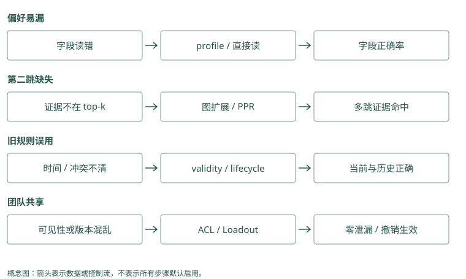

# 选型与演进路线

## 用你的失败，决定下一步学哪种技术

假设 Atlas 助手已经跑通最小事实库。现在有四个失败：用户默认语言偶尔丢失；批准人跨两份文档找不到；旧发布规则仍干扰；另一个团队资料串进结果。

这四个问题不需要同一种升级。稳定语言可以直接读 profile 或放小 core；跨文档证据可以试关系连接；旧规则先补纠正和有效时间；跨团队问题先修身份与范围。给第四个问题加重排，可能只是让泄漏的资料排序更好。

因此先选一个真实失败，保存原始输入、必要证据和实际结果。用这个例子推动接下来的比较，避免从项目功能表开始堆组件。

如果失败是几天后忘了迁移教训，Mem0 的短记录存取就值得先试；如果失败是维护团队、批准人和变更日期分散在多份材料，Graphiti 的关系与时间更贴题。先说明要避免哪种具体错误，再挑机制，才能知道试用时应查看哪种中间结果。

### Mem0：选择 SDK 的理由应落在事实管线上

适合希望现有应用增加短事实提取与搜索的场景。先核对提取质量、语义池边界、scope 与 provider 成本。稳定语言丢失可能只需直接读取，不必更换框架；当前时间状态复杂则要明确外层版本责任。

### Graphiti：选择时间图的理由应落在关系失败上

同名消歧、跨来源关系和晚到变更是更直接的采用理由。需要结构化抽取、driver、索引与时间过滤，运维负担比简单事实库多。先用批准链和历史默认证明收益，不为“图更先进”而增加组件。

## 起步：把你能解释的数据路径跑通

小型助手可以从第 4 章的思路开始：明确写入、按用户读取、手动替代、有限组装。需要 SDK 时考虑 Mem0；偏好密集时学习 Memobase 的资料整理；需要人审普通文本时考虑 Basic Memory。

在这个阶段，先有不使用记忆的对照和几条回归题。回归题是以后每次修改都再跑的案例，确认旧问题没回来。权限和删除从一开始就有基本边界，不应因为“先做简单版”而读全库。

Baseline 是比较新方案之前的简单对照。给 Mem0 直接保存几条审核文字，再查是否正确返回；给 Graphiti 只输入维护与批准两份材料，核对对象、边与来源。小到能手工解释每个结果，之后增加提取、重排或时间变化，才看得清哪里开始出错。

### Mem0：用直接保存建立最短 baseline

审核文本走 infer=False，用户和 source 由业务确定，查询采用 filters。之后再开启普通推断，比较正文是否丢条件。显式 update、delete、history 的语义先跑清楚，尤其验证删除历史残留，不把 API 名当隐私保证。

### Graphiti：从极小 episode 集验证关系模型

先加入两份批准材料和一次批准人变化，查看实体 UUID、边来源和时间字段，再查询当前与历史。先限制类型和搜索配方，不同时启用全部社区与复杂重排。运行需要真实模型与图配置，教学伪调用不能代替部署验证。

## 第二个问题：记了，但找不准

如果原文在库里，却因措辞变化漏掉，比较关键词、向量和混合候选。MCP 和 Hippo 提供可学习的融合路径，Mem0 的池边界也要检查。若正确证据已在候选里但排名差，再试 cross-encoder 或 Jev，先只观察，不改变用户可见结果。

这种只观察的模式叫 shadow。它让你测重排会保留什么、会误删什么，再决定是否采用。别同时扩大候选、换 reader、开生命周期，否则遇到改善也说不清来自哪一步。

同样没返回 A，可能是 Mem0 第一批未找到它，也可能找到后被排低。Graphiti 可能只找到 Atlas 节点，却缺批准关系。先检查候选单位与编号，再试词搜索、额外查询或邻域扩展；不必一看到漏项就换整个数据库，更不能只调最后的排序权重。

### Mem0：先定位 A 是池外还是排低

原文正确却不返回，检查 semantic results、keyword results 与 entity boosts。池外记录无法被外层 reranker 补回，可尝试扩大池或第二次受限查询。配置重排后还需 `rerank=True`，并记录错误回退是否发生。

### Graphiti：先固定边搜索，再增加扩展

比较 edge BM25、cosine 与 RRF，必要时启用 BFS 补第二跳。若规范节点错误，增加遍历会放大问题，应修 ingestion。正确候选已经返回却没进 prompt 时，继续更换图查询没有收益。

## 第三个问题：需要关系、历史或长期整理

跨文档第二跳可以试 HippoRAG 的关联传播、Cognee 的结构管线、Graphiti 的关系搜索，也可以先用 Basic 的显式链接。要回答“当时谁负责”，再重点测有效时间，不要只测能不能找到一个人名。

近期问答越来越多时，可以学习 MemoryOS 的主题页面与提升；旧教训价值不同，可以试 Hippo 的反馈和寿命；笔记描述需要随新证据更新，可以试 A-MEM。多种记忆资源和队列需要统一管理时，再评估 MemOS，而不是为一个偏好字段引入完整资源层。

如果希望 Agent 自己控制读取和修改未来规则，Letta Code 是 runtime 路线，改变的不只是一个搜索函数。试用应观察实际工具调用、提交和后续编译，不只测试单次 recall。

问当前默认环境，几张审核卡与明确读取规则可能足够；问 15 日批准人，则需要历史有效性。Mem0 可以由应用另存版本并查询，Graphiti 提供关系时间与解析，但也要过滤正确日期。比较的是写入、纠正和查询整条链要承担多少工作，不是哪个项目字段更多。

### Mem0：长期版本可由外层补，成本需明确

metadata 能保存 source 与生效信息，但必须实现读取策略，ADD-only 不自动维护唯一当前值。若关系较少，事实表加显式版本可能更简单；若应用自己要补大量消歧、边查询和时间裁决，就应与图框架做成本比较。

### Graphiti：时间字段与关系解析形成完整链的一部分

reference_time 辅助抽取，resolution 更新边，SearchFilters 控制读取，episode 回查来源。缺一个环节仍可能答错。长期巩固、半衰期和 Skill 审核不是因此全部内置，应另用宿主策略治理。

## 多人共享时，先建立可见范围

TencentDB 面向团队资产和 Loadout，Cognee、MCP 等服务也有不同授权边界。明确谁拥有会话、谁能共享 Skill、撤销如何影响缓存，再部署读取路径。Beacon 帮助补原始动作证据，不自动完成这些权限；Hermes 帮助选择已有候选，也不决定谁有权看。

一个可行组合是采集工具事件、把验证过的教训写成笔记、只对授权资料检索，再统一装入输入。不必每个项目都接一遍，选择能解释数据流和故障流的组合即可。

多人共享时，先列哪些用户能读哪个项目、关系和原文，再实现查询入口。Mem0 自定义 metadata 字段能承载项目名，却不会自动认证它；Graphiti group 能分区，却不证明调用者属于组。服务端将真实权限转成筛选条件，才能避免模型或客户端自行选中别人的资料。

### Mem0：共享范围不能用任意客户端 metadata 代替

应用验证身份并选择私有、项目或团队事实集合，按 ID 操作也核验对象。一个客户端可读并不代表另一个可读，scope 设计要匹配共享政策。独立记录权限撤销与缓存清理，避免跨会话便利成为串线理由。

### Graphiti：组分区与共享策略一起设计

独立团队可使用不同 group，共享资料通过授权查询或审核导入，不随意合并两个同名项目节点。即使配置支持多 group 查询，也先确定 caller 可读集合。查询后的原文展开同样受到这个集合限制。

## 给试用设一个能否通过的条件

不要写“试用一周看效果”，写成“这十个真实发布问题里，正确规则必须出现；演练例外不改长期默认；另一个用户的资料不进入候选；服务断开时不绕过权限”。再记录延迟和总费用，判断多一层机制是否值得。

维护、许可证和托管边界也要检查。下面表格保留路线对照，但它是查找候选的工具。MemoryOS、Memobase 等路线有教学价值，当前维护状态也可能使你选择借鉴机制而非直接依赖原项目。

试用通过可以要求：正确教训能被当前输入使用，单次例外不改默认，越权查询得不到资料，模型失败后原文可重试。Mem0 另外核对卡片与历史一致，Graphiti 另外核对对象合并、旧关系结束和来源回查。把条件写成可检查结果，不用“效果不错”代替验收。

### Mem0：试用合同涵盖普通与失败路径

检查默认和例外提取、同义重复、精确错误码池外遗漏、更新实体清理、删除 history 残留，以及 LLM 超时。记录实际事实与最终输入，每一项都有预期，不以 README 分数代替。锁定后端和模型再测费用与延迟。

### Graphiti：试用合同覆盖身份、时间与来源

同名不同团队不合并，晚到消息保持正确有效区间，演练不关闭默认，第二跳来源确实返回。另测 remove_episode 的共享支持与摘要影响、driver 故障和索引恢复。图能画出来只能证明其中很少的环节。

## 给 Atlas 做一次有理由的选型

假设只有 Alice 使用助手，项目资料不多，主要问题是跨会话漏掉发布检查。可以先把审核过的教训放进 SQLite 或一份项目笔记，按项目直接读取，再明确装入发布任务输入。此时不需要图传播，因为必要证据就在已知项目里；也不需要自动衰减，因为教训数量仍可人工维护。

运行一段时间后，错误码查询开始漏掉历史事件。先比较全文与现有搜索的候选，如果全文补回了必要记录，就保留混合候选。若两路都找到了记录，只是排名不对，再试重排。每一步都保留前一版本作为对照，不把一次升级顺手变成重写所有管线。

后来用户开始问“谁批准 Atlas”，证据散在团队文档里。若只有几条稳定关系，可以先维护显式链接或关系表；若对象多、文档持续增长，才比较图框架或 PPR。再后来需要问“上月谁批准”，就必须引入有效时间，而不能继续拿当前批准人回答所有日期。

第二个团队加入时，权限成为即时需求，无需等到所谓第四阶段。先隔离可读资产、检查每条检索路径和缓存，再考虑共享经验。原始动作还原困难时补采集；候选过多时补判别。组件加入的理由都来自一次明确的失败，而不是为了凑齐完整架构。

Atlas 初期只有几条发布教训，可以先用 Mem0 明确存取与注入位置。出现多团队批准链及批准人变更，再用 Graphiti 小图检验两份来源与日期查询。迁移要同时检查旧卡片如何转成新对象和关系，不能将旧正文搬进去就认定新结构已经正确。

### Mem0：Atlas 初期可以只采用少量路径

先存核验教训并直接读固定规则，再为历史经历加 search；输入规模增长后验证推断与重排。若批准关系需要两次检索，记录这两次的成本，与显式关系表比较。保持一个简单无自动提取的对照，才能知道新增机制值不值。

### Graphiti：批准链和变更出现后再验证迁移

把审核材料按顺序加入独立测试图，核对团队 UUID 和批准边，再引入日期过滤。应用 assembler 和权限策略尽量不变，避免迁移时同时更换 reader。通过自己的失败题再决定将哪些资料从事实池迁到关系图。

## 怎样判断一次升级应该撤回

试用前可以写出成功条件和撤回条件。假设新图方案找回了第二跳，却明显增加同名团队串线，且目前无法可靠纠正身份，便不应只看平均答题率保留它。可以暂时撤回自动建图，保留原始来源和已核验的显式关系，再继续研究消歧。

类似地，生命周期机制降低了输入长度，却把低频回滚步骤隐藏了；云重排节省了 token，却超出外发政策；平台功能丰富，却让一次故障难以恢复。这些都可能使净收益为负。减少组件并不会丢掉已经学到的东西，只要失败案例、来源数据和对照结果还在，就能以后重新验证。

最终留下来的方案，应让你能解释一条记忆从哪里来、为何被选中、何时失效、如何删除，以及服务坏了之后怎么办。达到这个程度后，项目名只是实现选择。继续演进时，用新增失败提出下一个具体问题，书中的机制和源码对照便能成为查阅入口。

新评分增加费用却没有补回必要卡片，可以撤掉额外排序；新图扩展不断把不同平台组合并，可以先缩小自动建图范围。Mem0 与 Graphiti 都应保留简单可复现的对照与原材料。撤回某项复杂机制，不等于删除历史，更不等于免去权限和当前状态检查。

### Mem0：复杂评分无收益时回到可解释读取

若实体 boost 增噪、云重排增加成本却不减少失败，可撤回相应配置而保留审核事实与源数据。不要把一次实验产生的更新留给 baseline。回滚范围包括 payload、辅助实体索引与应用缓存，历史记录只提供证据不自动恢复全部状态。

### Graphiti：关系误合并无法控制时先缩小自动化

可以保留原 episode，暂用显式审核关系或较窄 schema，关闭不必要扩展，再研究 resolution。撤回前核对旧边有效性与摘要，必要时从事件重建。平均正确率提升不能抵消跨团队泄漏，安全失败应独立作为门槛。

## 动手检查

从自己的任务找一个失败，补完这三句话：“正确结果需要哪条证据；现在哪一步丢了它；我只改变哪一个机制来验证。”

答案提示：若第二句还写不出来，先保存候选和最终输入，不急着选新框架。试验通过后将失败案例保留为回归题，下一次修改继续检查。

选型表、试用条件与实现对照（选读）

## 按场景选，不按榜单选

| 场景 | 起点 | 何时升级 |
|---|---|---|
| 小型个性化助手 | SQLite/Postgres + fact/profile + hybrid search | 时间冲突、多跳明显时加图 |
| 快速 SDK 接入 | Mem0 | 核对 OSS/托管边界与成本 |
| 动态事实与时间查询 | Graphiti | 先验证结构化抽取可靠性 |
| 企业异构知识平台 | Cognee | 有平台运维与 schema 团队 |
| Stateful/self-edit Agent | Letta Code | 需要 Agent 管理 core context |
| 本地人机知识库 | Basic Memory | 接受 AGPL，偏显式笔记 |
| 自托管多客户端 | MCP Memory Service | 需要 auth/remote MCP/REST |
| Coding trace 复用 | Agent Beacon | 先解决敏感 trace 治理 |
| 团队 Agent 资产 | TencentDB Agent Memory | 需要 ACL、Skill、Wiki、CodeGraph |
| 生命周期/遗忘实验 | Hippo | 接受单维护者风险并自建评测 |
| 多形态 Memory OS 研究 | MemOS | plaintext 成熟后再碰 KV/parametric |
| 图检索研究 | HippoRAG / A-MEM | 不直接当生产 memory backend |

## 四阶段演进

### 阶段 1：可控事实库

先实现 `remember / recall / supersede / delete`，带 user scope、source、valid time、token budget。建立 50 至 200 条真实 query 标注集。

### 阶段 2：混合检索与反馈

增加 BM25 + embedding + RRF，记录候选与 outcome。若重排成为瓶颈，再引入 cross-encoder 或 Jev，并先 shadow。

### 阶段 3：层级和生命周期

加入 working/episodic/semantic，异步巩固、冲突、衰减和 Skill promotion。删除和重建必须可验证。

### 阶段 4：图与团队治理

只有当多跳、时间事实、跨来源 entity 和共享资产成为主要失败模式时，再引入 temporal graph、ACL、Agent Loadout 与多 Agent memory exchange。

## 最终检查表

- [ ] canonical 主仓仍活跃，而不是归档/迁移仓
- [ ] 许可证适合你的分发方式
- [ ] OSS 功能与托管功能分开验证
- [ ] benchmark 协议与你的场景一致
- [ ] 写入 precision、检索 recall、最终任务收益分别测量
- [ ] tenant filter 在检索前执行并有负面测试
- [ ] 原始 episode 与派生记忆可追溯
- [ ] embedding/schema/prompt 都有版本
- [ ] 删除能覆盖向量、图、缓存和派生摘要
- [ ] 记忆服务故障不会拖垮主 Agent
- [ ] 只有一个 context assembler
- [ ] 有不使用记忆的 baseline

最稳妥的 SOTA 路线不是复制最大的项目，而是把自己的失败查询变成持续回归集。维护活跃的项目值得优先读；最终留下哪套机制，应由你的任务收益、总成本和安全约束决定。

## 同一失败类型，候选路线如何取舍

偏好经常漏召回时，先比较 Mem0 query-fact 与 Memobase/MemoryOS 的稳定画像路径；若偏好本来就应该每次生效，Letta core 或 TencentDB 高层注入也可选，但要承担规则更新/权限边界。Memobase 的维护弱、MemoryOS 的提升阈值和 core 的常驻 token 是三种不同代价，不应用同一 README 延迟选胜者。

跨文档批准关系缺第二跳时，先用 Graphiti/Cognee 的关系检索、HippoRAG PPR 与直接 hybrid 在同一 corpus 对比。Basic 显式 link 适合可人工维护的知识，A-MEM 适合演化研究，Hippo 图 stream 适合已有本地 memory 池。若问题是历史状态，则需要 valid time 与冲突，不能只增加跳数。

旧教训越来越多时，对比 Hippo value/outcome、MCP horizon consolidation、MemoryOS promotion 和 A-MEM description evolution。分别测误遗忘、错误强化、摘要漂移；如果只有索引噪音，先做作用域与原文去重，不必上完整 OS。MemOS 的异步资源管理则适合多 backend/形态组织，不应只为一个用户字段引入。

团队共享需要 TencentDB 的资产/ACL/Loadout 或 Cognee/MCP 等服务的授权数据面，人审笔记可由 Basic 提供。Beacon 捕获证据，Hermes 筛候选，两者是互补层，不能替代这些 store。Letta 是 runtime 选择，Mem0 是 SDK 选择，这种不同层选型通常可以组合，但必须定义唯一最终 assembler。

## 阶段是验收顺序，不是强制购买顺序

四阶段表示先保证可控，再加复杂机制。明确有多租户需求时第一天就做权限；已有时间关系业务时可以直接试 Graphiti；数据绝不外发时不应先上线 Jev 再补隐私。每次升级至少留一个更简单 baseline，以及一个证明新机制必要的失败集。下面列出各路线最小试用合同，不表示已完成这些实测。

<figure class="concept-diagram" tabindex="0"><figcaption>图：从失败类型选择机制，再用对应验收决定保留或撤回。</figcaption></figure>

项目对照速查（选读）

## 本章对照结论

| 项目 | 选择它是为了什么 | 更简单的对照 | 试用必须交出的证据 |
|---|---|---|---|
| Mem0 | SDK 事实提取/检索生态 | 手工事实 + SQL/FTS | 提取正确、池边界、删除与总成本 |
| Memobase | 稳定 profile + event | 显式用户字段 | flush 延迟、例外合并、维护出口 |
| MemoryOS | 多层提升与画像 | 最近 turns + profile | heat 消融、摘要证据、提升正确 |
| Graphiti | 时变关系与来源 | validity 事实表 + hybrid | 消歧、晚到时间、历史查询 |
| Cognee | 异构平台/可选管线 | 固定 loader + chunk hybrid | route/schema 收益、恢复与运维 |
| HippoRAG | 关联/多跳 passage | dense/BM25/hybrid | PPR 第二跳收益、OpenIE 成本 |
| A-MEM | 描述/link 演化研究 | 静态笔记近邻 | 关闭 evolution 对照、邻居真返回 |
| Hippo | 本地 lifecycle/outcome | 静态分数 + 简单过期 | decay/outcome 分离、误强化、恢复 |
| MemOS | cube/scheduler/多形态研究 | 单文本 backend + 队列 | 实际模块成熟度、兼容/积压 |
| Letta Code | Agent 自管理 core/经验 | 固定 core + history tools | 主动工具与 commit/recompile 正确 |
| Basic Memory | 人审 Markdown 知识 | 普通文件 + 搜索 | 重建、rename/link、许可证与冲突 |
| MCP Memory Service | 多客户端统一服务 | 单客户端本地 DB | 每路 auth/scope、同步/删除 |
| TencentDB | 团队资产/Loadout/知识工具 | 小范围共享笔记 + ACL | 撤销、版本、服务链与注入一致 |
| Beacon | 跨 harness 行为证据 | 单 runtime 原生日志 | capture coverage、fidelity 与脱敏 |
| Hermes Jev Skills | 判别/filter/搜索控制 | 本地 rerank + deterministic checks | shadow/graded、云费用、故障回退 |
| 旧 Letta | 复现历史论文/API | 当前 Letta Code 对照 | 锁定 archive 版本，不作新生产入口 |

