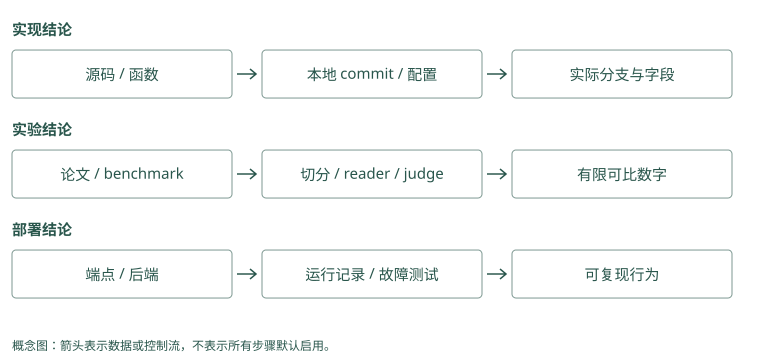

# 源码与论文索引

## 从一个问题开始读源码

读源码不必从第一个文件开始逐行浏览。你已经理解第 5 章的候选池区别，可以带一个问题进去：“Mem0 的关键词命中，会不会把语义池外记录补回来？”

在项目根目录运行：

```bash
rg -n '_search_vector_store|_compute_entity_boosts' \
  sources/repos/mem0/mem0/memory/main.py
```

搜索会告诉你定义和调用的位置。打开函数后，先看输入的 query 和 filters，再追向量候选、关键词或实体信号、最终排序和返回。遇到辅助函数，只追会改变候选集合或分数的部分，不必立即理解每个异常和配置类。

### Mem0：从实际函数与提示双向核对

[主流程](../../sources/repos/mem0/mem0/memory/main.py) 从 `add()` 进入 `_add_to_vector_store()`，读取普通追加和过程摘要两个分支；[历史存储](../../sources/repos/mem0/mem0/memory/storage.py) 核对消息与变更表。不要停在 docstring 的自动 CRUD 描述，正文解释以函数实际写操作为准。

### Graphiti：从 orchestration 追 maintenance

[主流程](../../sources/repos/graphiti/graphiti_core/graphiti.py) 的 `add_episode()` 编排抽取、解析和保存；[边维护](../../sources/repos/graphiti/graphiti_core/utils/maintenance/edge_operations.py) 展开重复候选与时间关闭逻辑。先记返回的 resolved、invalidated、new 三集合，再核对它们如何写回。

## 用纸笔记录三个集合

把“向量命中的 ID”“关键词命中的 ID”“最终返回的 ID”分别写下来。如果代码只遍历向量候选做加分，池外关键词记录没有入口；如果代码把两组 ID 合并，再补取正文，行为就不同。

随后看 MCP 的 `storage/mixins/hybrid.py`，观察全文、向量、hash 合并和正文补取。不要只凭它们都叫 hybrid 认定同一个算法。读完后，你应该能用一条漏召回案例预测两种路径的差别，而不仅是记住函数名。

这种追踪方法也适用于 A-MEM 的 links 追加与最终 k 截断、Letta 的文件提交与后续编译、Memobase 的写入与 flush。追最后真正被读取的状态，才能验证前面处理有没有影响结果。

### Mem0：semantic 集合决定 candidate 身份

分别记录后端 search、keyword_search 和 entity boost 的 ID，随后看 candidates 是否只遍历 semantic results。源码显示后两者给分，而非无条件补入新身份。explain 提供已评分记录的分项，没有覆盖池外遗漏，复查时要保存原始集合。

### Graphiti：UUID 并集与各路名次同时保留

[搜索实现](../../sources/repos/graphiti/graphiti_core/search/search.py) 的 `edge_search()` 汇集多路列表，再构造 edge_uuid_map。RRF 用名次，cross-encoder 先截断再读 fact。对照[配方](../../sources/repos/graphiti/graphiti_core/search/search_config_recipes.py)，确认本次到底启用了哪些路。

## 用论文学习机制，再核对当前代码

读 HippoRAG 论文，可以先找问题设定、索引图、查询种子和传播流程。把“Atlas → 平台组 → 批准人”的教学例子放进去，看看每一处需要什么节点或证据。再读实验，确认作者固定了哪个 reader、比较什么基线。

之后打开当前 `HippoRAG.py`，看事实与段落种子怎样组合。论文第一版和后续实现可能不同，不能把图示的每个细节都套到当前目录。Graphiti 的时间论文、MemoryOS 的提升论文和 MemOS 的模型资源论文也应这样读。

不懂术语时，先找它在数据路径里的作用：输入什么、改什么、返回什么。知道作用之后，再研究公式和配置，比先记一页缩写更容易。

### Mem0：论文路线与当前 batch 实现分开记

论文可能描述较早的提取与更新算法，当前源码已有 additive prompt、批量 embedding 和实体链接。读实验时记数据、reader、候选粒度及 OSS 或 managed 交付物。算法思想相近不证明当前本地后端复现了同一分数。

### Graphiti：时间思想要核对字段和过滤

时间论文解释为什么保留历史，[边定义](../../sources/repos/graphiti/graphiti_core/edges.py) 明确具体字段，[过滤实现](../../sources/repos/graphiti/graphiti_core/search/search_filters.py) 决定查询怎样使用它们。字段存在只支持模型表达，仍要实际测试当前与历史视图，不能把论文目标当作每个接口保证。

## 给自己的结论留一个可复查的小注释

可以写成：“在这个 commit 和后端下，候选来自某集合；依据是这个函数；尚未运行所有后端。”实验结论再另写数据、参数与运行输出。

本书下列索引保留源码、论文和 2026-09-21 快照，便于复查机制，不把代码阅读当作全项目性能复现。托管服务宣称、开源代码行为和你的运行结果要分别标注，以后版本变化时才知道哪条结论需要重查。

### Mem0：记录分支、provider 与已验证范围

可以写“在普通 infer=True 同步路径，候选由语义池构造；未测试所有 vector stores”。同时注明 commit、模型和 backend，真实实验另保存源数据与输出。delete history 残留等观察也限定到实际函数，不宣称所有托管版本行为相同。

### Graphiti：记录配置、driver 与对象粒度

结论如“基础 search 采用 edge RRF，未自动启用 BFS”应指向 recipe 和入口分支；晚到日期实验注明 search_filter。针对 remove_episode 记录共享来源和摘要检查结果。源码观察、教学推演和运行结论各自标明证据类型。

## 动手检查

任选一个“会学习”“支持图”或“可删除”的描述，把它改写成一条能追代码、能运行检查的具体问题。

答案提示：“A-MEM 建了链接后，池外邻居最终是否返回？”比“它的图记忆好不好”更可操作；“删掉 source 后哪些摘要还含原文？”比“有 delete API 吗”更接近删除责任。

<details class="implementation-notes">
<summary>完整源码路径、论文清单与证据索引（选读）</summary>

## 本地源码

| 项目 | 本地目录 | 重点入口 | License |
|---|---|---|---|
| Mem0 | `sources/repos/mem0` | `mem0/memory/main.py` | Apache-2.0 |
| Letta Code | `sources/repos/letta-code` | `src/agent/prompts/letta_root_memfs.md` | Apache-2.0 |
| Graphiti | `sources/repos/graphiti` | `graphiti_core/graphiti.py` | Apache-2.0 |
| Cognee | `sources/repos/cognee` | `cognee/api/v1/{remember,recall,improve}` | Apache-2.0（核对模块） |
| MemOS | `sources/repos/memos` | `src/memos/memories/`, `mem_os/` | Apache-2.0 |
| MemoryOS | `sources/repos/memoryos` | `memoryos-pypi/{memoryos,updater,retriever,mid_term}.py` | Apache-2.0 |
| A-MEM | `sources/repos/a-mem` | `agentic_memory/memory_system.py` | MIT |
| HippoRAG | `sources/repos/hipporag` | `src/hipporag/HippoRAG.py` | 见仓库 |
| Memobase | `sources/repos/memobase` | `src/server/` | Apache-2.0 |
| Hippo Memory | `sources/repos/hippo-memory` | `src/`, `benchmarks/`, `docs/evals/` | MIT |
| Basic Memory | `sources/repos/basic-memory` | `src/basic_memory/` | AGPL-3.0 |
| MCP Memory Service | `sources/repos/mcp-memory-service` | `src/mcp_memory_service/` | Apache-2.0 |
| Agent Beacon | `sources/repos/agent-beacon` | `endpoint/`, `docs/` | MIT |
| TencentDB Agent Memory | `sources/repos/tencent-agent-memory` | `MemoryCore/`, `MemoryKnowledge/` | MIT |
| Hermes Jev Skills | `sources/repos/hermes-jev-skills` | `jevkit/`, `skills/jev-memory/` | MIT |

`letta-ai/letta` 也保留在本地，但只用于证明主仓迁移，不应作为当前源码入口。因此共有 16 个仓库，当前详解覆盖 15 个实现/工具和 Letta 的历史来源。

## 本次扩写的机制证据

以下路径均相对于 `sources/repos/`。详细章节保留可点击的源码链接；README/MDX 路径作为源码定位使用，不转换成 wiki 页面。

| 项目 | 已核对的关键函数或文件 | 对应讲解 |
|---|---|---|
| Mem0 | `mem0/memory/main.py`：`_add_to_vector_store`、`_search_vector_store`、`_compute_entity_boosts` | ADD-only batch、局部 hash 去重、语义候选池与多信号评分 |
| Memobase | `src/server/api/memobase_server/controllers/buffer.py`、`controllers/modal/chat/` | flush 状态、并发限制、profile/event 处理、原 blob 保留开关 |
| Graphiti | `graphiti_core/graphiti.py`、`edges.py` | entity/edge resolution、episode 引用、有效与系统时间 |
| Cognee | `cognee/api/v1/remember/remember.py`、`recall/recall.py` | 管线路由、配置、后台任务与数据集边界 |
| HippoRAG | `src/hipporag/HippoRAG.py`：`graph_search_with_fact_entities`、`run_ppr` | fact 与 passage seeds、无向加权 PPR、manifest |
| MemoryOS | `memoryos-pypi/updater.py`、`retriever.py`、`mid_term.py`、`memoryos.py` | page/session 提升、heat、LFU、长期分析与并行读取 |
| MemOS | `src/memos/mem_cube/general.py`、`mem_scheduler/` | 可选 memory modules、load/dump/schema、调度结构 |
| Hippo | `src/memory.ts`、`physics.ts`、`consolidate.ts`、`rerankers/jev.ts` | strength/outcome、粒子评分、sleep、40 候选重排与本地回退 |
| A-MEM | `agentic_memory/memory_system.py`：`process_memory`、`search_agentic` | 演化动作、邻居修改、links 与 k 截断 |
| Letta / Letta Code | 旧仓 `README.md`；新仓 `src/agent/prompts/letta_root_memfs.md` | 迁移、索引格式、commit 与 recompile 生效边界 |
| Basic Memory | `src/basic_memory/markdown/entity_parser.py`、`services/context_service.py` | 文件解析、URI 与关系上下文 |
| MCP Memory Service | `src/mcp_memory_service/storage/mixins/hybrid.py`、`consolidation/consolidator.py` | weighted/RRF、候选补取、horizon 与巩固阶段 |
| Agent Beacon | `docs/architecture/architecture.mdx`、`system-architecture.mdx` | 采集方式、事件 fidelity、JSONL 边界、OSS/managed 范围 |
| TencentDB | `MemoryCore/README_CN.md`、`MemoryProxy/README_CN.md` | Core/Knowledge 分工、生成溯源、Proxy 高层注入与工具读取 |
| Hermes Jev Skills | `jevkit/rerank.py`、`search.py`、`memo.py` | 截断/隐私/注入判别、unjudged 回退、sufficiency、exact-match memo |

这里只表示源码与官方说明核对，不表示所有后端已经运行或 benchmark 已独立复现。扩写保持原有 2026-09-21 快照，不把本次文稿更新当成重新获取上游维护数据。

## 论文原文

PDF 位于 `sources/papers/pdf/`，可搜索文本位于 `sources/papers/text/`。

1. Packer et al. **MemGPT: Towards LLMs as Operating Systems**. arXiv:2310.08560.
2. Maharana et al. **LoCoMo: Evaluating Very Long-Term Conversational Memory of LLM Agents**. arXiv:2402.17753.
3. Gutiérrez et al. **HippoRAG: Neurobiologically Inspired Long-Term Memory for LLMs**. arXiv:2405.14831.
4. Wu et al. **LongMemEval: Benchmarking Chat Assistants on Long-Term Interactive Memory**. arXiv:2410.10813.
5. Rasmussen et al. **Zep: A Temporal Knowledge Graph Architecture**. arXiv:2501.13956.
6. Xu et al. **A-MEM: Agentic Memory for LLM Agents**. arXiv:2502.12110.
7. Gutiérrez et al. **From RAG to Memory: Non-Parametric Continual Learning for LLMs**. arXiv:2502.14802.
8. Chhikara et al. **Mem0: Building Production-Ready AI Agents with Scalable Long-Term Memory**. arXiv:2504.19413.
9. Markovic et al. **Optimizing the Interface Between Knowledge Graphs and LLMs for Complex Reasoning**. arXiv:2505.24478.
10. Kang et al. **Memory OS of AI Agent**. arXiv:2506.06326.
11. Li et al. **MemOS: A Memory OS for AI System**. arXiv:2507.03724.

## 证据使用约定

- 论文结果引用论文；项目新增功能和最新数字引用对应 README/评测目录。
- README 自报结果不视为独立复现。
- 本书没有把不同指标、数据切分和 reader 的分数混成排行榜。
- Git 活跃度是 2026-09-21 的快照，不代表未来维护状态。
- 任何项目上线前都应重新检查主仓、release、security advisory 与许可证。

## 进一步阅读顺序

1. **心智模型**：MemGPT → Mem0。
2. **时间图谱**：Zep/Graphiti → HippoRAG 1/2。
3. **生命周期**：MemOS → MemoryOS → Hippo 源码与负面评测。
4. **评测**：LoCoMo → LongMemEval，再对照项目 benchmark harness。
5. **工程**：Mem0 `Memory`、Graphiti `add_episode/search`、Cognee `remember/recall/improve/forget`、Letta MemFS prompts。

## 按技术问题复核，而不是只读 README

检索比较应从 public API 追到最终 candidate set、过滤和截断：Mem0 的 keyword boost 与 MCP 的候选并集不同，Hippo graph stream 与 graph-recall 不同，Graphiti 的 configuration 决定 RRF/MMR/cross-encoder。只看到函数名或接口介绍不足以作结论。

演化比较应追到具体写操作：MemoryOS 的 heap/heat 与 profile update，A-MEM 的邻居属性变化与 index refresh，Hippo strength/outcome 与 sleep，MCP decay/forgetting 的 action，Cognee improve 的 gate/watermark，TencentDB L1 dedup/Skill version，MemOS scheduler，Letta commit/recompile。副作用之后是否读取新状态也要核对。

接入比较应画出原文与派生副本：Basic 文件与索引，Beacon JSONL 与 forwarding，Memobase blob/profile/event，Graphiti episode/fact，HippoRAG passage/fact，TencentDB Core/Knowledge/Proxy。许可证、auth、删除或性能属于不同证据问题，不能用论文或宣传分数替当前部署证明。

</details>

<figure class="concept-diagram" tabindex="0"><figcaption>图：证据类型不同，支持的结论范围也不同；本次仍是本地快照审阅。</figcaption></figure>

<details class="comparison-reference">
<summary>项目对照速查（选读）</summary>

## 本章对照结论

| 技术问题 | 需要比较的项目 | 优先证据 | 本次能支持/不能支持 |
|---|---|---|---|
| 事实/画像写入 | Mem0、Memobase、MemoryOS、TencentDB、Letta、MemOS | 提取/提升/编译代码及 prompt | 解释数据流；未独立测所有模型 |
| 候选/排序 | Mem0、MCP、Hippo、Graphiti、Cognee、HippoRAG、Hermes | candidate/fusion/rerank 与配置 | 区分池边界；未复现统一质量排名 |
| 图/来源 | Graphiti、Cognee、HippoRAG、Basic、A-MEM、Hippo、MCP、TencentDB、MemOS | graph/node/edge/source 及读取 | 区分连接语义；未保证全部删除链 |
| 演化/遗忘 | Hippo、MCP、MemoryOS、A-MEM、Cognee、Memobase、Graphiti、TencentDB、MemOS、Letta | 状态写操作、反馈、gate、版本 | 描述机制；未证明长期任务提升 |
| 接入/副本 | Beacon、Basic、MCP、TencentDB、Letta、MemOS、Hippo 与 SDK 框架 | 事件 schema、transport、sync、auth | 说明审计点；非生产安全认证 |
| 历史与实验 | MemGPT/旧 Letta、各论文和 benchmark | archive commit、数据/reader/judge | 限定原协议；非当前产品背书 |

</details>

